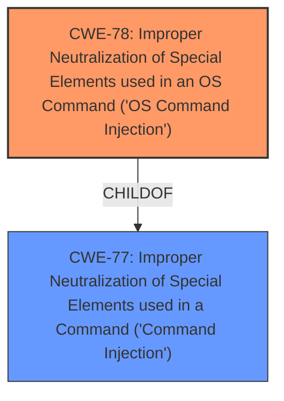

# Raw Analyzer Response for CVE-2022-38828

# Summary
| CWE ID | CWE Name | Confidence | CWE Abstraction Level | CWE Vulnerability Mapping Label | CWE-Vulnerability Mapping Notes |
|---|---|---|---|---|---|
| CWE-78 | Improper Neutralization of Special Elements used in an OS Command ('OS Command Injection') | 1.0 | Base | Allowed | Primary CWE |
| CWE-77 | Improper Neutralization of Special Elements used in a Command ('Command Injection') | 0.7 | Class | Allowed-with-Review | Secondary Candidate.  Considered due to the broader scope of command injection, but CWE-78 is more specific. |

## Evidence and Confidence

*   **Confidence Score:** 1.0
*   **Evidence Strength:** HIGH

## Relationship Analysis
The primary relationship influencing the decision is the hierarchical relationship between CWE-77 and CWE-78. CWE-78 is a ChildOf CWE-77, making it a more specific classification. The vulnerability involves the injection of OS commands, justifying the selection of CWE-78.

## Vulnerability Chain
The vulnerability chain begins with the **improper neutralization** of input, leading to **OS command injection** and ultimately resulting in **arbitrary command execution** and potential **full system compromise**. The chain is: **Improper Neutralization** -> **CWE-78** -> **Arbitrary Command Execution** -> **System Compromise**.

## Summary of Analysis
The initial analysis strongly points to **CWE-78 (Improper Neutralization of Special Elements used in an OS Command ('OS Command Injection'))**. The vulnerability description explicitly states that the TOTOLINK T6 router is vulnerable to **command injection**. The CVE Reference Links Content Summary confirms that the root cause is the **lack of input validation and sanitization** of the `pin` parameter within the `setWiFiWpsStart` function of `cstecgi.cgi`, leading to the ability to inject arbitrary shell commands via a system call. This directly aligns with the description of CWE-78, which focuses on the **improper neutralization of special elements** used in an OS command.

The graph relationships confirm that CWE-78 is a specific type of command injection, being a child of CWE-77. Given that the injected commands are OS commands, CWE-78 is the more appropriate choice.

The selected CWE is at the optimal level of specificity. While CWE-77 is a more general "Command Injection" class, CWE-78 is more specific to OS commands, which is the case in this vulnerability.

The evidence supporting this decision is:

-   "TOTOLINK T6 V4.1.5cu.709_B20210518 is vulnerable to **command injection** via cstecgi.cgi"
-   "The vulnerability lies in the `cstecgi.cgi` executable of the TOTOLINK T6 router firmware (version V4.1.5cu.709_B20210518)."
-   "Specifically, the `setWiFiWpsStart` function within `cstecgi.cgi` is vulnerable to command injection. The `pin` parameter, which is derived from the MAC address, is passed to a `system` function without proper sanitization."
-   "**Command Injection:** The primary weakness is the **lack of input validation and sanitization** on the `pin` parameter before it is used in a system call. This allows an attacker to inject arbitrary shell commands."

**CWE-77** was considered as a broader category of command injection but was determined to be less specific than CWE-78.

**CWE-88 (Improper Neutralization of Argument Delimiters in a Command ('Argument Injection'))** was also considered, as it is a peer of CWE-78, but was not selected because the primary issue isn't argument delimiter injection, but rather the overall lack of sanitization leading to command injection.

All other CWEs were not considered to be a close match to the vulnerability description.