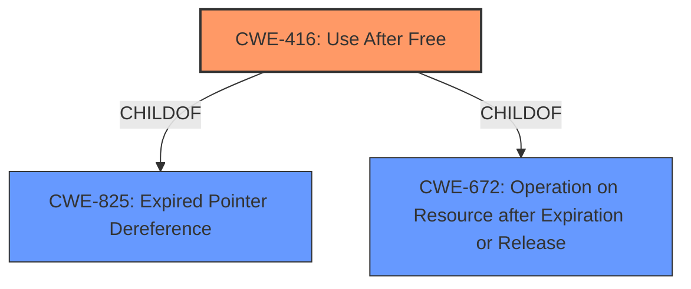

# Analysis for CVE-2022-3887

# Summary
| CWE ID | CWE Name | Confidence | CWE Abstraction Level | CWE Vulnerability Mapping Label | CWE-Vulnerability Mapping Notes |
|---|---|---|---|---|---|
| CWE-416 | Use After Free | 1.0 | Variant | Allowed | Primary CWE |
| CWE-672 | Operation on Resource after Expiration or Release | 0.4 | Class | Allowed-with-Review | Secondary CWE |

## Evidence and Confidence

*   **Confidence Score:** 1.0
*   **Evidence Strength:** HIGH

## Relationship Analysis
The primary CWE, CWE-416 **(Use After Free)**, is a Variant of CWE-825 **(Expired Pointer Dereference)** and CWE-672 **(Operation on Resource after Expiration or Release)**. The **use-after-free** condition allows an attacker to potentially exploit heap corruption. Given the strong evidence of a **use-after-free** vulnerability, CWE-416 is the most appropriate and specific choice.

## Vulnerability Chain
The vulnerability chain starts with the **use-after-free** condition (CWE-416), which allows a remote attacker to exploit heap corruption. The chain is:
1.  **Use After Free (CWE-416)**: The root cause of the vulnerability.
2.  **Heap Corruption (Impact)**: The direct consequence of the **use-after-free**, leading to potential exploitation.

## Summary of Analysis
The initial analysis strongly points to CWE-416 **(Use After Free)** as the primary weakness. The vulnerability description clearly states "**use after free**" as the root cause, and the CVE Reference Links Content Summary reinforces this. The Retriever Results also list CWE-416 as the top candidate.

The relationship analysis confirms that CWE-416 is the most specific and appropriate choice, being a Variant of more general classes. The mapping guidance for CWE-416 allows its usage, further supporting this decision.

The evidence from the vulnerability description is:
*   "**rootcause:** **use after free**" from Vulnerability Description Key Phrases
*   "The vulnerability is a **use-after-free** error." from CVE Reference Links Content Summary
*   "**Use-after-free:** This occurs when a program attempts to access memory that has already been freed, potentially leading to unpredictable behavior or corruption." from CVE Reference Links Content Summary

These excerpts provide direct evidence for classifying the vulnerability as CWE-416.

Other CWEs considered but not used:

*   **CWE-787 (Out-of-bounds Write):** While heap corruption is mentioned, the root cause is the **use-after-free**, not directly an out-of-bounds write. CWE-787 is a frequent consequence of other issues.
*   **CWE-665 (Improper Initialization):** Not directly related to the provided vulnerability description.
*   **CWE-843 (Access of Resource Using Incompatible Type ('Type Confusion'))**, **CWE-366 (Race Condition within a Thread)**, **CWE-911 (Improper Update of Reference Count)**, **CWE-356 (Product UI does not Warn User of Unsafe Actions)**, **CWE-122 (Heap-based Buffer Overflow)**, **CWE-123 (Write-what-where Condition)**, **CWE-415 (Double Free)**, **CWE-404 (Improper Resource Shutdown or Release)**, **CWE-362 (Concurrent Execution using Shared Resource with Improper Synchronization ('Race Condition'))**: These CWEs were considered but deemed less relevant as they do not directly address the **use-after-free** condition.

Relevant CWE Information:

# Enhanced Context (25 CWEs)
The following CWEs were identified as potentially relevant to this vulnerability:

## CWE-366: Race Condition within a Thread
**Abstraction Level**: Base
**Similarity Score**: 0.82
**Source**: dense

**Description**:
If two threads of execution use a resource simultaneously, there exists the possibility that resources may be used while invalid, in turn making the state of execution undefined.

**Mapping Guidance**:
- Usage: Allowed
- Rationale: This CWE entry is at the Base level of abstraction, which is a preferred level of abstraction for mapping to the root causes of vulnerabilities.

## CWE-404: Improper Resource Shutdown or Release
**Abstraction Level**: Class
**Similarity Score**: 0.77
**Source**: dense

**Description**:
The product does not release or incorrectly releases a resource before it is made available for re-use.

**Mapping Guidance**:
- Usage: Allowed-with-Review
- Rationale: This CWE entry is a Class and might have Base-level children that would be more appropriate

## CWE-362: Concurrent Execution using Shared Resource with Improper Synchronization ('Race Condition')
**Abstraction Level**: Class
**Similarity Score**: 0.77
**Source**: dense

**Description**:
The product contains a concurrent code sequence that requires temporary, exclusive access to a shared resource, but a timing window exists in which the shared resource can be modified by another code sequence operating concurrently.

**Mapping Guidance**:
- Usage: Allowed-with-Review
- Rationale: This CWE entry is a Class and might have Base-level children that would be more appropriate

## CWE-662: Improper Synchronization
**Abstraction Level**: Class
**Similarity Score**: 0.77
**Source**: dense

**Description**:
The product utilizes multiple threads or processes to allow temporary access to a shared resource that can only be exclusive to one process at a time, but it does not properly synchronize these actions, which might cause simultaneous accesses of this resource by multiple threads or processes.

**Mapping Guidance**:
- Usage: Discouraged
- Rationale: This CWE entry is a level-1 Class (i.e., a child of a Pillar). It might have lower-level children that would be more appropriate

## CWE-367: Time-of-check Time-of-use (TOCTOU) Race Condition
**Abstraction Level**: Base
**Similarity Score**: 0.76
**Source**: dense

**Description**:
The product checks the state of a resource before using that resource, but the resource's state can change between the check and the use in a way that invalidates the results of the check. This can cause the product to perform invalid actions when the resource is in an unexpected state.

**Mapping Guidance**:
- Usage: Allowed
- Rationale: This CWE entry is at the Base level of abstraction, which is a preferred level of abstraction for mapping to the root causes of vulnerabilities.

## CWE-667: Improper Locking
**Abstraction Level**: Class
**Similarity Score**: 0.76
**Source**: dense

**Description**:
The product does not properly acquire or release a lock on a resource, leading to unexpected resource state changes and behaviors.

**Mapping Guidance**:
- Usage: Allowed-with-Review
- Rationale: This CWE entry is a Class and might have Base-level children that would be more appropriate

## CWE-368: Context Switching Race Condition
**Abstraction Level**: Base
**Similarity Score**: 0.75
**Source**: dense

**Description**:
A product performs a series of non-atomic actions to switch between contexts that cross privilege or other security boundaries, but a race condition allows an attacker to modify or misrepresent the product's behavior during the switch.

**Mapping Guidance**:
- Usage: Allowed
- Rationale: This CWE entry is at the Base level of abstraction, which is a preferred level of abstraction for mapping to the root causes of vulnerabilities.

## CWE-226: Sensitive Information in Resource Not Removed Before Reuse
**Abstraction Level**: Base
**Similarity Score**: 0.74
**Source**: dense

**Description**:
The product releases a resource such as memory or a file so that it can be made available for reuse, but it does not clear or "zeroize" the information contained in the resource before the product performs a critical state transition or makes the resource available for reuse by other entities.

**Mapping Guidance**:
- Usage: Allowed
- Rationale: This CWE entry is at the Base level of abstraction, which is a preferred level of abstraction for mapping to the root causes of vulnerabilities.

## CWE-363: Race Condition Enabling Link Following
**Abstraction Level**: Base
**Similarity Score**: 0.72
**Source**: dense

**Description**:
The product checks the status of