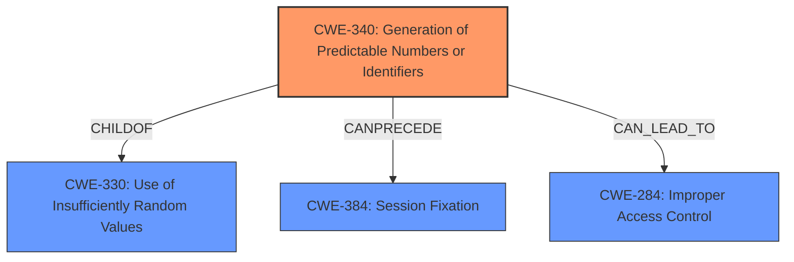

# Analysis Report for CVE-2022-38970

# Vulnerability Analysis Report: CVE-2022-38970

## Description


## Analysis (with Relationship Data)

# Summary
| CWE ID | CWE Name | Confidence | CWE Abstraction Level | CWE Vulnerability Mapping Label | CWE-Vulnerability Mapping Notes |
|---|---|---|---|---|---|
| CWE-340 | Generation of Predictable Numbers or Identifiers | 1.0 | Class | Primary | Allowed-with-Review |
| CWE-284 | Improper Access Control | 0.7 | Class | Secondary | Allowed |

## Evidence and Confidence

*   **Confidence Score:** 0.85
*   **Evidence Strength:** HIGH

## Relationship Analysis
The primary CWE is CWE-340, which falls under the Class abstraction level. It is related to CWE-330 (Use of Insufficiently Random Values), as it is a child of it. CWE-340 can precede CWE-384 (Session Fixation). CWE-284 is related to, and can be caused by, various weaknesses including CWE-340.



## Vulnerability Chain
The chain of events for this vulnerability begins with the **predictability flaw in the UID generation algorithm** (CWE-340), which allows remote attackers to establish direct connections to arbitrary devices (CWE-284).

## Summary of Analysis
The analysis is primarily based on the provided evidence, which includes the vulnerability description, key phrases, and CVE reference links content summary.

The vulnerability description clearly states that the algorithm used to generate device IDs suffers from a **predictability flaw**. The CVE reference links content summary reinforces this, stating that the Unique Identifier (UID) of the ieGeek IG20 camera is generated using a **predictable pattern (CWE-340)**.

The consequence of this **predictability flaw** is that remote attackers can establish direct connections to arbitrary devices, indicating an **Improper Access Control (CWE-284)** issue. The evidence confirms that the predictable UID, combined with other factors such as default credentials, allows unauthorized access.

The retriever results also support the selection of CWE-340, with a high similarity score.

CWE-340 is chosen as the primary CWE because it represents the root cause of the vulnerability. The **predictable UID generation** is the underlying issue that enables the unauthorized access.

CWE-284 is chosen as a secondary CWE because the impact of the **predictability flaw** is that access control is bypassed.

The selected CWEs are at the appropriate level of specificity. CWE-340 is a Class, and while there might be more specific variants, the available information does not provide enough detail to determine a more precise match. CWE-284 is selected because the lack of proper access control is a direct result of the predictable UIDs.

Relevant CWE Information:

# Enhanced Context (25 CWEs)
The following CWEs were identified as potentially relevant to this vulnerability:

## CWE-340: Generation of Predictable Numbers or Identifiers
**Abstraction:** Class
**Similarity Score**: 0.75
**Source**: dense

**Description**:
The product uses a scheme that generates numbers or identifiers that are more predictable than required.

**Mapping Guidance**
- **Usage**: Allowed-with-Review
- **Rationale**: This CWE entry is a Class and might have Base-level children that would be more appropriate

## CWE-284: Improper Access Control
**Abstraction:** Class
**Similarity Score**: N/A
**Source**: N/A

**Description**:
The software does not restrict or incorrectly restricts access to resources (data, files, actions, etc.) to only the intended users.

**Mapping Guidance**
- **Usage**: Allowed
- **Rationale**: N/A
- **Comments**: N/A
- **Reasons**: Acceptable-Use

Based on the evidence and analysis:

*   **CWE-340 (Generation of Predictable Numbers or Identifiers)** is the most appropriate primary CWE because the root cause of the vulnerability lies in the **predictable UID generation algorithm**. This allows attackers to easily guess or brute-force device IDs.
*   **CWE-284 (Improper Access Control)** is a secondary CWE because the predictable UIDs, in conjunction with other factors such as default credentials, lead to unauthorized access to the devices.

The confidence in this assessment is high (0.85) due to the clear evidence from the vulnerability description, CVE reference links content summary, and the retriever results.


## CWE Relationship Analysis

Current CWEs represent these abstraction levels: .


### Vulnerability Chain Analysis

**Chain starting from CWE-340:**
- 340 (Generation of Predictable Numbers or Identifiers) - ROOT


**Chain starting from CWE-330:**
- 330 (Use of Insufficiently Random Values) - ROOT


### CWE Relationship Diagram

```mermaid
graph TD
    classDef primary fill:#f96,stroke:#333,stroke-width:2px
    classDef secondary fill:#69f,stroke:#333
    classDef tertiary fill:#9e9,stroke:#333
```


*Report generated on 2025-03-30 20:17:19*
