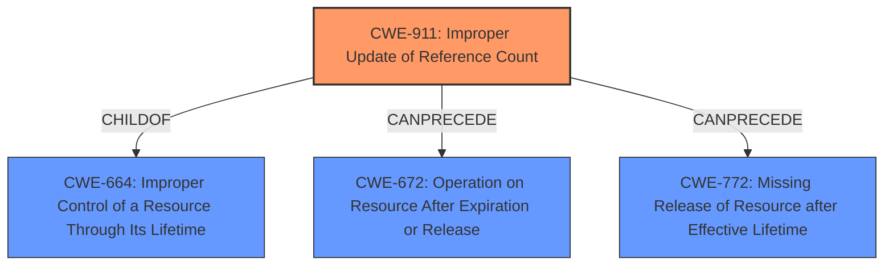

# Raw Analyzer Response for CVE-2022-38999

# Summary
| CWE ID | CWE Name | Confidence | CWE Abstraction Level | CWE Vulnerability Mapping Label | CWE-Vulnerability Mapping Notes |
|---|---|---|---|---|---|
| CWE-911 | Improper Update of Reference Count | 1.0 | Base | Primary | Allowed |

## Evidence and Confidence

*   **Confidence Score:** 1.0
*   **Evidence Strength:** HIGH

## Relationship Analysis
The primary relationship that influenced the decision was the direct match of the vulnerability description to CWE-911. CWE-911 is a child of CWE-664 (Improper Control of a Resource Through Its Lifetime) and has potential chain relationships (CanPrecede) to CWE-672 (Operation on Resource After Expiration or Release) and CWE-772 (Missing Release of Resource after Effective Lifetime), suggesting potential consequences of reference count mismanagement.

## Vulnerability Chain
The vulnerability chain starts with the **improper update of the reference count** (CWE-911). This can lead to resources being released prematurely or not being released at all. Premature release could lead to use-after-free conditions or double frees, while failure to release could lead to resource exhaustion. The final impact is the compromise of data integrity, confidentiality, and availability.

## Summary of Analysis
The analysis is based on the clear evidence provided in the vulnerability description and the CVE reference summary, both of which explicitly state the **improper update of the reference count** as the root cause.

The vulnerability description states: "The AOD module has the **improper update of reference count** vulnerability. Successful exploitation of this vulnerability may affect data integrity, confidentiality, and availability."

The CVE Reference Links Content Summary states: "**Root Cause:** Improper update of the reference count in the AOD (Always On Display) module."

The retriever results also strongly support CWE-911 as the primary candidate, with the highest similarity score. The mapping guidance for CWE-911 explicitly allows its use and considers it a preferred level of abstraction. The CWE description aligns perfectly with the vulnerability description, making it the most appropriate and specific classification. The abstraction level of Base is also optimal for this vulnerability.

CWE-94, CWE-190, CWE-415, CWE-639, CWE-1329, CWE-416, CWE-125, CWE-285 and CWE-287 were considered but deemed less suitable. While some of these CWEs may be related to potential consequences or contributing factors, they do not represent the core weakness of improper reference count management. For example, CWE-416 (Use After Free) and CWE-415 (Double Free) could be potential consequences of improper reference counting, but the root cause remains the incorrect handling of the reference count itself.