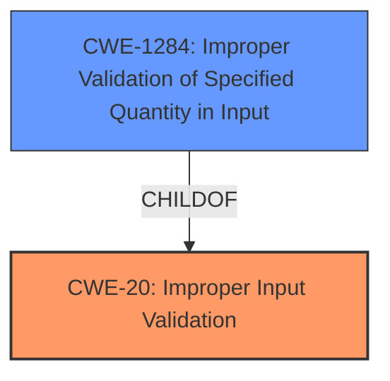

# Raw Analyzer Response for CVE-2022-39012

# Summary

| CWE ID  | CWE Name  | Confidence | CWE Abstraction Level | CWE Vulnerability Mapping Label | CWE-Vulnerability Mapping Notes |
|----------------|---------------------------------------------|-------------------|--------------------------|------------------------------------|-----------------------------------------------------------------|
| CWE-20 | Improper Input Validation  | 0.8 | Class | Discouraged | Vulnerability stems from **improper input validation** |
| CWE-1284 | Improper Validation of Specified Quantity in Input | 0.6 | Base | Allowed | The product receives input that is expected to specify a quantity, but it does not validate or incorrectly validates that the quantity has the required properties. |

## Evidence and Confidence

*   **Confidence Score:** 0.7
*   **Evidence Strength:** HIGH

## Relationship Analysis
The primary CWE is CWE-20, Improper Input Validation, which is a class-level CWE. The retriever results suggest other more specific base-level CWEs that are children of CWE-20. CWE-1284, Improper Validation of Specified Quantity in Input, is a base-level CWE that is a child of CWE-20. Choosing CWE-20 indicates a general case of improper input validation, while selecting CWE-1284 suggests that the improper validation is related to the quantity specified in the input.

## Vulnerability Chain
The vulnerability chain starts with the **improper input validation** (**CWE-20**) and results in the watch's application service behaving abnormally.

## Summary of Analysis
The initial assessment identified CWE-20 (Improper Input Validation) as the primary weakness, aligning with the vulnerability description's key phrase "**improper input validation**". The provided content summary also emphasizes the root cause being **improper input validation**.

The retriever results provided several candidate CWEs, with CWE-20 being a top match. However, CWE-20 is a class-level CWE and the mapping guidance discourages its use when more specific CWEs are available.

Several child CWEs of CWE-20 were considered, including CWE-1284 (Improper Validation of Specified Quantity in Input), CWE-1286 (Improper Validation of Syntactic Correctness of Input), and CWE-1285 (Improper Validation of Specified Index, Position, or Offset in Input). The vulnerability description does not explicitly specify what kind of input is not being validated or has insufficient validation. However, the description suggests a potential network-based attack vector involving a specially crafted packet. It's plausible the packet contains a field specifying a quantity or length that is not validated correctly, leading to the application service failure. So while a more specific variant is not apparent, CWE-1284 is still a possibility.

The final decision is to assign CWE-20 as the primary CWE due to the broad nature of the vulnerability description, which only mentions **improper input validation**. Although more specific CWEs exist, there isn't enough information to confidently assign one of them. CWE-1284 is considered as a secondary candidate.

Relevant CWE Information:

# Enhanced Context (25 CWEs)

## CWE-20: Improper Input Validation
**Abstraction:** Class
**Status:** Stable

### Description
The product receives input or data, but it does
        not validate or incorrectly validates that the input has the
        properties that are required to process the data safely and
        correctly.

### Extended Description
Input validation is a frequently-used technique for checking potentially dangerous inputs in order to ensure that the inputs are safe for processing within the code, or when communicating with other components. When software does not validate input properly, an attacker is able to craft the input in a form that is not expected by the rest of the application. This will lead to parts of the system receiving unintended input, which may result in altered control flow, arbitrary control of a resource, or arbitrary code execution.

### Mapping Guidance
**Usage:** Discouraged
**Rationale:** CWE-20 is commonly misused in low-information vulnerability reports when lower-level CWEs could be used instead, or when more details about the vulnerability are available [REF-1287]. It is not useful for trend analysis. It is also a level-1 Class (i.e., a child of a Pillar).
**Comments:** Consider lower-level children such as Improper Use of Validation Framework (CWE-1173) or improper validation involving specific types or properties of input such as Specified Quantity (CWE-1284); Specified Index, Position, or Offset (CWE-1285); Syntactic Correctness (CWE-1286); Specified Type (CWE-1287); Consistency within Input (CWE-1288); or Unsafe Equivalence (CWE-1289).

## CWE-1284: Improper Validation of Specified Quantity in Input
**Abstraction:** Base
**Status:** Incomplete

### Description
The product receives input that is expected to specify a quantity (such as size or length), but it does not validate or incorrectly validates that the quantity has the required properties.

### Extended Description
Specified quantities include size, length, frequency, price, rate, number of operations, time, and others. Code may rely on specified quantities to allocate resources, perform calculations, control iteration, etc. When the quantity is not properly validated, then attackers can specify malicious quantities to cause excessive resource allocation, trigger unexpected failures, enable buffer overflows, etc.
### Relationships
ChildOf -> CWE-20
CanPrecede -> CWE-789