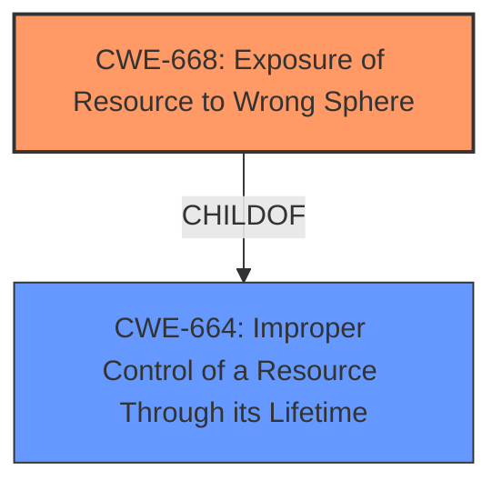

# Raw Analyzer Response for CVE-2022-39015

# Summary
| CWE ID | CWE Name | Confidence | CWE Abstraction Level | CWE Vulnerability Mapping Label | CWE-Vulnerability Mapping Notes |
|---|---|---|---|---|---|
| CWE-668 | Exposure of Resource to Wrong Sphere | 0.7 | Class | Allowed-with-Review | The product exposes a resource to the wrong control sphere, providing unintended actors with inappropriate access to the resource. |

## Evidence and Confidence

*   **Confidence Score:** 0.7
*   **Evidence Strength:** LOW

## Relationship Analysis
The primary relationship considered was the ChildOf relationship between CWE-668 and CWE-664 (Improper Control of a Resource Through its Lifetime). While CWE-664 is more general (Pillar), CWE-668 (Class) is a more specific description of the problem, involving exposure to the wrong control sphere. Although CWE-668 is discouraged, there isn't a better fit among its children given the limited information.

## Vulnerability Chain
The description suggests a basic chain:

1.  **WEAKNESS:** The product (**BOE AdminTools/ BOE SDK**) has a **weakness** that under certain conditions, it allows access to restricted information.
2.  **Impact:** This leads to an attacker being able to access information that should otherwise be restricted.

The missing link is *how* the resource is exposed to the wrong sphere.

## Summary of Analysis
The initial analysis focused on identifying the root cause of the vulnerability based on the limited information provided. The vulnerability description states that the product allows an attacker to access restricted information under certain conditions. The key phrase is "**access restricted information**".

Given the limited information, the best-fit CWE appears to be CWE-668 (Exposure of Resource to Wrong Sphere). This CWE describes a scenario where a product exposes a resource to the wrong control sphere, providing unintended actors with inappropriate access to the resource.

The evidence is weak because the description lacks specifics on *how* the information is exposed. The "CVE Reference Links Content Summary" is "UNRELATED," which means there is no additional information to extract. The weakness is only described as "under certain conditions."

The Retriever Results listed CWE-668 as the top result, albeit with a low score.

The mapping guidance for CWE-668 is "Discouraged" because it is high-level. However, without more specifics, lower-level CWEs are not applicable.

Other CWEs Considered:

*   CWE-863 (Incorrect Authorization) and CWE-285 (Improper Authorization): These CWEs were considered but deemed less suitable because the description doesn't explicitly mention authorization checks. It's possible that incorrect authorization is the underlying cause, but the description doesn't provide enough evidence.
*   CWE-311 (Missing Encryption of Sensitive Data): This was considered because sensitive information is being accessed. However, the primary issue seems to be related to access control rather than a lack of encryption.
*   CWE-1244 (Internal Asset Exposed to Unsafe Debug Access Level or State): This is too specific and doesn't align with the general nature of the description.

Ultimately, the selection of CWE-668 is based on the overall theme of exposing restricted information. The confidence level is moderate due to the lack of detailed information.

Relevant CWE Information:

# Enhanced Context (25 CWEs)
The following CWEs were identified as potentially relevant to this vulnerability:

## CWE-99: Improper Control of Resource Identifiers ('Resource Injection')
**Abstraction Level**: Class
**Similarity Score**: 0.80
**Source**: dense

**Description**:
The product receives input from an upstream component, but it does not restrict or incorrectly restricts the input before it is used as an identifier for a resource that may be outside the intended sphere of control.

**Mapping Guidance**:
- Usage: Allowed-with-Review
- Rationale: This CWE entry is a Class and might have Base-level children that would be more appropriate

## CWE-404: Improper Resource Shutdown or Release
**Abstraction Level**: Class
**Similarity Score**: 0.78
**Source**: dense

**Description**:
The product does not release or incorrectly releases a resource before it is made available for re-use.

**Mapping Guidance**:
- Usage: Allowed-with-Review
- Rationale: This CWE entry is a Class and might have Base-level children that would be more appropriate

## CWE-664: Improper Control of a Resource Through its Lifetime
**Abstraction Level**: Pillar
**Similarity Score**: 0.77
**Source**: dense

**Description**:
The product does not maintain or incorrectly maintains control over a resource throughout its lifetime of creation, use, and release.

**Mapping Guidance**:
- Usage: Discouraged
- Rationale: This CWE entry is high-level when lower-level children are available.

## CWE-610: Externally Controlled Reference to a Resource in Another Sphere
**Abstraction Level**: Class
**Similarity Score**: 0.77
**Source**: dense

**Description**:
The product uses an externally controlled name or reference that resolves to a resource that is outside of the intended control sphere.

**Mapping Guidance**:
- Usage: Discouraged
- Rationale: This CWE entry is a level-1 Class (i.e., a child of a Pillar). It might have lower-level children that would be more appropriate

## CWE-668: Exposure of Resource to Wrong Sphere
**Abstraction Level**: Class
**Similarity Score**: 0.77
**Source**: dense

**Description**:
The product exposes a resource to the wrong control sphere, providing unintended actors with inappropriate access to the resource.

**Mapping Guidance**:
- Usage: Discouraged
- Rationale: CWE-668 is high-level and is often misused as a catch-all when lower-level CWE IDs might be applicable. It is sometimes used for low-information vulnerability reports [REF-1287]. It is a level-1 Class (i.e., a child of a Pillar). It is not useful for trend analysis.

## CWE-226: Sensitive Information in Resource Not Removed Before Reuse
**Abstraction Level**: Base
**Similarity Score**: 0.77
**Source**: dense

**Description**:
The product releases a resource such as memory or a file so that it can be made available for reuse, but it does not clear or "zeroize" the information contained in the resource before the product performs a critical state transition or makes the resource available for reuse by other entities.

**Mapping Guidance**:
- Usage: Allowed
- Rationale: This CWE entry is at the Base level of abstraction, which is a preferred level of abstraction for mapping to the root causes of vulnerabilities.

## CWE-41: Improper Resolution of Path Equivalence
**Abstraction Level**: Base
**Similarity Score**: 0.76
**Source**: dense

**Description**:
The product is vulnerable to file system contents disclosure through path equivalence. Path equivalence involves the use of special characters in file and directory names. The associated manipulations are intended to generate multiple names for the same object.

**Mapping Guidance**:
- Usage: Allowed
- Rationale: This CWE entry is at the Base level of abstraction, which is a preferred level of abstraction for mapping to the root causes of vulnerabilities.

## CWE-73: External Control of File Name or Path
**Abstraction Level**: Base
**Similarity Score**: 0.76
**Source**: dense

**Description**:
The product allows user input to control or influence paths or file names that are used in filesystem operations.

**Mapping Guidance**:
- Usage: Allowed
- Rationale: This CWE entry is at the Base level of abstraction, which is a preferred level of abstraction for mapping to the root causes of vulnerabilities.

## CWE-653: Improper Isolation or Compartmentalization
**Abstraction Level**: Class
**Similarity Score**: 0.76
**Source**: dense

**Description**:
The product does not properly compartmentalize or isolate functionality, processes, or resources that require different privilege levels, rights, or permissions.

**Mapping Guidance**:
- Usage: Allowed
- Rationale: This CWE entry is at the Base level of abstraction, which is a preferred level of abstraction for mapping to the root causes of vulnerabilities.

## CWE-669: Incorrect Resource Transfer Between Spheres
**Abstraction Level**: Class
**Similarity Score**: 0.76
**Source**: dense

**Description**:
The product does not properly transfer a resource/behavior to another sphere, or improperly imports a resource/behavior from another sphere, in a manner that provides unintended control over that resource.

**Mapping Guidance**:
- Usage: Allowed-with-Review
- Rationale: This CWE entry is a Class and might have Base-level children that