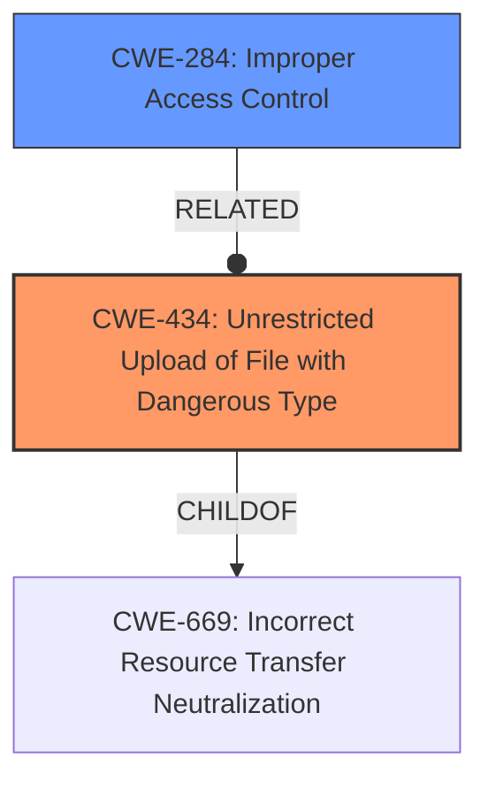

# Analysis Report for CVE-2022-39019

# Vulnerability Analysis Report: CVE-2022-39019

## Description


## Analysis (with Relationship Data)

# Summary
| CWE ID | CWE Name | Confidence | CWE Abstraction Level | CWE Vulnerability Mapping Label | CWE-Vulnerability Mapping Notes |
|---|---|---|---|---|---|
| CWE-434 | Unrestricted Upload of File with Dangerous Type | 1.0 | Base | Allowed | Primary CWE |
| CWE-284 | Improper Access Control | 0.7 | Pillar | Discouraged | Secondary Candidate |

## Evidence and Confidence

*   **Confidence Score:** 0.9
*   **Evidence Strength:** HIGH

## Relationship Analysis
The primary CWE is CWE-434, which describes the vulnerability of allowing unrestricted file uploads of dangerous types. CWE-434 is a base level CWE, which is preferred. It is a child of CWE-669: Incorrect Resource Transfer Neutralization. A secondary CWE to consider is CWE-284, Improper Access Control. It is a parent to CWE-862, CWE-863, CWE-732, CWE-306, CWE-1390, and CWE-923. Due to the rootcause of the vulnerability being **broken access controls**, CWE-284 is considered. However, CWE-284 is too high level of a CWE, so it is not the primary CWE.



## Vulnerability Chain
The vulnerability chain starts with **broken access controls** (potentially CWE-284), leading to the ability for unauthenticated attackers to upload malicious files (CWE-434), which can then be executed on the application server, potentially leading to further exploitation.

## Summary of Analysis
The initial assessment, based on the provided evidence, points to CWE-434 as the primary weakness, with CWE-284 as a related but higher-level concern.

The **Vulnerability Description** states "Broken access controls on PDFtron WebviewerUI in M-Files Hubshare before 3.3.11.3 allows unauthenticated attackers to upload malicious files to the application server."

The **Vulnerability Description Key Phrases** includes:
- **rootcause:** **broken access controls**
- **impact:** upload malicious files
- **attacker:** unauthenticated attackers

The **CVE Reference Links Content Summary** states "Root cause of vulnerability: **Broken access controls** in the PDFtron WebviewerUI component of M-Files Hubshare." and "Weaknesses/vulnerabilities present: Unauthenticated file upload vulnerability. The application fails to properly restrict access to the file upload functionality in the PDFtron WebviewerUI."

The Retriever Results identify CWE-434 with the highest density score. It also identifies CWE-284 as the top sparse result.

CWE-434 and CWE-284 were considered for this vulnerability.
- CWE-434 (Unrestricted Upload of File with Dangerous Type) is a Base level CWE, which is preferred. The description "The product allows the upload or transfer of dangerous file types that are automatically processed within its environment" matches the **impact** of the vulnerability, which allows "unauthenticated attackers to upload malicious files to the application server". Therefore, this is the primary CWE.
- CWE-284 (Improper Access Control) is a Pillar level CWE. While the **rootcause** of the vulnerability is **broken access controls**, the CWE is too high-level and vague. The description "The product does not restrict or incorrectly restricts access to a resource from an unauthorized actor" does describe the **rootcause** of the vulnerability, but is too generic. The mapping guidance recommends against using this CWE because it is "extremely high-level" and "not useful for trend analysis". Therefore, this is a secondary CWE.

The selection of CWE-434 is at the optimal level of specificity because it accurately captures the nature of the vulnerability, which is the ability to upload malicious files due to **broken access controls**. This is more specific than simply stating there is an access control issue (CWE-284), and aligns with the evidence that the vulnerability leads to unrestricted file uploads.


## CWE Relationship Analysis

Current CWEs represent these abstraction levels: .


### Vulnerability Chain Analysis

**Chain starting from CWE-862:**
- 862 (Missing Authorization) - ROOT


**Chain starting from CWE-434:**
- 434 (Unrestricted Upload of File with Dangerous Type) - ROOT


### CWE Relationship Diagram

```mermaid
graph TD
    classDef primary fill:#f96,stroke:#333,stroke-width:2px
    classDef secondary fill:#69f,stroke:#333
    classDef tertiary fill:#9e9,stroke:#333
```


*Report generated on 2025-03-31 05:04:18*
