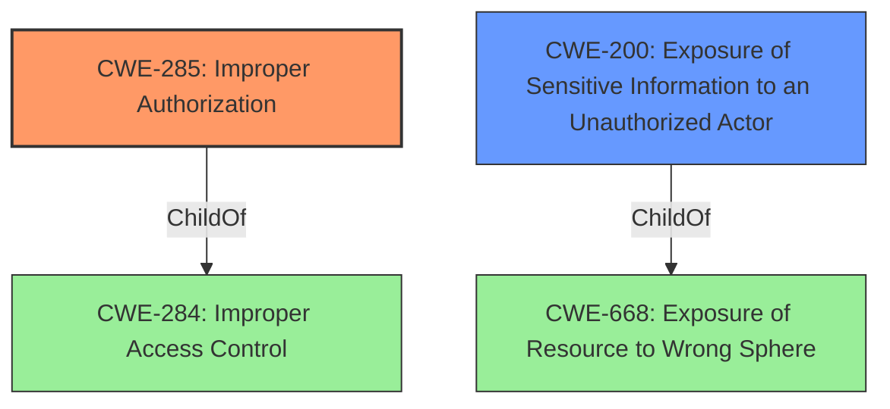

# Enhanced Analysis for CVE-2022-39030

# Summary
| CWE ID | CWE Name | Confidence | CWE Abstraction Level | CWE Vulnerability Mapping Label | CWE-Vulnerability Mapping Notes |
|---|---|---|---|---|---|
| CWE-285 | Improper Authorization | 0.85 | Class | Primary | Allowed |
| CWE-200 | Exposure of Sensitive Information to an Unauthorized Actor | 0.7 | Class | Secondary | Discouraged |

## Evidence and Confidence

*   **Confidence Score:** 0.8
*   **Evidence Strength:** HIGH

## Relationship Analysis
The primary CWE selected is CWE-285 Improper Authorization (Class). It is a child of CWE-284 Improper Access Control (Pillar) which is a more general case of access control issues. The secondary CWE is CWE-200 Exposure of Sensitive Information to an Unauthorized Actor, also a Class. It is a child of CWE-668 Exposure of Resource to Wrong Sphere (Class), which represents resources being exposed to the wrong control sphere. While CWE-284 is higher level and discouraged, CWE-285 is more specific and better reflects the root cause. CWE-200 represents the impact of the **inadequate authorization**.



## Vulnerability Chain
The vulnerability chain starts with **inadequate authorization**, leading to **access to sensitive information**.

## Summary of Analysis
The vulnerability description states that smart eVision has **inadequate authorization** for system information query function, allowing an unauthenticated remote attacker to access sensitive information. The CVE reference links confirm that the root cause is improper authorization, leading to the exposure of administrator account credentials.

The initial assessment considered CWE-284 (Improper Access Control) but was deemed too general as it is a Pillar level CWE. CWE-863 (Incorrect Authorization) and CWE-639 (Authorization Bypass Through User-Controlled Key) were also considered. However, CWE-285 (Improper Authorization) was selected as the primary CWE because it directly reflects the **root cause** of the vulnerability, which is that the system does not properly perform authorization checks, it is more specific than CWE-284, and it encompasses the scenario described in the vulnerability description, where an unauthenticated attacker can access sensitive information due to **inadequate authorization**. CWE-200 (Exposure of Sensitive Information to an Unauthorized Actor) was considered as a secondary CWE because it represents the impact of the vulnerability, but it is discouraged for root cause analysis.

The selected CWEs are at the optimal level of specificity because they accurately capture the **root cause** (**improper authorization**) and the resulting impact (**exposure of sensitive information**) without being overly broad or narrow in scope. The evidence from the vulnerability description and CVE reference links directly supports this classification.


## CWE Relationship Analysis

Current CWEs represent these abstraction levels: .


### Vulnerability Chain Analysis

**Chain starting from CWE-200:**
- 200 (Exposure of Sensitive Information to an Unauthorized Actor) - ROOT


**Chain starting from CWE-668:**
- 668 (Exposure of Resource to Wrong Sphere) - ROOT


### CWE Relationship Diagram

```mermaid
graph TD
    classDef primary fill:#f96,stroke:#333,stroke-width:2px
    classDef secondary fill:#69f,stroke:#333
    classDef tertiary fill:#9e9,stroke:#333
```