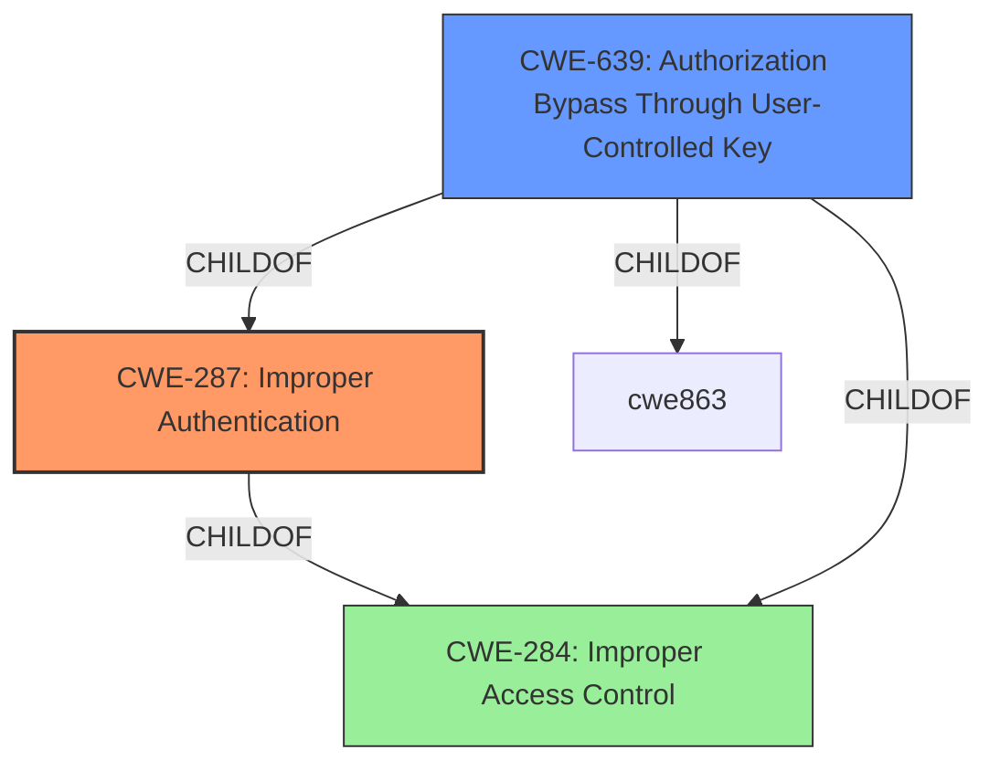

# Analysis for CVE-2022-39038

# Summary

| CWE ID | CWE Name | Confidence | CWE Abstraction Level | CWE Vulnerability Mapping Label | CWE-Vulnerability Mapping Notes |
|---|---|---|---|---|---|
| CWE-287 | Improper Authentication | 0.9 | Class | Primary | Discouraged, but most fitting based on the provided information. Consider children or descendants, beginning with CWE-1390: Weak Authentication or CWE-306: Missing Authentication for Critical Function. |
| CWE-639 | Authorization Bypass Through User-Controlled Key | 0.7 | Base | Secondary | Allowed. Addresses the mechanism of bypassing authorization by manipulating user identifiers. |

## Evidence and Confidence

*   **Confidence Score:** 0.8
*   **Evidence Strength:** HIGH

## Relationship Analysis

The primary relationship influencing the decision is the hierarchical structure with CWE-287 as a Class and CWE-639 as a child. Since the vulnerability involves **improper authentication** leading to privilege escalation by changing user account names, CWE-287 serves as the broader classification. However, the specific mechanism of achieving this, through user-controlled keys, is captured by CWE-639.

## Vulnerability Chain

The chain of events in this vulnerability is as follows:

1.  **Improper Authentication (CWE-287):** The system **fails to properly authenticate** user identity claims.
2.  **Authorization Bypass Through User-Controlled Key (CWE-639):** A user can **manipulate their account name** to gain access to another user's account.
3.  **Privilege Escalation:** This leads to gaining unauthorized privileges.
4.  **Access and Manipulation of System:** The attacker can now access and manipulate the system.

## Summary of Analysis

The initial assessment pointed towards **improper authentication** as the primary issue, since a remote attacker with general user privilege can change the name of the user account to acquire arbitrary account privilege. The "Vulnerability Description Key Phrases" section identified **improper authentication** as the root cause. Further investigation of the "CVE Reference Links Content Summary" reveals the weakness lies in "Broken Access Control" where "the system does not properly validate user permissions" and "does not prevent a logged-in user from changing their username to impersonate another user".

While the Retriever Results suggest CWE-287, **Improper Authentication**, as a top candidate, it is a Class-level CWE and is discouraged. However, based on the provided information, it is the most fitting primary CWE. CWE-639, **Authorization Bypass Through User-Controlled Key**, is selected as a secondary CWE because the **attacker modifies the key value** (username) identifying the data.

The selection of CWEs is based on the evidence that the system **incorrectly authenticates users**, allowing them to **modify usernames and gain unauthorized access**. The chain of weaknesses begins with **improper authentication**, followed by the authorization bypass and privilege escalation.

Relevant CWE Information:

# Enhanced Context (25 CWEs)
The following CWEs were identified as potentially relevant to this vulnerability:

## CWE-274: Improper Handling of Insufficient Privileges
**Abstraction Level**: Base
**Similarity Score**: 0.77
**Source**: dense

**Description**:
The product does not handle or incorrectly handles when it has insufficient privileges to perform an operation, leading to resultant weaknesses.

**Mapping Guidance**:
- Usage: Discouraged
- Rationale: This CWE entry could be deprecated in a future version of CWE.

*Not selected because the issue is not about handling insufficient privileges, but about gaining excessive privileges through **improper authentication**.*

## CWE-1220: Insufficient Granularity of Access Control
**Abstraction Level**: Base
**Similarity Score**: 0.76
**Source**: dense

**Description**:
The product implements access controls via a policy or other feature with the intention to disable or restrict accesses (reads and/or writes) to assets in a system from untrusted agents. However, implemented access controls lack required granularity, which renders the control policy too broad because it allows accesses from unauthorized agents to the security-sensitive assets.

**Mapping Guidance**:
- Usage: Allowed
- Rationale: This CWE entry is at the Base level of abstraction, which is a preferred level of abstraction for mapping to the root causes of vulnerabilities.

*Not selected because the primary issue is **improper authentication** and not the granularity of access controls.*

## CWE-639: Authorization Bypass Through User-Controlled Key
**Abstraction Level**: Base
**Similarity Score**: 0.76
**Source**: dense

**Description**:
The system's authorization functionality does not prevent one user from gaining access to another user's data or record by modifying the key value identifying the data.

**Mapping Guidance**:
- Usage: Allowed
- Rationale: This CWE entry is at the Base level of abstraction, which is a preferred level of abstraction for mapping to the root causes of vulnerabilities.

*Selected as a secondary CWE because it captures the specific mechanism of bypassing authorization by manipulating user identifiers.*

## CWE-280: Improper Handling of Insufficient Permissions or Privileges 
**Abstraction Level**: Base
**Similarity Score**: 0.76
**Source**: dense

**Description**:
The product does not handle or incorrectly handles when it has insufficient privileges to access resources or functionality as specified by their permissions. This may cause it to follow unexpected code paths that may leave the product in an invalid state.

**Mapping Guidance**:
- Usage: Allowed
- Rationale: This CWE entry is at the Base level of abstraction, which is a preferred level of abstraction for mapping to the root causes of vulnerabilities.

*Not selected because the issue is not about handling insufficient privileges but rather **improper authentication**.*

## CWE-472: External Control of Assumed-Immutable Web Parameter
**Abstraction Level**: Base
**Similarity Score**: 0.75
**Source**: dense

**Description**:
The web application does not sufficiently verify inputs that are assumed to be immutable but are actually externally controllable, such as hidden form fields.

**Mapping Guidance**:
- Usage: Allowed
- Rationale: This CWE entry is at the Base level of abstraction, which is a preferred level of abstraction for mapping to the root causes of vulnerabilities.

*Not selected because while the username is externally controllable, the core issue is with the authentication process itself.*

## CWE-807: Reliance on Untrusted Inputs in a Security Decision
**Abstraction Level**: Base
**Similarity Score**: 0.75
**Source**: dense

**Description**:
The product uses a protection mechanism that relies on the existence or values of an input, but the input can be modified by an untrusted actor in a way that bypasses the protection mechanism.

**Mapping Guidance**:
- Usage: Allowed
- Rationale: This CWE entry is at the Base level of abstraction, which is a preferred level of abstraction for mapping to the root causes of vulnerabilities.

*Not selected because the primary issue is **improper authentication**, not a reliance on untrusted input for a security decision.*

## CWE-653: Improper Isolation or Compartmentalization
**Abstraction Level**: Class
**Similarity Score**: 0.75
**Source**: dense

**Description**:
The product does not properly compartmentalize or isolate functionality, processes, or resources that require different privilege levels, rights, or permissions.

**Mapping Guidance**:
- Usage: Allowed
- Rationale: This CWE entry is at the Base level of abstraction, which is a preferred level of abstraction for mapping to the root causes of vulnerabilities.

*Not selected because the vulnerability is more directly related to **improper authentication** than a general lack of isolation.*

## CWE-266: Incorrect Privilege Assignment
**Abstraction Level**: Base
**Similarity Score**: 0.75
**Source**: dense

**Description**:
A product incorrectly assigns a privilege to a particular actor, creating an unintended sphere of control for that actor.

**Mapping Guidance**:
- Usage: Allowed
- Rationale: This CWE entry is at the Base level of abstraction, which is a preferred level of abstraction for mapping to the root causes of vulnerabilities.

*Not selected because the core issue is **improper authentication** leading to incorrect privilege assignment, not the assignment itself.*

## CWE-424: Improper Protection of Alternate Path
**Abstraction Level**: Class
**Similarity Score**: 0.74
**Source**: dense

**Description**:
The product does not sufficiently protect all possible paths that a user