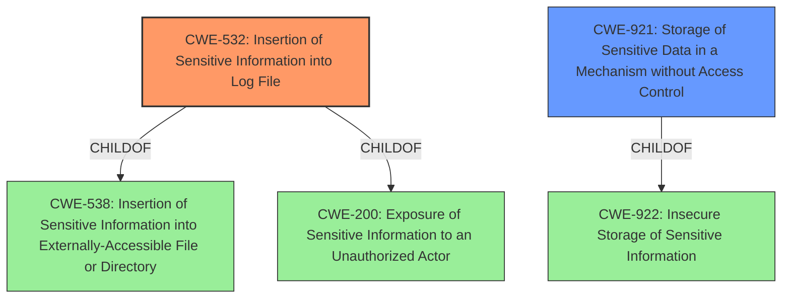

# Analysis for CVE-2022-39043

# Summary

| CWE ID  | CWE Name                                                        | Confidence | CWE Abstraction Level | CWE Vulnerability Mapping Label | CWE-Vulnerability Mapping Notes |
| ------- | --------------------------------------------------------------- | ---------- | --------------------- | ------------------------------- | ----------------------------- |
| CWE-532 | Insertion of Sensitive Information into Log File                | 0.9        | Base                  | Primary                         | Allowed                       |
| CWE-921 | Storage of Sensitive Data in a Mechanism without Access Control | 0.7        | Base                  | Secondary                       | Allowed                       |

## Evidence and Confidence

*   **Confidence Score:** 0.8
*   **Evidence Strength:** HIGH

## Relationship Analysis

The primary relationship influencing the CWE selection is that CWE-532 (Insertion of Sensitive Information into Log File) is a child of CWE-538 (Insertion of Sensitive Information into Externally-Accessible File or Directory) and CWE-200 (Exposure of Sensitive Information to an Unauthorized Actor). While CWE-200 is a broader class, CWE-532 is more specific to the **insertion of sensitive information into logs**, which aligns directly with the vulnerability description. CWE-921 (Storage of Sensitive Data in a Mechanism without Access Control) highlights the lack of access control on the external storage, making it a relevant secondary factor.

## Vulnerability Chain

The vulnerability chain starts with the **insertion of sensitive information into debug logs** (CWE-532). These logs are then stored in a location without proper access controls (CWE-921), leading to the **exposure of sensitive information** (contacts) to an unauthenticated physical attacker.

## Summary of Analysis

The primary classification, CWE-532, is based on the explicit statement in the vulnerability description and CVE summary that the Juiker app stores debug logs containing sensitive information. The "Vulnerability Description Key Phrases" also state "acquire partial user information such as personal contacts" due to the **impact of the vulnerability**. The "CVE Reference Links Content Summary" states "The Juiker app stores debug logs containing sensitive information in the phone's external storage (e.g., SD card)."

CWE-921 is a secondary classification because the issue is compounded by the fact that the external storage lacks proper access control, allowing easy access to the logs. This lack of access control is highlighted in the CVE summary as well.

The graph relationships helped to refine the selection by highlighting the connection between CWE-532, CWE-538, and CWE-200, confirming that the chosen CWE is appropriately specific. CWE-532 is at the optimal level of specificity because it accurately describes the **root cause** of the vulnerability, which is the **insertion of sensitive information into log files**. The retriever results also list CWE-532 at the top.

Relevant CWE Information:

# Enhanced Context (25 CWEs)

## CWE-532: Insertion of Sensitive Information into Log File

**Abstraction:** Base
**Status:** Incomplete

### Description

The product writes sensitive information to a log file.

### Extended Description

Not provided

### Alternative Terms

None

### Relationships

ChildOf -> CWE-538
ChildOf -> CWE-200

### Mapping Guidance

**Usage:** Allowed
**Rationale:** This CWE entry is at the Base level of abstraction, which is a preferred level of abstraction for mapping to the root causes of vulnerabilities.
**Comments:** Carefully read both the name and description to ensure that this mapping is an appropriate fit. Do not try to 'force' a mapping to a lower-level Base/Variant simply to comply with this preferred level of abstraction.
**Reasons:**
- Acceptable-Use

### Observed Examples

-   **CVE-2017-9615:** verbose logging stores admin credentials in a world-readable log file
-   **CVE-2018-1999036:** SSH password for private key stored in build log

## CWE-921: Storage of Sensitive Data in a Mechanism without Access Control

**Abstraction:** Base
**Status:** Incomplete

### Description

The product stores sensitive information in a file system or device that does not have built-in access control.

### Extended Description

While many modern file systems or devices utilize some form of access control in order to restrict access to data, not all storage mechanisms have this capability. For example, memory cards, floppy disks, CDs, and USB devices are typically made accessible to any user within the system. This can become a problem when sensitive data is stored in these mechanisms in a multi-user environment, because anybody on the system can read or write this data.

On Android devices, external storage is typically globally readable and writable by other applications on the device. External storage may also be easily accessible through the mobile device's USB connection or physically accessible through the device's memory card port.

### Alternative Terms

None

### Relationships

ChildOf -> CWE-922

### Mapping Guidance

**Usage:** Allowed
**Rationale:** This CWE entry is at the Base level of abstraction, which is a preferred level of abstraction for mapping to the root causes of vulnerabilities.
**Comments:** Carefully read both the name and description to ensure that this mapping is an appropriate fit. Do not try to 'force' a mapping to a lower-level Base/Variant simply to comply with this preferred level of abstraction.
**Reasons:**
- Acceptable-Use

## CWEs Considered But Not Used:

*   **CWE-200 (Exposure of Sensitive Information to an Unauthorized Actor):** While the vulnerability ultimately results in information exposure, it is a consequence of the **insertion of sensitive information into logs** and the **lack of access control**. CWE-200 is too broad and does not capture the specific nature of the weakness. The mapping guidance discourages its use when more specific CWEs are available.
*   **CWE-259 (Use of Hard-coded Password) and CWE-321 (Use of Hard-coded Cryptographic Key):** These CWEs are not relevant as the vulnerability does not involve hard-coded credentials or cryptographic keys.
*   **CWE-522 (Insufficiently Protected Credentials) and CWE-256 (Plaintext Storage of a Password):** These are not relevant as the vulnerability is not about password storage.
*   **CWE-209 (Generation of Error Message Containing Sensitive Information) and CWE-1295 (Debug Messages Revealing Unnecessary Information):** While debug logs are involved, the issue is not about error messages or general debug information, but about the deliberate **insertion of sensitive information into those logs**.
*   **CWE-639 (Authorization Bypass Through User-Controlled Key):** Not relevant as the vulnerability is not about bypassing authorization through a user-controlled key.