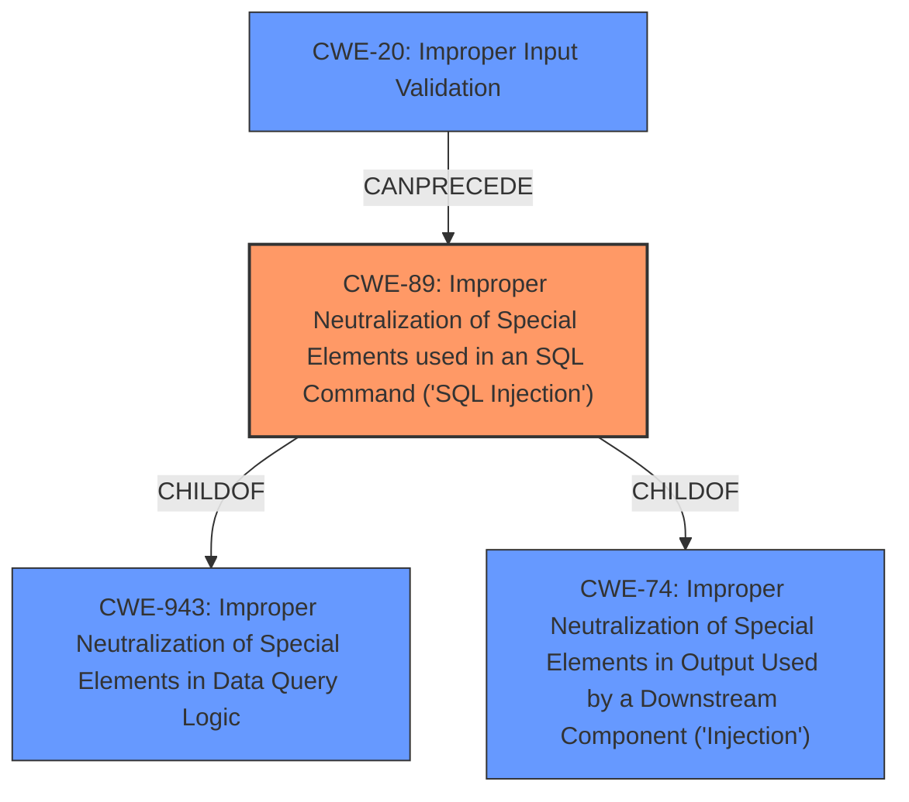

# Analysis Report for CVE-2022-39056

# Vulnerability Analysis Report: CVE-2022-39056

## Description


## Analysis (with Relationship Data)

# Summary
| CWE ID | CWE Name | Confidence | CWE Abstraction Level | CWE Vulnerability Mapping Label | CWE-Vulnerability Mapping Notes |
|---|---|---|---|---|---|
| CWE-89 | Improper Neutralization of Special Elements used in an SQL Command ('SQL Injection') | 1.0 | Base | Allowed | Primary CWE. The vulnerability description clearly states "SQL injection" and the root cause is **insufficient input validation**. |
| CWE-20 | Improper Input Validation | 0.6 | Class | Discouraged | Secondary CWE. While **insufficient input validation** is mentioned, CWE-89 is a more specific and appropriate classification. |

## Evidence and Confidence

*   **Confidence Score:** 0.9
*   **Evidence Strength:** HIGH

## Relationship Analysis
The primary CWE is CWE-89, which is a base CWE and a child of both CWE-943 and CWE-74, indicating that SQL Injection is related to improper data query logic and a type of injection. CWE-20, Improper Input Validation, can precede CWE-89.



## Vulnerability Chain
The vulnerability chain starts with **insufficient input validation**, leading to a **SQL injection** vulnerability. This allows an attacker to access, modify, and delete database information.

## Summary of Analysis
The primary weakness is CWE-89, SQL Injection, due to **insufficient validation of user input**. The vulnerability description explicitly mentions "SQL injection", making it a clear match. CWE-20 is a secondary consideration because it represents the general class of input validation issues, but CWE-89 provides a more specific classification.

Evidence for CWE-89 is strong:
*   Vulnerability Description Key Phrases: "**rootcause:** **insufficient input validation**", "**weakness:** **SQL injection**"
*   CVE Reference Links Content Summary: "**Weaknesses/vulnerabilities present**: SQL injection vulnerability", "**Root cause of vulnerability**: The RAVA Certificate Verification System website does not validate user inputs in specific function parameters."

I considered and rejected several other CWEs:

*   CWE-74 and CWE-943: While CWE-89 is a child of these, CWE-89 is a more specific match.
*   CWE-791: This could be relevant if there was filtering happening and it was incomplete. However, the description describes validation, not filtering.
*   CWE-116: This CWE concerns improper encoding or escaping of output, not the initial input validation.
*   CWE-566: Authorization Bypass Through User-Controlled SQL Primary Key: This is a more specific type of SQL injection. The description does not indicate that is the specific case.
*   CWE-120: This is a buffer overflow. This is not indicated in the description.
*   CWE-918: This is Server-Side Request Forgery, which does not apply.
*   CWE-22: This is Path Traversal, which does not apply.

The selection of CWE-89 is at the optimal level of specificity, as it directly reflects the SQL injection vulnerability.


## CWE Relationship Analysis

Current CWEs represent these abstraction levels: .


### Vulnerability Chain Analysis

**Chain starting from CWE-89:**
- 89 (Improper Neutralization of Special Elements used in an SQL Command ('SQL Injection')) - ROOT


**Chain starting from CWE-918:**
- 918 (Server-Side Request Forgery (SSRF)) - ROOT


### CWE Relationship Diagram

```mermaid
graph TD
    classDef primary fill:#f96,stroke:#333,stroke-width:2px
    classDef secondary fill:#69f,stroke:#333
    classDef tertiary fill:#9e9,stroke:#333
```


*Report generated on 2025-03-31 04:04:59*
