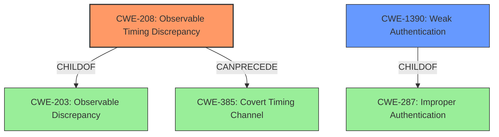

# Enhanced Analysis for CVE-2022-3907

# Summary
| CWE ID | CWE Name | Confidence | CWE Abstraction Level | CWE Vulnerability Mapping Label | CWE-Vulnerability Mapping Notes |
|---|---|---|---|---|---|
| CWE-208 | Observable Timing Discrepancy | 1 | Base | Primary | Allowed |
| CWE-1390 | Weak Authentication | 0.7 | Class | Secondary | Allowed-with-Review |

## Evidence and Confidence

*   **Confidence Score:** 0.85
*   **Evidence Strength:** HIGH

## Relationship Analysis
The primary CWE identified is CWE-208 (**Observable Timing Discrepancy**), which is a Base level CWE. CWE-208 is a child of CWE-203 (**Observable Discrepancy**). It can precede CWE-385 (**Covert Timing Channel**). A secondary CWE is CWE-1390 (**Weak Authentication**), which is a Class level CWE and a child of CWE-287 (**Improper Authentication**). The relationship between CWE-208 and CWE-1390 is that a timing discrepancy can be a contributing factor to weak authentication schemes, making it easier for attackers to bypass them. Selecting CWE-208 is a better fit since the **root cause** is the **usage of comparison operators to verify API keys** which leads to the **weakness** of **time-based attacks**.



## Vulnerability Chain
The vulnerability chain starts with the **improper implementation** of API key validation using comparison operators, which introduces an **observable timing discrepancy**. This discrepancy can be exploited by attackers to perform **time-based attacks**, ultimately leading to **authentication bypass** and **sensitive data disclosure** (API keys).

## Summary of Analysis
The initial analysis identified the **root cause** as the **usage of comparison operators to verify API keys** leading to **time-based attacks**.
The evidence supports the selection of CWE-208 (**Observable Timing Discrepancy**) as the primary CWE. The "CVE Reference Links Content Summary" states, "The core weakness is that the API key validation process is vulnerable to timing attacks. By sending a series of requests with varying, incorrect keys, an attacker can observe slight differences in response times. This can be used to deduce the correct keys by determining which requests take slightly longer, which indicates a partial match."

CWE-1390 (**Weak Authentication**) was also considered as a secondary CWE. While the vulnerability ultimately leads to authentication bypass, the **root cause** is the **timing discrepancy** in the API key validation process, making CWE-208 more directly relevant.

The selected CWEs are at the optimal level of specificity. CWE-208 is a Base level CWE, which is preferred for mapping to the root causes of vulnerabilities. CWE-1390 is a Class level CWE, but is included as a secondary weakness because the timing discrepancy contributes to the overall weakness of the authentication scheme.

Relevant CWE Information:

# Enhanced Context (25 CWEs)

## CWE-807: Reliance on Untrusted Inputs in a Security Decision
**Abstraction Level**: Base
**Similarity Score**: 0.78
**Source**: dense

**Description**:
The product uses a protection mechanism that relies on the existence or values of an input, but the input can be modified by an untrusted actor in a way that bypasses the protection mechanism.

**Mapping Guidance**:
- Usage: Allowed
- Rationale: This CWE entry is at the Base level of abstraction, which is a preferred level of abstraction for mapping to the root causes of vulnerabilities.

*Not Used*: While relevant, the core issue is the timing discrepancy, not the reliance on untrusted inputs directly.

## CWE-472: External Control of Assumed-Immutable Web Parameter
**Abstraction Level**: Base
**Similarity Score**: 0.78
**Source**: dense

**Description**:
The web application does not sufficiently verify inputs that are assumed to be immutable but are actually externally controllable, such as hidden form fields.

**Mapping Guidance**:
- Usage: Allowed
- Rationale: This CWE entry is at the Base level of abstraction, which is a preferred level of abstraction for mapping to the root causes of vulnerabilities.

*Not Used*: This CWE is not relevant because the vulnerability is not related to the external control of assumed-immutable web parameters.

## CWE-208: Observable Timing Discrepancy
**Abstraction Level**: Base
**Similarity Score**: 0.78
**Source**: dense

**Description**:
Two separate operations in a product require different amounts of time to complete, in a way that is observable to an actor and reveals security-relevant information about the state of the product, such as whether a particular operation was successful or not.

**Mapping Guidance**:
- Usage: Allowed
- Rationale: This CWE entry is at the Base level of abstraction, which is a preferred level of abstraction for mapping to the root causes of vulnerabilities.

*Used*: This is the primary CWE because the vulnerability involves a timing discrepancy that can be observed by an attacker.

## CWE-639: Authorization Bypass Through User-Controlled Key
**Abstraction Level**: Base
**Similarity Score**: 0.78
**Source**: dense

**Description**:
The system's authorization functionality does not prevent one user from gaining access to another user's data or record by modifying the key value identifying the data.

**Mapping Guidance**:
- Usage: Allowed
- Rationale: This CWE entry is at the Base level of abstraction, which is a preferred level of abstraction for mapping to the root causes of vulnerabilities.

*Not Used*: This CWE is not the best fit because the vulnerability is not directly about authorization bypass through user-controlled keys, but rather about the timing discrepancy in the key validation process.

## CWE-1390: Weak Authentication
**Abstraction Level**: Class
**Similarity Score**: 0.77
**Source**: dense

**Description**:
The product uses an authentication mechanism to restrict access to specific users or identities, but the mechanism does not sufficiently prove that the claimed identity is correct.

**Mapping Guidance**:
- Usage: Allowed-with-Review
- Rationale: This CWE entry is a Class and might have Base-level children that would be more appropriate

*Used*: This is a secondary CWE because the timing discrepancy weakens the authentication mechanism.

## CWE-303: Incorrect Implementation of Authentication Algorithm
**Abstraction Level**: Base
**Similarity Score**: 0.77
**Source**: dense

**Description**:
The requirements for the product dictate the use of an established authentication algorithm, but the implementation of the algorithm is incorrect.

**Mapping Guidance**:
- Usage: Allowed
- Rationale: This CWE entry is at the Base level of abstraction, which is a preferred level of abstraction for mapping to the root causes of vulnerabilities.

*Not Used*: While the implementation is incorrect, the core issue is the timing discrepancy caused by the comparison operators, not a fundamentally flawed authentication algorithm.

## CWE-1391: Use of Weak Credentials
**Abstraction Level**: Class
**Similarity Score**: 0.76
**Source**: dense

**Description**:
The product uses weak credentials (such as a default key or hard-coded password) that can be calculated, derived, reused, or guessed by an attacker.

**Mapping Guidance**:
- Usage: Allowed-with-Review
- Rationale: This CWE entry is a Class and might have Base-level children that would be more appropriate

*Not Used*: The vulnerability is not about the use of weak credentials, but rather the timing discrepancy in the API key validation process.

## CWE-302: Authentication Bypass by Assumed-Immutable Data
**Abstraction Level**: Base
**Similarity Score**: 0.76
**Source**: dense

**Description**:
The authentication scheme or implementation uses key data elements that are assumed to be immutable, but can be controlled or modified by the attacker.

**Mapping Guidance**:
- Usage: Allowed
- Rationale: This CWE entry is at the Base level of abstraction, which is a preferred level of abstraction for mapping to the root causes of vulnerabilities.

*Not Used*: This CWE is not the best fit because the vulnerability is not about authentication bypass through assumed-immutable data, but rather the timing discrepancy in the key validation process.

## CWE-668: Exposure of Resource to Wrong Sphere
**Abstraction Level**: Class


## CWE Relationship Analysis

Current CWEs represent these abstraction levels: .


### Vulnerability Chain Analysis

**Chain starting from CWE-208:**
- 208 (Observable Timing Discrepancy) - ROOT


**Chain starting from CWE-203:**
- 203 (Observable Discrepancy) - ROOT


### CWE Relationship Diagram

```mermaid
graph TD
    classDef primary fill:#f96,stroke:#333,stroke-width:2px
    classDef secondary fill:#69f,stroke:#333
    classDef tertiary fill:#9e9,stroke:#333
```