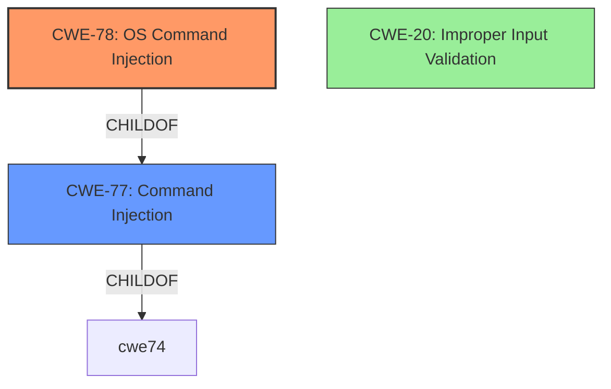

# Raw Analyzer Response for CVE-2022-39073

# Summary
| CWE ID | CWE Name | Confidence | CWE Abstraction Level | CWE Vulnerability Mapping Label | CWE-Vulnerability Mapping Notes |
|---|---|---|---|---|---|
| CWE-78 | Improper Neutralization of Special Elements used in an OS Command ('OS Command Injection') | 1.0 | Base | Allowed | Primary CWE: Matches the root cause of the vulnerability where **insufficient input validation** leads to **command injection**. |
| CWE-20 | Improper Input Validation | 0.7 | Class | Discouraged | Secondary CWE: The vulnerability stems from **insufficient input validation**, but CWE-20 is too general. |

## Evidence and Confidence

*   **Confidence Score:** 0.9
*   **Evidence Strength:** HIGH

## Relationship Analysis
The primary relationship that influenced the selection was the parent-child relationship between CWE-77 and CWE-78, where CWE-78 is a more specific case of CWE-77, focusing on OS commands. CWE-20 was considered as a potential contributing factor, but ultimately deemed too general.

## Vulnerability Chain
The vulnerability chain starts with **insufficient input validation** which leads to **OS command injection**, enabling an attacker to execute arbitrary commands.

## Summary of Analysis
The initial analysis identified a **command injection** vulnerability due to **insufficient input validation**. The retriever results suggested CWE-77 and CWE-78 as potential matches. After reviewing the CWE specifications, CWE-78 was selected as the primary CWE because it specifically addresses **OS command injection**, which aligns with the vulnerability description. While **insufficient input validation** is a contributing factor, CWE-20 is too general and doesn't capture the specific nature of the vulnerability. The final decision is based on the evidence from the vulnerability description and the CWE specifications, focusing on the root cause and the specific type of command injection.

Relevant CWE Information:

# Enhanced Context (25 CWEs)
The following CWEs were identified as potentially relevant to this vulnerability:

## CWE-74: Improper Neutralization of Special Elements in Output Used by a Downstream Component ('Injection')
**Abstraction Level**: Class
**Similarity Score**: 0.75
**Source**: dense

**Description**:
The product constructs all or part of a command, data structure, or record using externally-influenced input from an upstream component, but it does not neutralize or incorrectly neutralizes special elements that could modify how it is parsed or interpreted when it is sent to a downstream component.

**Mapping Guidance**:
- Usage: Discouraged
- Rationale: CWE-74 is high-level and often misused when lower-level weaknesses are more appropriate.

## CWE-77: Improper Neutralization of Special Elements used in a Command ('Command Injection')
**Abstraction:** Class
**Status:** Draft

### Description
The product constructs all or part of a command using externally-influenced input from an upstream component, but it does not neutralize or incorrectly neutralizes special elements that could modify the intended command when it is sent to a downstream component.

### Extended Description

Many protocols and products have their own custom command language. While OS or shell command strings are frequently discovered and targeted, developers may not realize that these other command languages might also be vulnerable to attacks.

### Alternative Terms
Command injection: an attack-oriented phrase for this weakness. Note: often used when "OS command injection" (CWE-78) was intended.

### Relationships
ChildOf -> CWE-74
ChildOf -> CWE-74

### Mapping Guidance
**Usage:** Allowed-with-Review
**Rationale:** CWE-77 is often misused when OS command injection (CWE-78) was intended instead [REF-1287].
**Comments:** Ensure that the analysis focuses on the root-cause error that allows the execution of commands, as there are many weaknesses that can lead to this consequence. See Terminology Notes. If the weakness involves a command language besides OS shell invocation, then CWE-77 could be used.
**Reasons:**
- Frequent Misuse
**Suggested Alternatives:**
- CWE-78: OS Command Injection

## CWE-78: Improper Neutralization of Special Elements used in an OS Command ('OS Command Injection')
**Abstraction:** Base
**Status:** Stable

### Description
The product constructs all or part of an OS command using externally-influenced input from an upstream component, but it does not neutralize or incorrectly neutralizes special elements that could modify the intended OS command when it is sent to a downstream component.

### Extended Description

This weakness can lead to a vulnerability in environments in which the attacker does not have direct access to the operating system, such as in web applications. Alternately, if the weakness occurs in a privileged program, it could allow the attacker to specify commands that normally would not be accessible, or to call alternate commands with privileges that the attacker does not have. The problem is exacerbated if the compromised process does not follow the principle of least privilege, because the attacker-controlled commands may run with special system privileges that increases the amount of damage.

## CWE-20: Improper Input Validation
**Abstraction:** Class
**Status:** Stable

### Description
The product receives input or data, but it does
        not validate or incorrectly validates that the input has the
        properties that are required to process the data safely and
        correctly.

### Extended Description

Input validation is a frequently-used technique for checking potentially dangerous inputs in order to ensure that the inputs are safe for processing within the code, or when communicating with other components. When software does not validate input properly, an attacker is able to craft the input in a form that is not expected by the rest of the application. This will lead to parts of the system receiving unintended input, which may result in altered control flow, arbitrary control of a resource, or arbitrary code execution.

### Technical Explanation for CWE-78:
The ZTE MF286R device **does not properly neutralize special elements** in user-supplied input when constructing OS commands. This allows an attacker to inject arbitrary commands that are then executed by the system.

*   **How the vulnerability's details match the CWE's characteristics:** The vulnerability description explicitly states a **command injection** vulnerability due to **insufficient validation of input parameters**, which directly aligns with CWE-78's description of improper neutralization of special elements in OS commands.
*   **The security implications and potential impact:** An attacker can execute arbitrary commands, potentially leading to a complete compromise of the device.
*   **Any parent-child relationships or chain patterns that influenced your mapping:** CWE-78 is a child of CWE-77 (Improper Neutralization of Special Elements used in a Command) and CWE-74 (Improper Neutralization of Special Elements in Output Used by a Downstream Component ('Injection')). This hierarchical relationship supports the selection of CWE-78 as a more specific and appropriate classification than its parents.
*   **Whether the weakness is primary or secondary in the vulnerability:** CWE-78 is the primary weakness, as it directly describes the root cause of the vulnerability.
*   **How the official MITRE mapping guidance influenced your decision:** The MITRE mapping guidance for CWE-78 recommends its use when the vulnerability involves improper neutralization of special elements in OS commands, which aligns perfectly with the vulnerability description.

### Technical Explanation for CWE-20:
The vulnerability description mentions **insufficient validation of input parameters**. This aligns with CWE-20's description of improper input validation. However, CWE-20 is a very broad category.

*   **How the vulnerability's details match the CWE's characteristics:** The vulnerability description states "**insufficient input validation**", which aligns with CWE-20.
*   **The security implications and potential impact:** Failure to validate input can lead to various vulnerabilities, including command injection.
*   **Any parent-child relationships or chain patterns that influenced your mapping:** CWE-20 is a parent to many specific input validation weaknesses.
*   **Whether the weakness is primary or secondary in the vulnerability:** CWE-20 can be considered a contributing factor, but it is not the primary weakness.
*   **How the official MITRE mapping guidance influenced your decision:** The MITRE mapping guidance for CWE-20 discourages its use when lower-level CWEs are available, which is the case here with CWE-78.

### CWEs Considered But Not Used:

*   **CWE-77 (Improper Neutralization of Special Elements used in a Command ('Command Injection'))**: While related, CWE-78 is more specific to OS commands, making it a better fit.
*   **CWE-74 (Improper Neutralization of Special Elements in Output Used by a Downstream Component ('Injection'))**: This is a more general injection category. The vulnerability is specifically OS command injection.
*