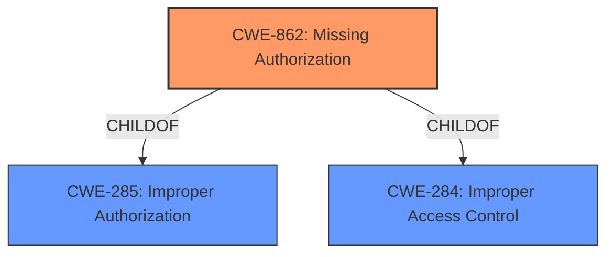

# Raw Analyzer Response for CVE-2022-39093

# Summary
| CWE ID | CWE Name | Confidence | CWE Abstraction Level | CWE Vulnerability Mapping Label | CWE-Vulnerability Mapping Notes |
|---|---|---|---|---|---|
| CWE-862 | Missing Authorization | 1.0 | Class | Primary | Allowed-with-Review |

## Evidence and Confidence

*   **Confidence Score:** 1.0
*   **Evidence Strength:** HIGH

## Relationship Analysis
The primary CWE identified is CWE-862, "Missing Authorization," which is a Class-level CWE. It falls under the broader categories of CWE-285 "Improper Authorization" and CWE-284 "Improper Access Control." Given the vulnerability description explicitly states a **missing permission check**, which is a form of authorization, CWE-862 accurately captures the essence of the flaw. While CWE-862 is a Class, the provided information doesn't point to a more specific Base or Variant CWE.

## Vulnerability Chain
The vulnerability chain is straightforward:
1.  **Root Cause:** **Missing permission check** (CWE-862).
2.  **Impact:** The power management service can be set up without proper authorization, potentially leading to unauthorized control of power management functions.

## Summary of Analysis
The analysis is based directly on the provided vulnerability description, which states: "In power management service, there is a **missing permission check**. This could lead to set up power management service with no additional execution privileges needed." The **rootcause** is explicitly stated as "**missing permission check**."

The Retriever Results also strongly suggest CWE-862. The Primary CWE Match from similar CVE Descriptions is also CWE-862.

CWE-862 is the most appropriate because it directly addresses the **lack of authorization** check when setting up the power management service. The absence of this check allows unauthorized actions, aligning perfectly with CWE-862's definition.

Other CWEs were considered but deemed less appropriate:
*   CWE-20 "Improper Input Validation" was considered because a **missing permission check** could be viewed as a failure to validate whether the actor has the necessary permissions. However, CWE-862 is more specific.
*   CWE-863 "Incorrect Authorization" implies that there *is* an authorization check, but it is implemented incorrectly. In this case, the description states there is a **missing permission check** (no check at all). Thus, CWE-862 is more appropriate.
*   CWE-732 "Incorrect Permission Assignment for Critical Resource" implies that the permissions are incorrectly set, but not necessarily that there is a missing check.

The selection of CWE-862 is at the optimal level of specificity because the provided information does not describe how a permission check would be incorrectly implemented; rather it indicates a **missing permission check**.

Relevant CWE Information:

# Enhanced Context (25 CWEs)

## CWE-862: Missing Authorization
**Abstraction:** Class
**Status:** Incomplete

### Description
The product does not perform an authorization check when an actor attempts to access a resource or perform an action.

### Extended Description
Not provided

### Alternative Terms
AuthZ: "AuthZ" is typically used as an abbreviation of "authorization" within the web application security community. It is distinct from "AuthN" (or, sometimes, "AuthC") which is an abbreviation of "authentication." The use of "Auth" as an abbreviation is discouraged, since it could be used for either authentication or authorization.

### Relationships
ChildOf -> CWE-285
ChildOf -> CWE-284

### Mapping Guidance
**Usage:** Allowed-with-Review
**Rationale:** This CWE entry is a Class and might have Base-level children that would be more appropriate
**Comments:** Examine children of this entry to see if there is a better fit
**Reasons:**
- Abstraction

### Additional Notes
**[Terminology]** Assuming a user with a given identity, authorization is the process of determining whether that user can access a given resource, based on the user's privileges and any permissions or other access-control specifications that apply to the resource.

### Observed Examples
- **CVE-2022-24730:** Go-based continuous deployment product does not check that a user has certain privileges to update or create an app, allowing adversaries to read sensitive repository information
- **CVE-2009-3168:** Web application does not restrict access to admin scripts, allowing authenticated users to reset administrative passwords.
- **CVE-2009-3597:** Web application stores database file under the web root with insufficient access control (CWE-219), allowing direct request.