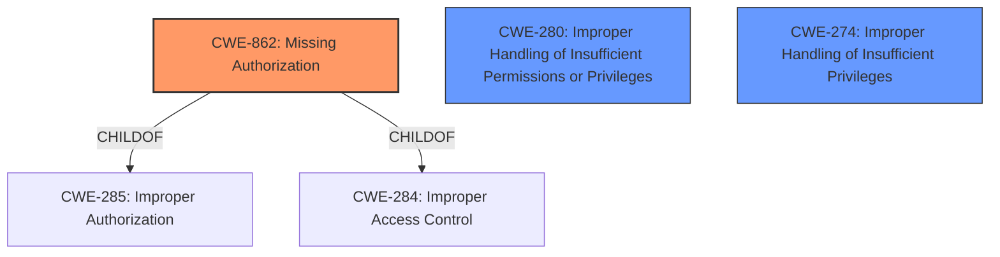

# Analysis for CVE-2022-39100

# Summary
| CWE ID | CWE Name | Confidence | CWE Abstraction Level | CWE Vulnerability Mapping Label | CWE-Vulnerability Mapping Notes |
|---|---|---|---|---|---|
| CWE-862 | Missing Authorization | 1.0 | Class | Primary | Allowed-with-Review |
| CWE-280 | Improper Handling of Insufficient Permissions or Privileges | 0.6 | Base | Secondary | Allowed |
| CWE-274 | Improper Handling of Insufficient Privileges | 0.5 | Base | Secondary | Discouraged |

## Evidence and Confidence

*   **Confidence Score:** 1.0
*   **Evidence Strength:** HIGH

## Relationship Analysis
The primary CWE, CWE-862 [Missing Authorization], is a class-level CWE. It is a child of both CWE-285 [Improper Authorization] and CWE-284 [Improper Access Control]. The vulnerability description clearly states a **missing permission check**, aligning directly with the definition of CWE-862. This indicates a lack of authorization, which is the root cause of the vulnerability. CWE-280 [Improper Handling of Insufficient Permissions or Privileges] and CWE-274 [Improper Handling of Insufficient Privileges] are base-level CWEs that are related to privilege handling. However, the description focuses on the **missing check**, making CWE-862 the more direct and appropriate classification as the primary weakness.

## Vulnerability Chain
The vulnerability chain starts with a **missing permission check** (CWE-862), which then leads to the ability to set up power management service without proper privileges. This can be seen as a direct consequence of the missing authorization. There aren't additional weaknesses mentioned in the chain, but the lack of the permission check is the enabler to the observed impact.

## Summary of Analysis
The initial assessment, supported by the "Vulnerability Description Key Phrases," clearly indicates a **missing permission check**. This directly corresponds to CWE-862 [Missing Authorization]. The "CWE for similar CVE Descriptions" section also lists CWE-862 as the primary match.

The final decision to classify the vulnerability as CWE-862 is based on the direct evidence of a **missing permission check** in the vulnerability description: "In power management service, there is a **missing permission check**. This could lead to set up power management service with no additional execution privileges needed."

The selection of CWE-862 is at the optimal level of specificity because it directly addresses the **missing authorization** aspect of the vulnerability. While other CWEs like CWE-280 and CWE-274 relate to permissions and privileges, they don't specifically highlight the absence of an authorization check, which is the core issue described in the vulnerability.

Relevant CWE Information:

# Enhanced Context (25 CWEs)
The following CWEs were identified as potentially relevant to this vulnerability:

## CWE-1289: Improper Validation of Unsafe Equivalence in Input
**Abstraction Level**: Base
**Similarity Score**: 0.76

## CWE-404: Improper Resource Shutdown or Release
**Abstraction Level**: Class
**Similarity Score**: 0.75

## CWE-280: Improper Handling of Insufficient Permissions or Privileges 
**Abstraction Level**: Base
**Similarity Score**: 0.75
The product does not handle or incorrectly handles when it has insufficient privileges to access resources or functionality as specified by their permissions. This may cause it to follow unexpected code paths that may leave the product in an invalid state.

**Mapping Guidance**:
- Usage: Allowed
- Rationale: This CWE entry is at the Base level of abstraction, which is a preferred level of abstraction for mapping to the root causes of vulnerabilities.
This is a secondary candidate since the root cause is a **missing permission check**, but this is about handling the permission.

## CWE-664: Improper Control of a Resource Through its Lifetime
**Abstraction Level**: Pillar
**Similarity Score**: 0.75

## CWE-274: Improper Handling of Insufficient Privileges
**Abstraction Level**: Base
**Similarity Score**: 0.75
The product does not handle or incorrectly handles when it has insufficient privileges to perform an operation, leading to resultant weaknesses.

**Mapping Guidance**:
- Usage: Discouraged
- Rationale: This CWE entry could be deprecated in a future version of CWE.
This is a secondary candidate since the root cause is a **missing permission check**, but this is about handling the permission.

## CWE-668: Exposure of Resource to Wrong Sphere
**Abstraction Level**: Class
**Similarity Score**: 0.75

## CWE-405: Asymmetric Resource Consumption (Amplification)
**Abstraction Level**: Class
**Similarity Score**: 0.74

## CWE-667: Improper Locking
**Abstraction Level**: Class
**Similarity Score**: 0.74

## CWE-807: Reliance on Untrusted Inputs in a Security Decision
**Abstraction Level**: Base
**Similarity Score**: 0.74

## CWE-1220: Insufficient Granularity of Access Control
**Abstraction Level**: Base
**Similarity Score**: 0.74

## CWE-1284: Improper Validation of Specified Quantity in Input
**Abstraction Level**: Base
**Similarity Score**: 6721.09

## CWE-863: Incorrect Authorization
**Abstraction Level**: Class
**Similarity Score**: 6663.05

## CWE-22: Improper Limitation of a Pathname to a Restricted Directory ('Path Traversal')
**Abstraction Level**: Base
**Similarity Score**: 6631.81

## CWE-770: Allocation of Resources Without Limits or Throttling
**Abstraction Level**: Base
**Similarity Score**: 6588.93

## CWE-639: Authorization Bypass Through User-Controlled Key
**Abstraction Level**: Base
**Similarity Score**: 6540.85

## CWE-41: Improper Resolution of Path Equivalence
**Abstraction Level**: base
**Similarity Score**: 5.03

## CWE-22: Improper Limitation of a Pathname to a Restricted Directory ('Path Traversal')
**Abstraction Level**: base
**Similarity Score**: 4.33

## CWE-59: Improper Link Resolution Before File Access ('Link Following')
**Abstraction Level**: base
**Similarity Score**: 4.33

## CWE-190: Integer Overflow or Wraparound
**Abstraction Level**: base
**Similarity Score**: 4.33

## CWE-434: Unrestricted Upload of File with Dangerous Type
**Abstraction Level**: base
**Similarity Score**: 4.33

## CWE-770: Allocation of Resources Without Limits or Throttling
**Abstraction Level**: base
**Similarity Score**: 4.33

## CWE-1284: Improper Validation of Specified Quantity in Input
**Abstraction Level**: base
**Similarity Score**: 4.33

## CWE-789: Memory Allocation with Excessive Size Value
**Abstraction Level**: variant
**Similarity Score**: 3.88

## CWE-178: Improper Handling of Case Sensitivity
**Abstraction Level**: base
**Similarity Score**: 3.76

## CWE-98: Improper Control of Filename for Include/Require Statement in PHP Program ('PHP Remote File Inclusion')
**Abstraction Level**: variant
**Similarity Score**: 3.75