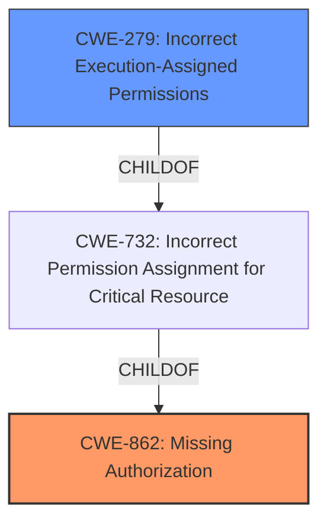

# Raw Analyzer Response for CVE-2022-39101

# Summary
| CWE ID | CWE Name | Confidence | CWE Abstraction Level | CWE Vulnerability Mapping Label | CWE-Vulnerability Mapping Notes |
|---|---|---|---|---|---|
| CWE-862 | Missing Authorization | 1.0 | Class | Primary | Allowed-with-Review |
| CWE-279 | Incorrect Execution-Assigned Permissions | 0.4 | Variant | Secondary | Allowed |

## Evidence and Confidence

*   **Confidence Score:** 0.7
*   **Evidence Strength:** HIGH

## Relationship Analysis
The primary relationship considered was the hierarchical one, specifically ChildOf. CWE-862, Missing Authorization, is a class-level CWE. While it has no children listed, the general guidance is to look for a more specific base or variant if possible. CWE-279, Incorrect Execution-Assigned Permissions, is a variant that is related to the assignment of permissions, but it's unclear if it directly applies. CWE-862 is a more appropriate fit since the **missing permission check** is the core issue.

## Vulnerability Chain
The vulnerability chain is quite simple: the **missing permission check** (CWE-862) leads to the ability to "set up power management service with no additional execution privileges needed," indicating a privilege escalation or unauthorized access to a protected service.

## Summary of Analysis
The initial analysis identified CWE-862 as the primary weakness due to the explicit mention of a **missing permission check**. The retriever results also highlighted CWE-862 as the top candidate. The analysis then considered other candidates, including CWE-279, based on their descriptions and relationships. Ultimately, CWE-862 was chosen as the most appropriate because it directly reflects the root cause vulnerability described. The relationship diagram shows the connection between CWE-862 and CWE-279 (as well as CWE-732). CWE-279 is not well supported by the evidence.

The evidence is based on the "Vulnerability Description Key Phrases":
- **rootcause:** **missing permission check**
- **impact:** set up power management service

*   **CWE-862: Missing Authorization** - The vulnerability description explicitly states a "**missing permission check**," which aligns directly with the definition of CWE-862: "The product does not perform an authorization check when an actor attempts to access a resource or perform an action." This allows unauthorized access to set up the power management service. Confidence: 1.0
*   **CWE-279: Incorrect Execution-Assigned Permissions** - This CWE is considered because of the "set up power management service with no additional execution privileges needed" statement. This could imply that the service is being set up with incorrect permissions during execution. However, the primary issue is the **missing check**, not necessarily the incorrect assignment. Therefore, this is a secondary consideration. Confidence: 0.4

Relevant CWE Information:

# Enhanced Context (25 CWEs)

## CWE-1289: Improper Validation of Unsafe Equivalence in Input
**Abstraction Level**: Base
**Similarity Score**: 0.76
**Source**: dense

**Description**:
The product receives an input value that is used as a resource identifier or other type of reference, but it does not validate or incorrectly validates that the input is equivalent to a potentially-unsafe value.
**Rationale for not using:** This CWE is about input validation, but the vulnerability is about a **missing permission check** which is closer to missing authorization.

## CWE-404: Improper Resource Shutdown or Release
**Abstraction Level**: Class
**Similarity Score**: 0.75
**Source**: dense

**Description**:
The product does not release or incorrectly releases a resource before it is made available for re-use.
**Rationale for not using:** This CWE is not relevant to the vulnerability description because it talks about releasing resources and there is no mention of resource handling.

## CWE-280: Improper Handling of Insufficient Permissions or Privileges 
**Abstraction Level**: Base
**Similarity Score**: 0.75
**Source**: dense

**Description**:
The product does not handle or incorrectly handles when it has insufficient privileges to access resources or functionality as specified by their permissions. This may cause it to follow unexpected code paths that may leave the product in an invalid state.
**Rationale for not using:** This CWE is about the service incorrectly handling permissions and privileges. But the vulnerability description says that there is a **missing permission check**.

## CWE-664: Improper Control of a Resource Through its Lifetime
**Abstraction Level**: Pillar
**Similarity Score**: 0.75
**Source**: dense

**Description**:
The product does not maintain or incorrectly maintains control over a resource throughout its lifetime of creation, use, and release.
**Rationale for not using:** This CWE is too high-level and there is no mention of resources being handled incorrectly through their lifecycle.

## CWE-274: Improper Handling of Insufficient Privileges
**Abstraction Level**: Base
**Similarity Score**: 0.74
**Source**: dense

**Description**:
The product does not handle or incorrectly handles when it has insufficient privileges to perform an operation, leading to resultant weaknesses.
**Rationale for not using:** This CWE is about the product incorrectly handling privileges. But the vulnerability description says that there is a **missing permission check**.

## CWE-668: Exposure of Resource to Wrong Sphere
**Abstraction Level**: Class
**Similarity Score**: 0.74
**Source**: dense

**Description**:
The product exposes a resource to the wrong control sphere, providing unintended actors with inappropriate access to the resource.
**Rationale for not using:** This CWE is not as specific as CWE-862 which directly relates to a **missing permission check**.

## CWE-405: Asymmetric Resource Consumption (Amplification)
**Abstraction Level**: Class
**Similarity Score**: 0.74
**Source**: dense

**Description**:
The product does not properly control situations in which an adversary can cause the product to consume or produce excessive resources without requiring the adversary to invest equivalent work or otherwise prove authorization, i.e., the adversary's influence is "asymmetric."
**Rationale for not using:** This CWE is not relevant because the vulnerability description does not talk about resources being consumed.

## CWE-667: Improper Locking
**Abstraction Level**: Class
**Similarity Score**: 0.74
**Source**: dense

**Description**:
The product does not properly acquire or release a lock on a resource, leading to unexpected resource state changes and behaviors.
**Rationale for not using:** This CWE is not relevant because the vulnerability description does not talk about locks.

## CWE-807: Reliance on Untrusted Inputs in a Security Decision
**Abstraction Level**: Base
**Similarity Score**: 0.74
**Source**: dense

**Description**:
The product uses a protection mechanism that relies on the existence or values of an input, but the input can be modified by an untrusted actor in a way that bypasses the protection mechanism.
**Rationale for not using:** This CWE is not relevant because the vulnerability description does not talk about any protection mechanisms that rely on untrusted inputs.

## CWE-1220: Insufficient Granularity of Access Control
**Abstraction Level**: Base
**Similarity Score**: 0.73
**Source**: dense

**Description**:
The product implements access controls via a policy or other feature with the intention to disable or restrict accesses (reads and/or writes) to assets in a system from untrusted agents. However, implemented access controls lack required granularity, which renders the control policy too broad because it allows accesses from unauthorized agents to the security-sensitive assets.
**Rationale for not using:** The vulnerability description is about a **missing permission check** not the granularity of access controls.

## CWE-1284: Improper Validation of Specified Quantity in Input
**Abstraction Level**: Base
**Similarity Score**: 6607.49
**Source**: sparse

**Description**:
The product receives input that is expected to specify a quantity (such as size or length), but it does not validate or incorrectly validates that the quantity has the required properties.
**Rationale for not using:** The vulnerability is about a **missing permission check** and does not deal with quantity validation.

## CWE-863: Incorrect Authorization
**Abstraction Level**: Class
**Similarity Score**: 6543.31
**Source**: sparse

**Description**:
The product performs an authorization check when an actor attempts to access a resource or perform an action, but it does not correctly perform the check.
**Rationale for not using:** The vulnerability description is about a **missing permission check**, implying no check is