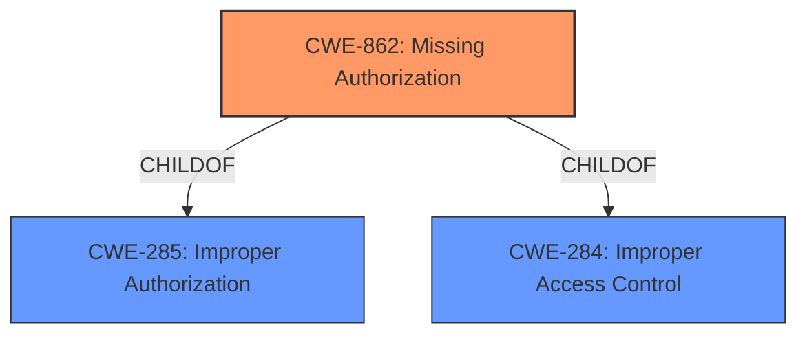

# Raw Analyzer Response for CVE-2022-39107

# Summary
| CWE ID | CWE Name | Confidence | CWE Abstraction Level | CWE Vulnerability Mapping Label | CWE-Vulnerability Mapping Notes |
|---|---|---|---|---|---|
| CWE-862 | Missing Authorization | 1.0 | Class | Allowed-with-Review | Primary CWE |
| CWE-285 | Improper Authorization | 0.6 | Class | Discouraged | Secondary Candidate |

## Evidence and Confidence

*   **Confidence Score:** 0.8
*   **Evidence Strength:** MEDIUM

## Relationship Analysis
The primary CWE is CWE-862 **Missing Authorization**, which is a child of both CWE-285 **Improper Authorization** and CWE-284 **Improper Access Control**. While CWE-862 is a class-level CWE, it directly addresses the **missing permission check** described in the vulnerability. CWE-285 is a more general class that encompasses both missing and incorrect authorization, making CWE-862 a more precise fit.

## Vulnerability Chain
The vulnerability chain is straightforward:
1.  **Root Cause:** **Missing permission check** in the Soundrecorder service.
2.  **Impact:** Elevation of privilege in the Soundrecorder service.

## Summary of Analysis
The analysis centers on the **missing permission check** that leads to an elevation of privilege. The vulnerability description explicitly states this **missing permission check** as the root cause.

The primary CWE selection, CWE-862 **Missing Authorization**, is based on the explicit description of the vulnerability and the provided **Vulnerability Description Key Phrases**. The vulnerability description states, "In Soundrecorder service, there is a **missing permission check**. This could lead to elevation of privilege..." The **rootcause** is clearly identified as a **missing permission check**.

CWE-862 is a class-level CWE, the mapping guidance recommends examining its children for a better fit. However, none of the children of CWE-862 provides a more specific description that fits the vulnerability. CWE-285 **Improper Authorization** could be a secondary candidate as it encompasses both missing and incorrect authorization checks, but is discouraged since it is a high-level CWE.

The decision to use CWE-862 is based on the direct evidence of a **missing permission check**.

Relevant CWE Information:

# Enhanced Context (25 CWEs)

## CWE-862: Missing Authorization
**Abstraction:** Class
**Similarity Score**: 0.256
**Source**: sparse

**Description**:
The product does not perform an authorization check when an actor attempts to access a resource or perform an action.

**Mapping Guidance**:
- Usage: Allowed-with-Review
- Rationale: This CWE entry is a Class and might have Base-level children that would be more appropriate

## CWE-285: Improper Authorization
**Abstraction:** Class
**Similarity Score**: 5702.16
**Source**: sparse

**Description**:
The product does not perform or incorrectly performs an authorization check when an actor attempts to access a resource or perform an action.

**Mapping Guidance**:
- Usage: Discouraged
- Rationale: CWE-285 is high-level and lower-level CWEs can frequently be used instead. It is a level-1 Class (i.e., a child of a Pillar).