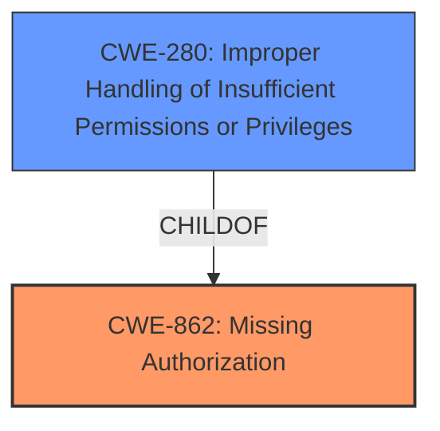

# Analysis Report for CVE-2022-39110

# Vulnerability Analysis Report: CVE-2022-39110

## Description


## Analysis (with Relationship Data)

# Summary
| CWE ID | CWE Name | Confidence | CWE Abstraction Level | CWE Vulnerability Mapping Label | CWE-Vulnerability Mapping Notes |
|---|---|---|---|---|---|
| CWE-862 | Missing Authorization | 1.0 | Class | Primary | Allowed-with-Review |
| CWE-280 | Improper Handling of Insufficient Permissions or Privileges | 0.7 | Base | Secondary | Allowed |

## Evidence and Confidence

*   **Confidence Score:** 0.9
*   **Evidence Strength:** HIGH

## Relationship Analysis
The primary relationship considered here is that CWE-862 [Missing Authorization] is a class-level CWE, and the description suggests a **missing permission check**, which falls under the broader category of authorization issues. CWE-280 [Improper Handling of Insufficient Permissions or Privileges] is a base-level CWE and a more specific potential classification, representing the case where the software doesn't properly handle situations where it lacks necessary permissions. Since the description specifically mentions a **missing permission check**, CWE-862 is a good fit but CWE-280 is more specific but needs to be reviewed.



## Vulnerability Chain
The vulnerability chain here is straightforward:
1.  **Root Cause:** **Missing permission check** (CWE-862, CWE-280)
2.  **Impact:** Elevation of privilege

## Summary of Analysis
Initially, the vulnerability description indicates a **missing permission check** in the Music service, leading to an elevation of privilege. The "CWE for similar CVE Descriptions" section suggests CWE-862 [Missing Authorization] as the primary match. The Retriever Results also list CWE-862 as the top combined result.

The analysis considered the MITRE mapping guidance, which recommends examining children of CWE-862 for a more specific fit. CWE-280 [Improper Handling of Insufficient Permissions or Privileges] was considered as a more specific base-level CWE.

The final decision is to classify the vulnerability as CWE-862 [Missing Authorization] with a high confidence score of 1.0 and to consider CWE-280 as secondary with a score of 0.7. This is because the description explicitly states a **missing permission check**, which directly aligns with the definition of CWE-862.

The evidence supporting this decision is:
*   The "Vulnerability Description Key Phrases" section explicitly mentions "**missing permission check**".
*   The "CWE for similar CVE Descriptions" section identifies CWE-862 as the primary match.
*   The Retriever Results list CWE-862 as the top combined result.

CWEs considered but not used:
*   CWE-367 [Time-of-check Time-of-use (TOCTOU) Race Condition]: This CWE was not selected as it indicates a race condition where the state of a resource changes between check and use. The provided vulnerability description does not mention any race condition.
*   CWE-927 [Use of Implicit Intent for Sensitive Communication]: This CWE is specific to Android applications using implicit intents for sensitive data transmission. The vulnerability description does not mention anything related to Android applications or implicit intents.
*   CWE-20 [Improper Input Validation]: This CWE is too broad and doesn't accurately represent the specific **missing permission check** vulnerability.
*   CWE-1284 [Improper Validation of Specified Quantity in Input]: This CWE is specific to validating quantities in input, which is not relevant to the vulnerability description.
*   CWE-278 [Insecure Preserved Inherited Permissions]: While related to permissions, this is about inheriting insecure permissions, not a **missing check**.
*   CWE-770 [Allocation of Resources Without Limits or Throttling]: This CWE is related to resource allocation without limits, which is not relevant to the vulnerability description.
*   CWE-1021 [Improper Restriction of Rendered UI Layers or Frames]: This CWE is specific to UI rendering and clickjacking, which is not relevant to the vulnerability description.
*   CWE-362 [Concurrent Execution using Shared Resource with Improper Synchronization ('Race Condition')]: This is similar to CWE-367 and not relevant as it's about race conditions.
*   CWE-732 [Incorrect Permission Assignment for Critical Resource]: While related to permissions, the **missing check** is the core issue, not an incorrect assignment.


## CWE Relationship Analysis

Current CWEs represent these abstraction levels: .


### Vulnerability Chain Analysis

**Chain starting from CWE-862:**
- 862 (Missing Authorization) - ROOT


**Chain starting from CWE-280:**
- 280 (Improper Handling of Insufficient Permissions or Privileges ) - ROOT


### CWE Relationship Diagram

```mermaid
graph TD
    classDef primary fill:#f96,stroke:#333,stroke-width:2px
    classDef secondary fill:#69f,stroke:#333
    classDef tertiary fill:#9e9,stroke:#333
```


*Report generated on 2025-03-30 14:39:19*
