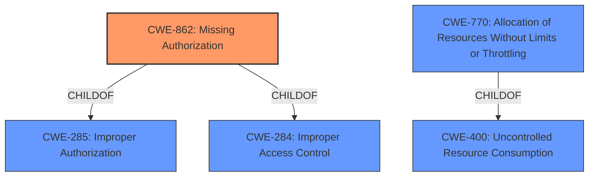

# Enhanced Analysis for CVE-2022-39114

# Summary

| CWE ID | CWE Name | Confidence | CWE Abstraction Level | CWE Vulnerability Mapping Label | CWE-Vulnerability Mapping Notes |
|---|---|---|---|---|---|
| CWE-862 | Missing Authorization | 1.0 | Class | Allowed-with-Review | Primary CWE |
| CWE-770 | Allocation of Resources Without Limits or Throttling | 0.5 | Base | Allowed | Secondary Candidate |
| CWE-400 | Uncontrolled Resource Consumption | 0.5 | Class | Discouraged | Secondary Candidate |

## Evidence and Confidence

*   **Confidence Score:** 0.8
*   **Evidence Strength:** HIGH

## Relationship Analysis
The primary CWE selected is CWE-862, Missing Authorization, which is a Class-level CWE. While a more specific Base or Variant CWE would be preferable, the provided information is insufficient to determine the exact mechanism of the **missing permission check**.

CWE-862 is a child of both CWE-285, Improper Authorization, and CWE-284, Improper Access Control. This indicates that it falls under the broader categories of authorization and access control issues.

CWE-770 is related to CWE-400 which represents the impact of the vulnerability.



## Vulnerability Chain
The vulnerability chain starts with the **missing permission check** (CWE-862), which directly leads to a local denial of service. In a denial-of-service scenario, the **missing permission check** might allow an attacker to allocate excessive resources, leading to resource exhaustion. This chain can be represented as:

CWE-862 (Missing Authorization) -> CWE-770 (Allocation of Resources Without Limits or Throttling) -> CWE-400 (Uncontrolled Resource Consumption)

## Summary of Analysis
The initial assessment pointed to CWE-862 (Missing Authorization) as the primary weakness, based on the "**missing permission check**" root cause identified in the vulnerability description. The retriever results and similar CVE descriptions also strongly suggested CWE-862 as the best match.

The selection of CWE-862 is based on the explicit statement in the vulnerability description key phrases: "**rootcause:** **missing permission check**".

The relationship graph highlights the hierarchical context of CWE-862 within authorization and access control. While it would be ideal to have a more specific Base or Variant CWE, the current evidence does not provide enough information to pinpoint the exact nature of the **missing permission check**.

The selection of CWE-862 is at the optimal level of specificity, given the available evidence. While CWE-862 is a Class-level CWE, it directly addresses the stated root cause.

Relevant CWE Information:

# Enhanced Context (25 CWEs)

## CWE-941: Incorrectly Specified Destination in a Communication Channel
This CWE was considered but is not relevant. The vulnerability does not involve incorrect communication channel specifications.

## CWE-799: Improper Control of Interaction Frequency
This CWE was considered but is not relevant. The vulnerability is not about interaction frequency.

## CWE-754: Improper Check for Unusual or Exceptional Conditions
This CWE was considered but is not relevant. The vulnerability is primarily about a **missing permission check**, not a general check for unusual conditions.

## CWE-807: Reliance on Untrusted Inputs in a Security Decision
This CWE was considered but is not relevant. The vulnerability is about a **missing permission check**, not about reliance on untrusted inputs.

## CWE-1289: Improper Validation of Unsafe Equivalence in Input
This CWE was considered but is not relevant. The vulnerability is about a **missing permission check**, not validation of input equivalence.

## CWE-41: Improper Resolution of Path Equivalence
This CWE was considered but is not relevant. The vulnerability does not involve path equivalence issues.

## CWE-668: Exposure of Resource to Wrong Sphere
This CWE was considered but is not the primary issue. While technically the impact of the **missing permission check** could lead to exposure, the root cause is the **missing permission check** itself.

## CWE-184: Incomplete List of Disallowed Inputs
This CWE was considered but is not relevant. The vulnerability is about a **missing permission check**, not an incomplete list of inputs.

## CWE-451: User Interface (UI) Misrepresentation of Critical Information
This CWE was considered but is not relevant. The vulnerability does not involve UI misrepresentation.

## CWE-755: Improper Handling of Exceptional Conditions
This CWE was considered but is not relevant. The vulnerability is primarily about a **missing permission check**, not the handling of exceptional conditions.

## CWE-367: Time-of-check Time-of-use (TOCTOU) Race Condition
This CWE was considered but is not relevant. The vulnerability does not involve TOCTOU conditions.

## CWE-252: Unchecked Return Value
This CWE was considered but is not relevant. The vulnerability is about a **missing permission check**, not about unchecked return values.

## CWE-1284: Improper Validation of Specified Quantity in Input
This CWE was considered but is not relevant. The vulnerability is about a **missing permission check**, not about quantity validation.

## CWE-863: Incorrect Authorization
This CWE was considered, but CWE-862 is more specific since it explicitly states the authorization is **missing**.

## CWE-73: External Control of File Name or Path
This CWE was considered but is not relevant. The vulnerability does not involve external control of file names or paths.

## CWE-386: Symbolic Name not Mapping to Correct Object
This CWE was considered but is not relevant. The vulnerability does not involve symbolic names.

## CWE-22: Improper Limitation of a Pathname to a Restricted Directory ('Path Traversal')
This CWE was considered but is not relevant. The vulnerability does not involve path traversal.

## CWE-770: Allocation of Resources Without Limits or Throttling
This CWE was considered as a potential secondary weakness, as the **missing permission check** might allow an attacker to allocate excessive resources, leading to a denial of service. This is a base level CWE and represents a resource management issue.

## CWE-190: Integer Overflow or Wraparound
This CWE was considered but is not relevant. The vulnerability does not involve integer overflows.

## CWE-476: NULL Pointer Dereference
This CWE was considered but is not relevant. The vulnerability does not involve null pointer dereferences.

## CWE-789: Memory Allocation with Excessive Size Value
This CWE was considered but is not directly relevant. While excessive memory allocation could be a consequence of the **missing permission check**, the root cause is the authorization issue.


## CWE Relationship Analysis

Current CWEs represent these abstraction levels: .


### Vulnerability Chain Analysis

**Chain starting from CWE-41:**
- 41 (Improper Resolution of Path Equivalence) - ROOT


**Chain starting from CWE-807:**
- 807 (Reliance on Untrusted Inputs in a Security Decision) - ROOT


### CWE Relationship Diagram

```mermaid
graph TD
    classDef primary fill:#f96,stroke:#333,stroke-width:2px
    classDef secondary fill:#69f,stroke:#333
    classDef tertiary fill:#9e9,stroke:#333
```