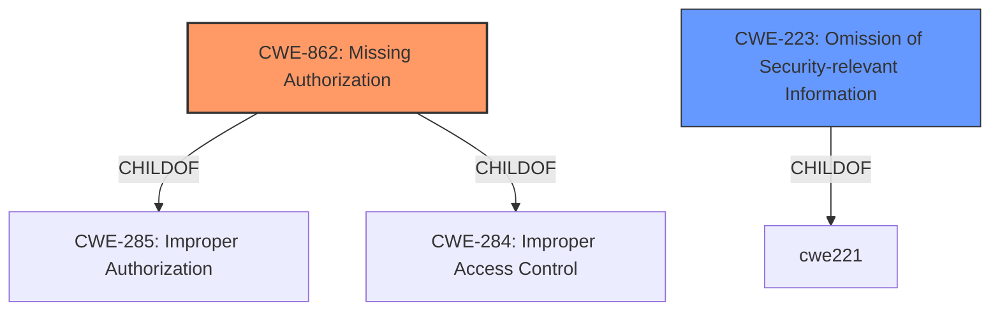

# Enhanced Analysis for CVE-2022-39117

# Summary
| CWE ID | CWE Name | Confidence | CWE Abstraction Level | CWE Vulnerability Mapping Label | CWE-Vulnerability Mapping Notes |
|---|---|---|---|---|---|
| CWE-862 | Missing Authorization | 1.0 | Class | Allowed-with-Review | Primary CWE |
| CWE-223 | Omission of Security-relevant Information | 0.5 | Base | Allowed | Secondary Candidate |

## Evidence and Confidence

*   **Confidence Score:** 1.0
*   **Evidence Strength:** HIGH

## Relationship Analysis
The primary CWE is CWE-862, which is a Class-level weakness indicating a general lack of authorization. The vulnerability description explicitly mentions a "**missing permission check**," which directly aligns with the description of CWE-862. CWE-862 is a child of CWE-285 (Improper Authorization) and CWE-284 (Improper Access Control).

CWE-223 is a Base-level weakness, which focuses on the omission of security-relevant information. This could be a secondary weakness because the absence of logging or auditing related to permission checks could hinder the detection of unauthorized access attempts.



## Vulnerability Chain
The vulnerability chain starts with a **missing permission check** (CWE-862), leading to potential local information disclosure. The chain only contains the rootcause and impact.

## Summary of Analysis
The analysis is based on the provided evidence, primarily the vulnerability description key phrases, which explicitly state a "**missing permission check**." This directly corresponds to CWE-862 (Missing Authorization). The description of CWE-862 aligns with the vulnerability where the product does not perform an authorization check when an actor attempts to access a resource or perform an action.

The graph relationships indicate that CWE-862 is a child of more general authorization and access control weaknesses (CWE-285 and CWE-284, respectively). While these parent CWEs are relevant, CWE-862 is more specific to the identified weakness.

CWE-223 (Omission of Security-relevant Information) was considered as a secondary weakness because the vulnerability may involve a lack of logging or auditing, but there is no evidence to support this in the vulnerability description. Thus, its confidence score is lower.

The selected CWEs are at the optimal level of specificity because CWE-862 directly describes the **missing permission check**, and is more descriptive than its parent classes.

Relevant CWE Information:
# Enhanced Context (25 CWEs)
The following CWEs were identified as potentially relevant to this vulnerability:

## CWE-1289: Improper Validation of Unsafe Equivalence in Input
**Abstraction Level**: Base
**Similarity Score**: 0.81
**Source**: dense

**Description**:
The product receives an input value that is used as a resource identifier or other type of reference, but it does not validate or incorrectly validates that the input is equivalent to a potentially-unsafe value.

**Mapping Guidance**:
- Usage: Allowed
- Rationale: This CWE entry is at the Base level of abstraction, which is a preferred level of abstraction for mapping to the root causes of vulnerabilities.

## CWE-862: Missing Authorization
**Abstraction Level**: Class
**Similarity Score**: 0.232 (Retriever Results)

**Description**:
The product does not perform an authorization check when an actor attempts to access a resource or perform an action.

**Mapping Guidance**:
**Usage:** Allowed-with-Review
**Rationale:** This CWE entry is a Class and might have Base-level children that would be more appropriate

## CWE-223: Omission of Security-relevant Information
**Abstraction Level**: Base
**Similarity Score**: 0.546 (Retriever Results)

**Description**:
The product does not record or display information that would be important for identifying the source or nature of an attack, or determining if an action is safe.


## CWE Relationship Analysis

Current CWEs represent these abstraction levels: .


### Vulnerability Chain Analysis

**Chain starting from CWE-862:**
- 862 (Missing Authorization) - ROOT


**Chain starting from CWE-1289:**
- 1289 (Improper Validation of Unsafe Equivalence in Input) - ROOT


### CWE Relationship Diagram

```mermaid
graph TD
    classDef primary fill:#f96,stroke:#333,stroke-width:2px
    classDef secondary fill:#69f,stroke:#333
    classDef tertiary fill:#9e9,stroke:#333
```