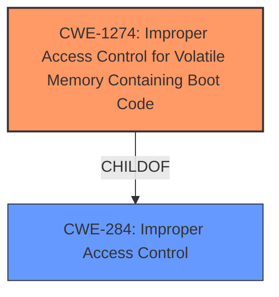

# Analysis for CVE-2022-3917

# Summary
| CWE ID | CWE Name | Confidence | CWE Abstraction Level | CWE Vulnerability Mapping Label | CWE-Vulnerability Mapping Notes |
|---|---|---|---|---|---|
| CWE-1274 | Improper Access Control for Volatile Memory Containing Boot Code | 0.9 | Base | Allowed | Primary CWE |
| CWE-284 | Improper Access Control | 0.5 | Pillar | Discouraged | Secondary Candidate |

## Evidence and Confidence

*   **Confidence Score:** 0.9
*   **Evidence Strength:** HIGH

## Relationship Analysis
The primary CWE is CWE-1274, which is a child of CWE-284. While CWE-284 is a broader, more general category, CWE-1274 specifically addresses the **improper access control** issues related to volatile memory containing boot code, which aligns precisely with the vulnerability description. Choosing CWE-1274 provides a more specific and accurate representation of the vulnerability.

## Vulnerability Chain
The vulnerability chain starts with **improper access control** in the bootloader, specifically regarding volatile memory. This allows an attacker with local access to read partition or RAM data, resulting in information disclosure.

## Summary of Analysis
The initial analysis indicated that the primary **weakness** lies in **improper access control** within the bootloader of the Motorola e20, allowing attackers with local access to read partition or RAM data.

The evidence for this assessment is found in the "Vulnerability Description Key Phrases":

*   **rootcause:** **Improper access control**
*   **impact:** read partition or RAM data
*   **attacker:** attacker with local access
*   **product:** Motorola Mobility Motorola e20
*   **component:** bootloader function

And the "CVE Reference Links Content Summary":

*   The vulnerability lies in the Motorola e20 bootloader, where **improper access control** allows unauthorized access to sensitive data.
*   **Improper Access Control:** The primary **weakness** is the lack of proper access controls in the bootloader.
*   **Information Disclosure:** Specifically, this allows for the disclosure of RAM or partition data.

The Retriever Results suggest CWE-284 (Improper Access Control) as a possible candidate. However, considering the complete CWE specifications, particularly CWE-1274 (Improper Access Control for Volatile Memory Containing Boot Code), it becomes apparent that CWE-1274 is a more specific and accurate fit. CWE-1274 addresses vulnerabilities where the product does not have sufficient access control for volatile memory containing boot code, allowing adversaries to bypass secure boot processes.

Given the specific context of the vulnerability related to the bootloader and volatile memory, CWE-1274 is the optimal choice due to its precise focus. The MITRE mapping guidance allows using Base-level CWEs like CWE-1274. CWE-284 is too high level and discouraged to use.

Relevant CWE Information:

# Enhanced Context (25 CWEs)
The following CWEs were identified as potentially relevant to this vulnerability:

## CWE-653: Improper Isolation or Compartmentalization
**Abstraction Level**: Class
**Similarity Score**: 0.78

## CWE-280: Improper Handling of Insufficient Permissions or Privileges
**Abstraction Level**: Base
**Similarity Score**: 0.77

## CWE-1220: Insufficient Granularity of Access Control
**Abstraction Level**: Base
**Similarity Score**: 0.77

## CWE-274: Improper Handling of Insufficient Privileges
**Abstraction Level**: Base
**Similarity Score**: 0.77

## CWE-73: External Control of File Name or Path
**Abstraction Level**: Base
**Similarity Score**: 0.77

## CWE-345: Insufficient Verification of Data Authenticity
**Abstraction Level**: Class
**Similarity Score**: 0.77

## CWE-667: Improper Locking
**Abstraction Level**: Class
**Similarity Score**: 0.76

## CWE-668: Exposure of Resource to Wrong Sphere
**Abstraction Level**: Class
**Similarity Score**: 0.76

## CWE-807: Reliance on Untrusted Inputs in a Security Decision
**Abstraction Level**: Base
**Similarity Score**: 0.76

## CWE-41: Improper Resolution of Path Equivalence
**Abstraction Level**: Base
**Similarity Score**: 0.76

## CWE-863: Incorrect Authorization
**Abstraction Level**: Class
**Similarity Score**: 5363.78

## CWE-285: Improper Authorization
**Abstraction Level**: Class
**Similarity Score**: 5331.35

## CWE-639: Authorization Bypass Through User-Controlled Key
**Abstraction Level**: Base
**Similarity Score**: 5254.62

## CWE-287: Improper Authentication
**Abstraction Level**: Class
**Similarity Score**: 5236.47

## CWE-1390: Weak Authentication
**Abstraction Level**: Class
**Similarity Score**: 5166.65

## CWE-613: Insufficient Session Expiration
**Abstraction Level**: base
**Similarity Score**: 4.33

## CWE-322: Key Exchange without Entity Authentication
**Abstraction Level**: base
**Similarity Score**: 2.87

## CWE-259: Use of Hard-coded Password
**Abstraction Level**: variant
**Similarity Score**: 2.81

## CWE-287: Improper Authentication
**Abstraction Level**: class
**Similarity Score**: 2.55

## CWE-350: Reliance on Reverse DNS Resolution for a Security-Critical Action
**Abstraction Level**: variant
**Similarity Score**: 2.55

## CWE-280: Improper Handling of Insufficient Permissions or Privileges
**Abstraction Level**: Base
**Similarity Score**: 2.49

## CWE-274: Improper Handling of Insufficient Privileges
**Abstraction Level**: Base
**Similarity Score**: 2.49

## CWE-1274: Improper Access Control for Volatile Memory Containing Boot Code
**Abstraction Level**: base
**Similarity Score**: 2.47

## CWE-639: Authorization Bypass Through User-Controlled Key
**Abstraction Level**: base
**Similarity Score**: 2.47

## CWE-306: Missing Authentication for Critical Function
**Abstraction Level**: base
**Similarity Score**: 2.47

## CWE-1274: Improper Access Control for Volatile Memory Containing Boot Code

**CWE-1274 (Improper Access Control for Volatile Memory Containing Boot Code):** This CWE accurately describes the vulnerability, as it involves insufficient access control for volatile memory containing boot code. The vulnerability allows attackers to bypass secure boot processes and execute malicious boot code. The security implication is a compromise of the device's boot process, leading to potential unauthorized code execution and information disclosure. This is a Base-level CWE, which is preferred.

## CWE-284: Improper Access Control

**CWE-284 (Improper Access Control):** While this CWE broadly covers access control issues, it is a Pillar-level CWE and too general. The vulnerability description specifically mentions **improper access control** related to the bootloader function in volatile memory, making CWE-1274 a more precise fit. The MITRE mapping guidance discourages the use of CWE-284 due to its high-level nature and suggests using more specific descendants.