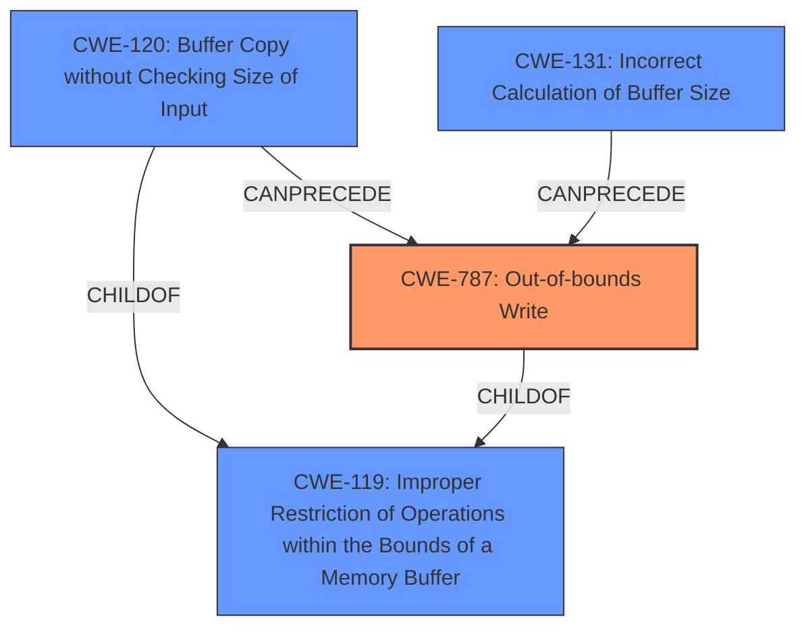

# Raw Analyzer Response for CVE-2022-39173

# Summary
| CWE ID    | CWE Name                                                                    | Confidence | CWE Abstraction Level | CWE Vulnerability Mapping Label | CWE-Vulnerability Mapping Notes |
| :--------- | :-------------------------------------------------------------------------- | :--------- | :-------------------- | :------------------------------ | :------------------------------ |
| CWE-787   | Out-of-bounds Write                                                         | 1          | Base                  | Primary                         | Allowed                         |
| CWE-120   | Buffer Copy without Checking Size of Input ('Classic Buffer Overflow')       | 0.7        | Base                  | Secondary                       | Allowed-with-Review             |
| CWE-119   | Improper Restriction of Operations within the Bounds of a Memory Buffer     | 0.5        | Class                 | Secondary                       | Discouraged                     |
| CWE-131   | Incorrect Calculation of Buffer Size                                        | 0.5        | Base                  | Secondary                       | Allowed                         |

## Evidence and Confidence

*   **Confidence Score:** 0.8
*   **Evidence Strength:** HIGH

## Relationship Analysis
The primary weakness is CWE-787, which indicates a write operation outside the intended buffer boundaries. CWE-120 is related as the **buffer overflow** occurs during a buffer copy operation without proper size validation. CWE-119 is a broader category encompassing memory buffer boundary issues, but it's less specific than CWE-787 and CWE-120. CWE-131 could be related if the size calculation for the buffer was incorrect leading to the overflow.

## Vulnerability Chain
The vulnerability chain starts with a malicious client sending crafted ClientHello messages during a resumed TLS 1.3 handshake. The **root cause** is the **insufficient bounds checking** in the `RefineSuites` function. This leads to a **buffer overflow** (CWE-787), potentially causing a denial-of-service (DoS) or remote code execution.

## Summary of Analysis
The analysis is based on the provided vulnerability description and CVE reference. The description clearly indicates a **buffer overflow** during a TLS 1.3 handshake due to **insufficient bounds checking** when refining cipher suites. The `RefineSuites` function **does not properly handle duplicate cipher suites**, leading to the overflow.

The primary CWE is CWE-787, which directly addresses the out-of-bounds write condition. CWE-120 is considered a secondary CWE because the overflow happens when copying a buffer without checking the input size, however, this information is not explicitly stated in the description. CWE-119 is a broader category and is discouraged when more specific CWEs like CWE-787 are applicable.

The evidence from the CVE Reference Links Content Summary is: "The vulnerability is due to **insufficient bounds checking** when refining cipher suites during a resumed TLS 1.3 handshake. The `RefineSuites` function **does not properly handle duplicate cipher suites** in the client's ClientHello message, leading to a **buffer overflow** on the stack."

The selection of CWE-787 is at the optimal level of specificity because it accurately describes the **out-of-bounds write** condition that occurs during the **buffer overflow**.

Relevant CWE Information:

# Enhanced Context (25 CWEs)

## CWE-131: Incorrect Calculation of Buffer Size
**Abstraction Level**: Base
**Similarity Score**: 0.78
**Source**: dense

**Description**:
The product does not correctly calculate the size to be used when allocating a buffer, which could lead to a buffer overflow.

**Mapping Guidance**:
- Usage: Allowed
- Rationale: This CWE entry is at the Base level of abstraction, which is a preferred level of abstraction for mapping to the root causes of vulnerabilities.

## CWE-120: Buffer Copy without Checking Size of Input ('Classic Buffer Overflow')
**Abstraction Level**: Base
**Similarity Score**: 4.82
**Source**: graph

**Description**:
CWE-120: Buffer Copy without Checking Size of Input ('Classic Buffer Overflow')

**Mapping Guidance**:
- Usage: Allowed-with-Review
- Rationale: There are some indications that this CWE ID might be misused and selected simply because it mentions "buffer overflow" - an increasingly vague term. This CWE entry is only appropriate for "Buffer Copy" operations (not buffer reads), in which where there is no "Checking [the] Size of Input", and (by implication of the copy) writing past the end of the buffer.

## CWE-787: Out-of-bounds Write
**Abstraction Level**: base
**Similarity Score**: 3.30
**Source**: graph

**Description**:
CWE-787: Out-of-bounds Write

**Mapping Guidance**:
- Usage: Allowed
- Rationale: This CWE entry is at the Base level of abstraction, which is a preferred level of abstraction for mapping to the root causes of vulnerabilities.