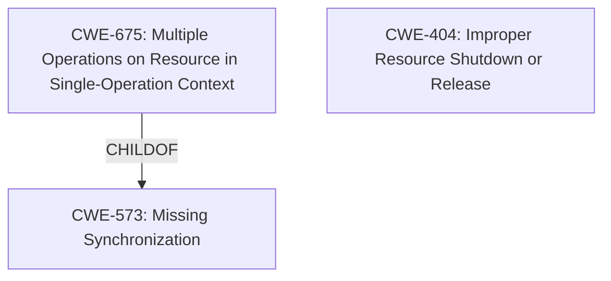

# Raw Analyzer Response for CVE-2022-39190

# Summary
| CWE ID | CWE Name | Confidence | CWE Abstraction Level | CWE Vulnerability Mapping Label | CWE-Vulnerability Mapping Notes |
|---|---|---|---|---|---|
| CWE-675 | Multiple Operations on Resource in Single-Operation Context | 0.75 | Class | Allowed-with-Review | Primary CWE. The vulnerability occurs because of binding to an already bound chain. |
| CWE-404 | Improper Resource Shutdown or Release | 0.60 | Class | Allowed-with-Review | Secondary candidate. A resource isn't properly released. |

## Evidence and Confidence

*   **Confidence Score:** 0.70
*   **Evidence Strength:** MEDIUM

## Relationship Analysis
The primary CWE is CWE-675, which is a Class-level CWE. It has peer relationships with CWE-586 (Multiple Singleton Violation) and CWE-102 (Struts Duplicate Validation Forms). It is a child of CWE-573 (Missing Synchronization). The secondary CWE is CWE-404, which is a Class-level CWE. It has a child relationship with CWE-401 (Missing Release of Memory after Effective Lifetime).

## Vulnerability Chain
The vulnerability chain is: **improper handling of binding to an already bound chain** leads to **denial of service**.

## Summary of Analysis
The initial analysis suggests that the vulnerability is due to the system allowing binding to an already bound chain which leads to denial of service. This is best described by CWE-675: Multiple Operations on Resource in Single-Operation Context. The evidence to support this includes the vulnerability description which states "A denial of service can occur upon binding to an already bound chain." The retriever results also show that CWE-675 is the top combined result.

CWE-404 was also considered because the issue involves a resource that is not properly released, but it wasn't binding to an already bound chain.

The selection of CWE-675 is at the optimal level of specificity because it is a Class-level CWE that accurately describes the vulnerability.

Relevant CWE Information:

# Enhanced Context (25 CWEs)
The following CWEs were identified as potentially relevant to this vulnerability:

## CWE-404: Improper Resource Shutdown or Release
**Abstraction Level**: Class
**Similarity Score**: 0.76
**Source**: dense

**Description**:
The product does not release or incorrectly releases a resource before it is made available for re-use.

**Mapping Guidance**:
- Usage: Allowed-with-Review
- Rationale: This CWE entry is a Class and might have Base-level children that would be more appropriate

## CWE-675: Multiple Operations on Resource in Single-Operation Context
**Abstraction:** Class
**Status:** Draft

### Description
The product performs the same operation on a resource two or more times, when the operation should only be applied once.

### Extended Description
Not provided

### Alternative Terms
None

### Relationships
ChildOf -> CWE-573
PeerOf -> CWE-586
PeerOf -> CWE-102

### Mapping Guidance
**Usage:** Allowed-with-Review
**Rationale:** This CWE entry is a Class and might have Base-level children that would be more appropriate
**Comments:** Examine children of this entry to see if there is a better fit
**Reasons:**
- Abstraction