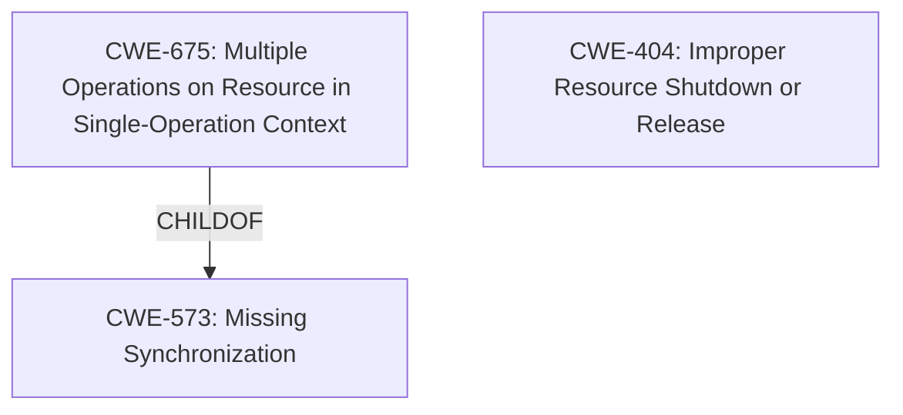

# Analysis for CVE-2022-39190

# Summary
| CWE ID | CWE Name | Confidence | CWE Abstraction Level | CWE Vulnerability Mapping Label | CWE-Vulnerability Mapping Notes |
|---|---|---|---|---|---|
| CWE-675 | Multiple Operations on Resource in Single-Operation Context | 0.75 | Class | Allowed-with-Review | Primary CWE. The vulnerability occurs because of binding to an already bound chain. |
| CWE-404 | Improper Resource Shutdown or Release | 0.60 | Class | Allowed-with-Review | Secondary candidate. A resource isn't properly released. |

## Evidence and Confidence

*   **Confidence Score:** 0.70
*   **Evidence Strength:** MEDIUM

## Relationship Analysis
The primary CWE is CWE-675, which is a Class-level CWE. It has peer relationships with CWE-586 (Multiple Singleton Violation) and CWE-102 (Struts Duplicate Validation Forms). It is a child of CWE-573 (Missing Synchronization). The secondary CWE is CWE-404, which is a Class-level CWE. It has a child relationship with CWE-401 (Missing Release of Memory after Effective Lifetime).



## Vulnerability Chain
The vulnerability chain is: **improper handling of binding to an already bound chain** leads to **denial of service**.

## Summary of Analysis
The initial analysis suggests that the vulnerability is due to the system allowing binding to an already bound chain which leads to denial of service. This is best described by CWE-675: Multiple Operations on Resource in Single-Operation Context. The evidence to support this includes the vulnerability description which states "A denial of service can occur upon binding to an already bound chain." The retriever results also show that CWE-675 is the top combined result.

CWE-404 was also considered because the issue involves a resource that is not properly released, but it wasn't binding to an already bound chain.

The selection of CWE-675 is at the optimal level of specificity because it is a Class-level CWE that accurately describes the vulnerability.

Relevant CWE Information:

# Enhanced Context (25 CWEs)
The following CWEs were identified as potentially relevant to this vulnerability:

## CWE-404: Improper Resource Shutdown or Release
**Abstraction Level**: Class
**Similarity Score**: 0.76
**Source**: dense

**Description**:
The product does not release or incorrectly releases a resource before it is made available for re-use.

**Mapping Guidance**:
- Usage: Allowed-with-Review
- Rationale: This CWE entry is a Class and might have Base-level children that would be more appropriate

## CWE-675: Multiple Operations on Resource in Single-Operation Context
**Abstraction:** Class
**Status:** Draft

### Description
The product performs the same operation on a resource two or more times, when the operation should only be applied once.

### Extended Description
Not provided

### Alternative Terms
None

### Relationships
ChildOf -> CWE-573
PeerOf -> CWE-586
PeerOf -> CWE-102

### Mapping Guidance
**Usage:** Allowed-with-Review
**Rationale:** This CWE entry is a Class and might have Base-level children that would be more appropriate
**Comments:** Examine children of this entry to see if there is a better fit
**Reasons:**
- Abstraction

# Enhanced Query for CVE-2022-39190

## Vulnerability Description
An issue was discovered in net/netfilter/nf_tables_api.c in the Linux kernel before 5.19.6. A denial of service can occur upon binding to an already bound chain.

### Vulnerability Description Key Phrases
- **impact:** denial of service
- **product:** Linux kernel
- **version:** before 5.19.6
- **component:** net/netfilter/nf_tables_api.c

## CVE Reference Links Content Summary
```
{
  "cve": "CVE-2022-39190",
  "description": "PLACEHOLDER - Implement CVE description retrieval",
  "fixes": [
    {
      "commit": "a36df92c7ff7ecde2fb362241d0ab024dddd0597",
      "author": "Daniel Borkmann",
      "date": "Thu Aug 25 23:26:47 2022 +0200",
      "component": "bpf",
      "description": "bpf: Don't use tnum_range on array range checking for poke descriptors",
      "details": "Hsin-Wei reported a KASAN splat triggered by their BPF runtime fuzzer which is based on a customized syzkaller:\nBUG: KASAN: slab-out-of-bounds in bpf_int_jit_compile+0x1257/0x13f0\nRead of size 8 at addr ffff888004e90b58 by task syz-executor.0/1489\nCPU: 1 PID: 1489 Comm: syz-executor.0 Not tainted 5.19.0 #1\nHardware name: QEMU Standard PC (i440FX + PIIX, 1996), BIOS\n1.13.0-1ubuntu1.1 04/01/2014\nThe problem here is that a range of tnum_range(0, map->max_entries - 1) has limited ability to represent the concrete tight range with the tnum as the set of resulting states from value + mask can result in a superset of the actual intended range, and as such a tnum_in(range, reg->var_off) check may yield true when it shouldn't, for example tnum_range(0, 2) would result in 00XX -> v = 0000, m = 0011 such that the intended set of {0, 1, 2} is here represented by a less precise superset of {0, 1, 2, 3}. As the register is known const scalar, really just use the concrete reg->var_off.value for the upper index check.",
       "vulnerability_details": {
        "root_cause": "The vulnerability arises from the inaccurate representation of concrete ranges when using tnum_range for array range checks in BPF. This inaccurate representation allows the tnum_in check to return true in cases where it should not have.",
        "weaknesses": [
          "Improper range check",
           "Inaccurate representation of ranges"
        ],
        "impact": "A KASAN slab-out-of-bounds read can occur which could lead to denial of service or potentially arbitrary code execution",
        "attack_vectors": "A crafted BPF program can exploit this vulnerability.",
        "required_capabilities": "Attacker needs to load a malicious BPF program."
      }
    }
  ],
    "related_commits":[
        "0761b0e818c7b41c0a2c61477a944314150c0ccc",
        "a8d79f9d1a4d90b7b4eb8bf7aa61995359aeb02e",
        "913fe86ae9038cb450c573ea991499c4f32d1264",
        "f83cbd14c79459b03f1d0235c76533c5628b7263",
        "ec76a1de1d65cdca53918f7b3258b1938a147ed1",
        "6d7a4a140cfcea05278217dd21e86835e2dc6087",
        "291f8baead174e17654465dcccc47e87530f8896",
        "a9271d39d6dc8a9b2fba6ed9312f8d77ba9f5379",
        "b2f10baf4d67e1a8c0ec52643c20d1895b0f749a",
        "ca949183c3407a790100ac1d9fc10821a5fd887f",
        "43365c8fbb3ca6d60ecb32b5c0f91e1563dd0ac1",
        "b864bc2ad49f413d670888abd737b2b5da3e5310",
        "7b0163c1b07b7ff1717aa975821c40df98786ddc",
        "b887868c4e6b9e8094909f3874444048345fce8a",
        "f42a9819ba84bed2e609a4dff56af37063dcabdc",
        "4d83d9b7d5ddbbabfd62af393a02c40ddd2a03db",
        "ba8da1806c4f24be1a0c5ab645b5c92864eab919",
        "5192d4ae17a563039876faae8a66e99a04bc1c34",
        "e8f1d2fd811384b2f91043580b9b3c1c6eaef73d",
        "c4ce7913dfd2a9cf567dbf70246e6b71934c3e5e",
        "b8e86aef0a601bc9731c38d4a5b3f0ee5aa99b2d",
        "f80d72069ede35765d4eb738c855d2cfed734f9a",
        "45d47bd9b96e7874b98dbcc7602fe2826c5d62a6",
        "f377ac7597ba6a631ed98888e8027f9a7b2dbe7e",
        "a25f09216071fe49cf453746f04785be538d1234",
         "8e3ba23a67de984f4156f0663f1f603ff6c15815",
        "f1a7466258b7fbb171728e0efabaef038ed1e1e6",
        "c061d697a304cc652a21eae4c252299de7e28cc5",
        "5f4d2b0caf2063e8b2560bf39be9c39443b3e91e",
        "f08ccb792d3eaf1dc62d8cbf6a30d6522329f660",
        "fbdc482d43eda40a70de4b0155843d5472f6de62",
        "bb125123f60ea05211d4b3e5ff9dfa7e9ddd43ab",
         "5fcf81e308d1f4ae95f31690d2a80b7061385ff9",
        "3ada1b3e58db255a14ec73a59d7913e84dc5a8a4",
         "9ae15c4ba2be1e5a62503b6d873e84beb5fcbb5a",
         "8eaa24d57ab6a3f95be50c947a885f983869e8cb",
        "c035edae0dad1aff599ce2d3ecb8d91d90ec5da0",
        "fe64e17d9b0120c6b1b02ec72ca5fc2d08cf1fcd",
         "22ebb780d54ef1e9a1fdba41696ebf48ef99b96d",
        "9a6c710f3bc10bc9cc23e1c080b53245b7f9d5b7",
         "9be7fa7ead18a48940df7b59d993bbc8b9055c15",
        "a210408b902465c20970c2abc1ef4391d1769cf6",
         "d9975eea5e6add825b18dadc8c13b0424f48ba4b",
        "9d0a21053cf3a3c229e56e96464048aa3b9f657e",
         "0666703c4be88fb576dab5bb109aa4f06c9ca073",
         "a10290756e4fc89c1f2a9f39f5d27ed58dc895b5",
         "d1a6d0a9631fe60bf113fa44a2074e577cb9a35e",
        "66f2f9f2772639e07b465d05f7e2a89eb6d66813",
         "e31430b23603661b7c4751c212eef23b5b0be03e",
         "ffbf5efde85e3fff2daeed3c9855b2861f932783",
        "1fc82cdd90897417d2d2f472d14899c374c3b300",
        "1fc82cdd90897417d2d2f472d14899c374c3b300",
        "4b124ad87244cd7f0883c5eaa38d2326b2154cad",
        "0f72e355c4a0737691610c9d3e6d1a23324a51a4",
        "a2e54eb64229f07f917b05d0c323604fda9b89f7",
        "a2e54eb64229f07f917b05d0c323604fda9b89f7",
        "b4656b25c83f04cae2e947d417a50350131edf07",
         "955d400e263d41255cf43c0fdae024116116f286",
        "e08fcb1284a998058643b454fddb59b4d1a85909",
         "3ef2786e32d93e562cd40601248a14ae090de873",
         "0d9981b0636dd54f5d17f6bac008d98163e9c509",
         "73f475865269aa386563a9751f4e83615df12afe",
         "27a5ab8fec274b07b7a4d473d835a8ac49790d79",
         "c830d7120137c460307c965cd80c09544ab92549",
         "79e77fb1565d00c76692166cfe614b38ed6b6e0f",
         "94d71d99e5dd5885d1a0bef8de5eabe21e7750f0",
        "091dc91e119fdd61432347231724f4e861c6b465",
        "b886aebd0c3df87e75a6d1587990532a830000da",
         "2f23757084678a074ef7188d34a86597fa5e5018",
         "82fd14027677a8d19c24c48740dcf1b7b2a8ba0f",
         "c2b99b2a249b3506ad7c6ffc55074510a911e506",
         "18a8b82643e791f7fed77d9525c7459e3ce4bd82",
        "8a536935207a66b3cb1506b7b3ba5fdbad91525a",
         "21c6c135354aca32676b0e94420b3b74c4194966",
         "bdb33552e663f2aafa2678684c9b665cfac3e246",
        "e94dd3e960367fb32c09e36a95e3fd8a8a0b5af6",
         "d923063ba2d19eee7d044c3f30831b45e27c188e",
        "c34e06f05ab7163a461e550a70e81a7256079789",
        "293ec6acc32a9ad2b4a8dd6e91dd43944876ee3e",
         "6a520caf1f55f128592a3cde7294d133610a15b7",
         "05d92723f99cf5c15ae74cc196193c2dbaa9a12c",
        "6fc89f990716ec516dfd817c785daab5be6d98aa",
        "764352456e55004a8f7b23a71226e3e6a42843ad",
        "f1bbd4c0966cdcdc60066c6f07ff06c94ec2634c",
        "c49b023e4e2eaa6401fba9fbb87867942ee53276",
        "32f8c816b92e5f7d556ca2f7f17082ce8c8286f0",
        "01198bebd53e21a139f7d8eacd190f262fbd66eb",
         "a9de312f45141ffff8f618a528b183e468154aef",
        "162571b77486beb0ecda05d7c2c23620269dffc7",
        "834a5483bfe08feac5cff1d561b01653b7b4eb10",
        "a2e54eb64229f07f917b05d0c323604fda9b89f7",
        "a2e54eb64229f07f917b05d0c323604fda9b89f7",
         "a2e54eb64229f07f917b05d0c323604fda9b89f7",
         "2ec3dc278d97a10879cf763644f90fdd1ddc159b",
         "160967199c5ee01b72d6769815bcdf624c3f45fb",
         "b0faef51599e2e848bce046b7c769a4f8dbeac33",
         "c2a47f6903e270c308c40ad4a23c17b30a54373c",
        "0ea1abf797f01826fe90916053dbe8942274854c",
        "cddad6c98f5c7a48c9278673bd9391e5beadce81",
        "3325cb4f2d071b87d33cc8bc3ec271fbe4564aa8",
         "4c040acf5744e87a7b3490f9ec8bedd0d15c9f29",
        "1155eb7baf1b9b0ddc50fd1a8fb8b928fc5961dd",
        "952efbc7a06f60eb6e7d2813dc4d29174fe255c4",
        "c30a47070009773d98692bf809f6468829b9c5c4",
        "7599bf69d16c6158f39ab8c9d1919061307661b4",
        "66399285017900a6d8ae5d10b57a47340620aa6a",
        "a4227f28f0a381670f88059c1695c72000c973d9",
         "c8ebc3b8635f6ceeb850099eb65226689ecd3168",
         "b7dfe042ecece0f1460aa17ce4c7910ba1d91911",
        "c5101ebeb2edb19b8659030e56ec0ef3e80b7f3b",
        "51ca62d3274c710441cdfea37cfe5ac4296867c7",
        "46195aec8631af94b8afc34fb1eadb09f02f2ec0",
        "c4b6e9341f930e4dd089231c0414758f5f1f9dbd",
        "c8b043702dc0894c07721c5b019096cebc8c798f",
        "a3a57bf07de23fe1ff779e0fdf710aa581c3ff73",
        "19058be7c48ceb3e60fa3948e24da1059bd68ee4",
        "0fc4dd452d6c14828eed6369155c75c0ac15bab3",
        "9cb9dadb8f45c67e4310e002c2f221b70312b293",
        "b0f571ecd7943423c25947439045f0d352ca3dbf",
        "0cf731f9ebb5bf6f252055bebf4463a5c0bd490b",
        "da6e113ff010815fdd21ee1e9af2e8d179a2680f",
        "bcf3a156429306070afbfda5544f2b492d25e75b",
         "25d7a5f5a6bb15a2dae0a3f39ea5dda215024726",
        "3c9ba81d72047f2e81bb535d42856517b613aba7",
        "05e49cfc89e4f325eebbc62d24dd122e55f94c23",
        "8db24af3f02ebdbf302196006ebb270c4c3a2706",
        "a5612ca10d1aa05624ebe72633e0c8c792970833",
        "af67508ea6cbf0e4ea27f8120056fa2efce127dd",
         "fa45d484c52c73f79db2c23b0cdfc6c6455093ad",
        "657b991afb89d25fe6c4783b1b75a8ad4563670d",
        "2e0c42374ee32e72948559d2ae2f7ba3dc6b977c",
        "e59ef36f0795696ab229569c153936bfd068d21c",
        "c42b7cddea47503411bfb5f2f93a4154aaffa2d9",
        "d2154b0afa73c0159b2856f875c6b4fe7cf6a95e",
         "7de6d09f51917c829af2b835aba8bb5040f8e86a",
         "6bae8ceb90ba76cdba39496db936164fa672b9be",
        "61adf447e38664447526698872e21c04623afb8e",
        "5dcd08cd19912892586c6082d56718333e2d19db",
        "bf955b5ab8f6f7b0632cdef8e36b14e4f6e77829",
        "1227c1771dd2ad44318aa3ab9e3a293b3f34ff2a",
          "a3a57bf07de23fe1ff779e0fdf710aa581c3ff73",
        "0b878a762d6665d960645a450b00736bf75793b2",
        "534a0431e9e68959e2c0d71c141d5b911d66ad7c",
        "91a98917a8839923d404a77c21646ca5fc9e330a",
        "27faa0aa85f6696d411bbbebaed9f0f723c2a175",
        "00a298bbc23876288b1cd04c38752d8e7ed53ae2",
        "7012033ce10e0968e6cb82709aa0ed7f2080b61e",
        "b75d612014447e04abdf0e37ffb8f2fd8b0b49d6",
        "6dc4df12d741c0fe8f885778a43039e0619b9cd9",
        "b8d4380365c515d8e0351f2f46d371738dd19be1",
         "5fbb08eb7f945c7e8896ea39f03143ce66dfa4c7",
         "79e77fb1565d00c76692166cfe614b38ed6b6e0f",
        "0fc4dd452d6c14828eed6369155c75c0ac15bab3",
        "366c304741729e64d778c80555d9eb422cf5cc89",
        "09a89cc59ad67794a11e1d3dd13c5b3172adcc51",
        "574b2bb9692fd3d45ed631ac447176d4679f3010",
        "7dd3de7cb1d657a918c6b2bc673c71e318aa0c05",
        "18bbc3213383a82b05383827f4b1b882e3f0a5a5",
         "7997eff82828304b780dc0a39707e1946d6f1ebf",
        "4b2e3a17e9f279325712b79fb01d1493f9e3e005",
         "f87904c075515f3e1d8f4a7115869d3b914674fd",
        "c490a0b5a4f36da3918181a8acdc6991d967c5f3",
        "a6bb15a2dae0a3f39ea5dda215024726",
        "c89191ce67ef17792d610c6a1b1b60b777656650",
        "4e3aa9238277597c6c7624f302d81a7b568b6f2d",
        "7df548840c496b0141fb2404b889c346380c2b22",
        "cdaa0a407f1acd3a44861e3aea6e3c7349e668f1",
        "fc2e426b1161761561624ebd43ce8c8d2fa058da",
         "47125db27e475903700a417802a6379434860450",
         "cde643ff75bc20c538dfae787ca3b587bab16b50",
         "4b1c742407571eff58b6de9881889f7ca7c4b4dc",
         "9dfb3b8d655022760ca68af11821f1c63aa547c3",
         "f619147104c8131431847063a1415730ffc67237",
        "dd0ff4d12dd284c334f7e9b07f8f335af856ac78",
         "41ac42f137080bc230b5882e3c88c392ab7f2d32",
         "d26f60703606ab425eee9882b32a1781a8bed74d",
         "0c7d7cc2b4fe2e74ef8728f030f0f1674f9f6aee",
         "d4fefa4801a1c2f9c0c7a48fbb0fdf384e89a4ab",
          "f87904c075515f3e1d8f4a7115869d3b914674fd",
        "f87904c075515f3e1d8f4a7115869d3b914674fd",
        "c490a0b5a4f36da3918181a8acdc6991d967c5f3",
        "72cbc8f04fe2fa93443c0fcccb7ad91dfea3d9ce",
         "2b12993220161e899a1374602621f3c1207f5e46",
        "8d50cdf8b83430e35a5658e01912387f87648e6f",
        "5e5ccff60a295db06e90c5d94f95e3c3d680417a",
         "6be7fa3c74d15106f79e31a6d7610567136d2373",
          "5b9f0c4df1c1152403c738373fb063e9ffdac0a1",
        "a1d2eb51f0a33c28f5399a1610e66b3

## Retriever Results

### Top Combined Results

| Rank | CWE ID | Name | Abstraction | Usage  | Retrievers | Individual Scores |
|------|--------|------|-------------|-------|------------|-------------------|
| 1 | 675 | Multiple Operations on Resource in Single-Operation Context | Class | Allowed-with-Review | sparse | 0.099 |
| 2 | 909 | Missing Initialization of Resource | Class | Allowed-with-Review | sparse | 0.075 |
| 3 | 362 | Concurrent Execution using Shared Resource with Improper Synchronization ('Race Condition') | Class | Allowed-with-Review | sparse | 0.062 |
| 4 | 119 | Improper Restriction of Operations within the Bounds of a Memory Buffer | Class | Discouraged | sparse | 0.060 |
| 5 | 1285 | Improper Validation of Specified Index, Position, or Offset in Input | Base | Allowed | sparse | 0.060 |
| 6 | 617 | Reachable Assertion | Base | Allowed | dense | 0.510 |
| 7 | 129 | Improper Validation of Array Index | Variant | Allowed | graph | 0.003 |
| 8 | 401 | Missing Release of Memory after Effective Lifetime | Variant | Allowed | sparse | 0.059 |
| 9 | 476 | NULL Pointer Dereference | Base | Allowed | sparse | 0.059 |
| 10 | 1284 | Improper Validation of Specified Quantity in Input | Base | Allowed | sparse | 0.058 |


# Complete CWE Specifications


## CWE-675: Multiple Operations on Resource in Single-Operation Context
**Abstraction:** Class
**Status:** Draft

### Description
The product performs the same operation on a resource two or more times, when the operation should only be applied once.

### Extended Description
Not provided

### Alternative Terms
None

### Relationships
ChildOf -> CWE-573
PeerOf -> CWE-586
PeerOf -> CWE-102

### Mapping Guidance
**Usage:** Allowed-with-Review
**Rationale:** This CWE entry is a Class and might have Base-level children that would be more appropriate
**Comments:** Examine children of this entry to see if there is a better fit
**Reasons:**
- Abstraction


### Additional Notes
**[Relationship]** This weakness is probably closely associated with other issues related to doubling, such as CWE-462 (duplicate key in alist) or CWE-102 (Struts duplicate validation forms). It's usually a case of an API contract violation (CWE-227).


### Observed Examples
- **CVE-2009-0935:** Attacker provides invalid address to a memory-reading function, causing a mutex to be unlocked twice
- **CVE-2019-13351:** file descriptor double close can cause the wrong file to be associated with a file descriptor.
- **CVE-2004-1939:** XSS protection mechanism attempts to remove "/" that could be used to close tags, but it can be bypassed using double encoded slashes (%252F)


## CWE-909: Missing Initialization of Resource
**Abstraction:** Class
**Status:** Incomplete

### Description
The product does not initialize a critical resource.

### Extended Description
Many resources require initialization before they can be properly used. If a resource is not initialized, it could contain unpredictable or expired data, or it could be initialized to defaults that are invalid. This can have security implications when the resource is expected to have certain properties or values.

### Alternative Terms
None

### Relationships
ChildOf -> CWE-665
ChildOf -> CWE-665
CanPrecede -> CWE-908

### Mapping Guidance
**Usage:** Allowed-with-Review
**Rationale:** This CWE entry is a Class and might have Base-level children that would be more appropriate
**Comments:** Examine children of this entry to see if there is a better fit
**Reasons:**
- Abstraction


### Observed Examples
- **CVE-2020-20739:** A variable that has its value set in a conditional statement is sometimes used when the conditional fails, sometimes causing data leakage
- **CVE-2005-1036:** Chain: Bypass of access restrictions due to improper authorization (CWE-862) of a user results from an improperly initialized (CWE-909) I/O permission bitmap


## CWE-362: Concurrent Execution using Shared Resource with Improper Synchronization ('Race Condition')
**Abstraction:** Class
**Status:** Draft

### Description
The product contains a concurrent code sequence that requires temporary, exclusive access to a shared resource, but a timing window exists in which the shared resource can be modified by another code sequence operating concurrently.

### Extended Description


A race condition occurs within concurrent environments, and it is effectively a property of a code sequence. Depending on the context, a code sequence may be in the form of a function call, a small number of instructions, a series of program invocations, etc.


A race condition violates these properties, which are closely related:


  - Exclusivity - the code sequence is given exclusive access to the shared resource, i.e., no other code sequence can modify properties of the shared resource before the original sequence has completed execution.

  - Atomicity - the code sequence is behaviorally atomic, i.e., no other thread or process can concurrently execute the same sequence of instructions (or a subset) against the same resource.

A race condition exists when an "interfering code sequence" can still access the shared resource, violating exclusivity.

The interfering code sequence could be "trusted" or "untrusted." A trusted interfering code sequence occurs within the product; it cannot be modified by the attacker, and it can only be invoked indirectly. An untrusted interfering code sequence can be authored directly by the attacker, and typically it is external to the vulnerable product.


### Alternative Terms
Race Condition

### Relationships
ChildOf -> CWE-691
CanPrecede -> CWE-416
CanPrecede -> CWE-476

### Mapping Guidance
**Usage:** Allowed-with-Review
**Rationale:** This CWE entry is a Class and might have Base-level children that would be more appropriate
**Comments:** Examine children of this entry to see if there is a better fit
**Reasons:**
- Abstraction


### Additional Notes
**[Maintenance]** The relationship between race conditions and synchronization problems (CWE-662) needs to be further developed. They are not necessarily two perspectives of the same core concept, since synchronization is only one technique for avoiding race conditions, and synchronization can be used for other purposes besides race condition prevention.

**[Research Gap]** Race conditions in web applications are under-studied and probably under-reported. However, in 2008 there has been growing interest in this area.

**[Research Gap]** Much of the focus of race condition research has been in Time-of-check Time-of-use (TOCTOU) variants (CWE-367), but many race conditions are related to synchronization problems that do not necessarily require a time-of-check.

**[Research Gap]** From a classification/taxonomy perspective, the relationships between concurrency and program state need closer investigation and may be useful in organizing related issues.


### Observed Examples
- **CVE-2022-29527:** Go application for cloud management creates a world-writable sudoers file that allows local attackers to inject sudo rules and escalate privileges to root by winning a race condition.
- **CVE-2021-1782:** Chain: improper locking (CWE-667) leads to race condition (CWE-362), as exploited in the wild per CISA KEV.
- **CVE-2021-0920:** Chain: mobile platform race condition (CWE-362) leading to use-after-free (CWE-416), as exploited in the wild per CISA KEV.


## CWE-119: Improper Restriction of Operations within the Bounds of a Memory Buffer
**Abstraction:** Class
**Status:** Stable

### Description
The product performs operations on a memory buffer, but it reads from or writes to a memory location outside the buffer's intended boundary. This may result in read or write operations on unexpected memory locations that could be linked to other variables, data structures, or internal program data.

### Extended Description
Not provided

### Alternative Terms
Buffer Overflow: This term has many different meanings to different audiences. From a CWE mapping perspective, this term should be avoided where possible. Some researchers, developers, and tools intend for it to mean "write past the end of a buffer," whereas others use the same term to mean "any read or write outside the boundaries of a buffer, whether before the beginning of the buffer or after the end of the buffer." Others could mean "any action after the end of a buffer, whether it is a read or write." Since the term is commonly used for exploitation and for vulnerabilities, it further confuses things.
buffer overrun: Some prominent vendors and researchers use the term "buffer overrun," but most people use "buffer overflow." See the alternate term for "buffer overflow" for context.
memory safety: Generally used for techniques that avoid weaknesses related to memory access, such as those identified by CWE-119 and its descendants. However, the term is not formal, and there is likely disagreement between practitioners as to which weaknesses are implicitly covered by the "memory safety" term.

### Relationships
ChildOf -> CWE-118
ChildOf -> CWE-20

### Mapping Guidance
**Usage:** Discouraged
**Rationale:** CWE-119 is commonly misused in low-information vulnerability reports when lower-level CWEs could be used instead, or when more details about the vulnerability are available.
**Comments:** Look at CWE-119's children and consider mapping to CWEs such as CWE-787: Out-of-bounds Write, CWE-125: Out-of-bounds Read, or others.
**Reasons:**
- Frequent Misuse


### Additional Notes
**[Applicable Platform]** 

It is possible in any programming languages without memory management support to attempt an operation outside of the bounds of a memory buffer, but the consequences will vary widely depending on the language, platform, and chip architecture.


### Observed Examples
- **CVE-2021-22991:** Incorrect URI normalization in application traffic product leads to buffer overflow, as exploited in the wild per CISA KEV.
- **CVE-2020-29557:** Buffer overflow in Wi-Fi router web interface, as exploited in the wild per CISA KEV.
- **CVE-2009-2550:** Classic stack-based buffer overflow in media player using a long entry in a playlist


## CWE-1285: Improper Validation of Specified Index, Position, or Offset in Input
**Abstraction:** Base
**Status:** Incomplete

### Description
The product receives input that is expected to specify an index, position, or offset into an indexable resource such as a buffer or file, but it does not validate or incorrectly validates that the specified index/position/offset has the required properties.

### Extended Description


Often, indexable resources such as memory buffers or files can be accessed using a specific position, index, or offset, such as an index for an array or a position for a file. When untrusted input is not properly validated before it is used as an index, attackers could access (or attempt to access) unauthorized portions of these resources. This could be used to cause buffer overflows, excessive resource allocation, or trigger unexpected failures. 


### Alternative Terms
None

### Relationships
ChildOf -> CWE-20

### Mapping Guidance
**Usage:** Allowed
**Rationale:** This CWE entry is at the Base level of abstraction, which is a preferred level of abstraction for mapping to the root causes of vulnerabilities.
**Comments:** Carefully read both the name and description to ensure that this mapping is an appropriate fit. Do not try to 'force' a mapping to a lower-level Base/Variant simply to comply with this preferred level of abstraction.
**Reasons:**
- Acceptable-Use


### Additional Notes
**[Maintenance]** This entry is still under development and will continue to see updates and content improvements.


### Observed Examples
- **CVE-2005-0369:** large ID in packet used as array index
- **CVE-2001-1009:** negative array index as argument to POP LIST command


## CWE-617: Reachable Assertion
**Abstraction:** Base
**Status:** Draft

### Description
The product contains an assert() or similar statement that can be triggered by an attacker, which leads to an application exit or other behavior that is more severe than necessary.

### Extended Description


While assertion is good for catching logic errors and reducing the chances of reaching more serious vulnerability conditions, it can still lead to a denial of service.


For example, if a server handles multiple simultaneous connections, and an assert() occurs in one single connection that causes all other connections to be dropped, this is a reachable assertion that leads to a denial of service.


### Alternative Terms
assertion failure

### Relationships
ChildOf -> CWE-670
ChildOf -> CWE-670

### Mapping Guidance
**Usage:** Allowed
**Rationale:** This CWE entry is at the Base level of abstraction, which is a preferred level of abstraction for mapping to the root causes of vulnerabilities.
**Comments:** Carefully read both the name and description to ensure that this mapping is an appropriate fit. Do not try to 'force' a mapping to a lower-level Base/Variant simply to comply with this preferred level of abstraction.
**Reasons:**
- Acceptable-Use


### Observed Examples
- **CVE-2023-49286:** Chain: function in web caching proxy does not correctly check a return value (CWE-253) leading to a reachable assertion (CWE-617)
- **CVE-2006-6767:** FTP server allows remote attackers to cause a denial of service (daemon abort) via crafted commands which trigger an assertion failure.
- **CVE-2006-6811:** Chat client allows remote attackers to cause a denial of service (crash) via a long message string when connecting to a server, which causes an assertion failure.


## CWE-129: Improper Validation of Array Index
**Abstraction:** Variant
**Status:** Draft

### Description
The product uses untrusted input when calculating or using an array index, but the product does not validate or incorrectly validates the index to ensure the index references a valid position within the array.

### Extended Description
Not provided

### Alternative Terms
out-of-bounds array index
index-out-of-range
array index underflow

### Relationships
ChildOf -> CWE-1285
ChildOf -> CWE-20
CanPrecede -> CWE-119
CanPrecede -> CWE-823
CanPrecede -> CWE-789

### Mapping Guidance
**Usage:** Allowed
**Rationale:** This CWE entry is at the Variant level of abstraction, which is a preferred level of abstraction for mapping to the root causes of vulnerabilities.
**Comments:** Carefully read both the name and description to ensure that this mapping is an appropriate fit. Do not try to 'force' a mapping to a lower-level Base/Variant simply to comply with this preferred level of abstraction.
**Reasons:**
- Acceptable-Use


### Additional Notes
**[Relationship]** This weakness can precede uncontrolled memory allocation (CWE-789) in languages that automatically expand an array when an index is used that is larger than the size of the array, such as JavaScript.

**[Theoretical]** An improperly validated array index might lead directly to the always-incorrect behavior of "access of array using out-of-bounds index."


### Observed Examples
- **CVE-2005-0369:** large ID in packet used as array index
- **CVE-2001-1009:** negative array index as argument to POP LIST command
- **CVE-2003-0721:** Integer signedness error leads to negative array index


## CWE-401: Missing Release of Memory after Effective Lifetime
**Abstraction:** Variant
**Status:** Draft

### Description
The product does not sufficiently track and release allocated memory after it has been used, which slowly consumes remaining memory.

### Extended Description
This is often triggered by improper handling of malformed data or unexpectedly interrupted sessions. In some languages, developers are responsible for tracking memory allocation and releasing the memory. If there are no more pointers or references to the memory, then it can no longer be tracked and identified for release.

### Alternative Terms
Memory Leak

### Relationships
ChildOf -> CWE-772
ChildOf -> CWE-404
ChildOf -> CWE-404

### Mapping Guidance
**Usage:** Allowed
**Rationale:** This CWE entry is at the Variant level of abstraction, which is a preferred level of abstraction for mapping to the root causes of vulnerabilities.
**Comments:** Carefully read both the name and description to ensure that this mapping is an appropriate fit. Do not try to 'force' a mapping to a lower-level Base/Variant simply to comply with this preferred level of abstraction.
**Reasons:**
- Acceptable-Use


### Additional Notes
**[Relationship]** This is often a resultant weakness due to improper handling of malformed data or early termination of sessions.

**[Terminology]** "memory leak" has sometimes been used to describe other kinds of issues, e.g. for information leaks in which the contents of memory are inadvertently leaked (CVE-2003-0400 is one such example of this terminology conflict).


### Observed Examples
- **CVE-2005-3119:** Memory leak because function does not free() an element of a data structure.
- **CVE-2004-0427:** Memory leak when counter variable is not decremented.
- **CVE-2002-0574:** chain: reference count is not decremented, leading to memory leak in OS by sending ICMP packets.


## CWE-476: NULL Pointer Dereference
**Abstraction:** Base
**Status:** Stable

### Description
The product dereferences a pointer that it expects to be valid but is NULL.

### Extended Description
Not provided

### Alternative Terms
NPD: Common abbreviation for Null Pointer Dereference
null deref: Common abbreviation for Null Pointer Dereference
NPE: Common abbreviation for Null Pointer Exception
nil pointer dereference: used for access of nil in Go programs

### Relationships
ChildOf -> CWE-710
ChildOf -> CWE-754
ChildOf -> CWE-754

### Mapping Guidance
**Usage:** Allowed
**Rationale:** This CWE entry is at the Base level of abstraction, which is a preferred level of abstraction for mapping to the root causes of vulnerabilities.
**Comments:** Carefully read both the name and description to ensure that this mapping is an appropriate fit. Do not try to 'force' a mapping to a lower-level Base/Variant simply to comply with this preferred level of abstraction.
**Reasons:**
- Acceptable-Use


### Observed Examples
- **CVE-2005-3274:** race condition causes a table to be corrupted if a timer activates while it is being modified, leading to resultant NULL dereference; also involves locking.
- **CVE-2002-1912:** large number of packets leads to NULL dereference
- **CVE-2005-0772:** packet with invalid error status value triggers NULL dereference


## CWE-1284: Improper Validation of Specified Quantity in Input
**Abstraction:** Base
**Status:** Incomplete

### Description
The product receives input that is expected to specify a quantity (such as size or length), but it does not validate or incorrectly validates that the quantity has the required properties.

### Extended Description


Specified quantities include size, length, frequency, price, rate, number of operations, time, and others. Code may rely on specified quantities to allocate resources, perform calculations, control iteration, etc. When the quantity is not properly validated, then attackers can specify malicious quantities to cause excessive resource allocation, trigger unexpected failures, enable buffer overflows, etc.


### Alternative Terms
None

### Relationships
ChildOf -> CWE-20
ChildOf -> CWE-20
CanPrecede -> CWE-789

### Mapping Guidance
**Usage:** Allowed
**Rationale:** This CWE entry is at the Base level of abstraction, which is a preferred level of abstraction for mapping to the root causes of vulnerabilities.
**Comments:** Carefully read both the name and description to ensure that this mapping is an appropriate fit. Do not try to 'force' a mapping to a lower-level Base/Variant simply to comply with this preferred level of abstraction.
**Reasons:**
- Acceptable-Use


### Additional Notes
**[Maintenance]** This entry is still under development and will continue to see updates and content improvements.


### Observed Examples
- **CVE-2022-21668:** Chain: Python library does not limit the resources used to process images that specify a very large number of bands (CWE-1284), leading to excessive memory consumption (CWE-789) or an integer overflow (CWE-190).
- **CVE-2008-1440:** lack of validation of length field leads to infinite loop
- **CVE-2008-2374:** lack of validation of string length fields allows memory consumption or buffer over-read

