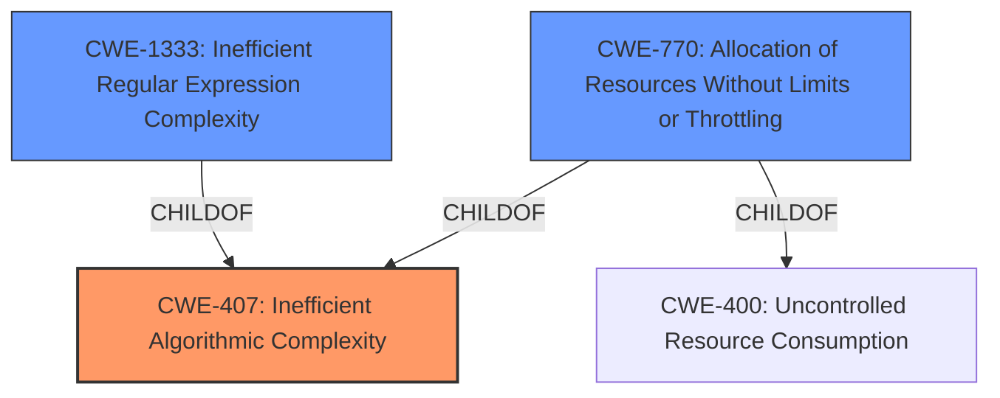

# Enhanced Analysis for CVE-2022-39209

# Summary
| CWE ID   | CWE Name                                                   | Confidence | CWE Abstraction Level | CWE Vulnerability Mapping Label | CWE-Vulnerability Mapping Notes |
| :--------- | :--------------------------------------------------------- | :--------- | :---------------------- | :------------------------------ | :------------------------------ |
| CWE-407  | Inefficient Algorithmic Complexity                         | 0.90       | Class                   | Primary                         | Allowed-with-Review           |
| CWE-1333 | Inefficient Regular Expression Complexity                  | 0.75       | Base                    | Secondary                       | Allowed                       |
| CWE-770  | Allocation of Resources Without Limits or Throttling       | 0.60       | Base                    | Secondary                       | Allowed                       |

## Evidence and Confidence

*   **Confidence Score:** 0.80
*   **Evidence Strength:** HIGH

## Relationship Analysis
The primary CWE selected is CWE-407, Inefficient Algorithmic Complexity, which is a Class-level CWE. CWE-1333, Inefficient Regular Expression Complexity is a Base-level CWE and a child of CWE-407, as regular expressions are algorithms. CWE-770 Allocation of Resources Without Limits or Throttling is also related to the resource exhaustion aspect of the vulnerability. Choosing CWE-407 reflects the general algorithmic inefficiency, while acknowledging the potential relevance of its more specific child CWE-1333 (if the autolink extension uses regular expressions) and CWE-770.



## Vulnerability Chain
The vulnerability chain starts with an **inefficient algorithm** in the autolink extension, leading to polynomial time complexity. This results in unbounded resource exhaustion, which ultimately causes a denial of service.

## Summary of Analysis
The initial assessment focused on the **polynomial time complexity issue** within the `cmark-gfm`'s autolink extension as the root cause. The vulnerability description key phrases indicate that the root cause is "polynomial time complexity issue in autolink extension" and the impact is "unbounded resource exhaustion and denial of service". The CVE Reference Links Content Summary further confirms that the **vulnerability stems from a polynomial time complexity issue** within the `cmark-gfm`'s autolink extension.

The Retriever Results and Complete CWE Specifications were analyzed to find the best match for this root cause.

CWE-407, Inefficient Algorithmic Complexity, was selected as the primary CWE because it directly addresses the **algorithmic inefficiency** that leads to the vulnerability. While it is a Class-level CWE, it accurately represents the general nature of the weakness.

CWE-1333, Inefficient Regular Expression Complexity, was considered as a more specific alternative, especially if the autolink extension utilizes regular expressions. However, without explicit confirmation of regular expression usage, it was deemed a secondary candidate.

CWE-770, Allocation of Resources Without Limits or Throttling, was considered due to the resulting resource exhaustion. However, the root cause is the **inefficient algorithm**, which then leads to resource exhaustion. Therefore, it was considered a secondary factor.

The selection of CWE-407 is at an appropriate level of specificity, as it captures the essence of the vulnerability's root cause without being overly specific about the implementation details. The evidence strongly supports the presence of an **inefficient algorithm** that can be exploited to cause a denial of service.
Relevant CWE Information:

# Enhanced Context (25 CWEs)
The following CWEs were identified as potentially relevant to this vulnerability:

## CWE-789: Memory Allocation with Excessive Size Value
**Abstraction Level**: Variant
**Similarity Score**: 0.79
**Source**: dense

**Description**:
The product allocates memory based on an untrusted, large size value, but it does not ensure that the size is within expected limits, allowing arbitrary amounts of memory to be allocated.

**Mapping Guidance**:
- Usage: Allowed
- Rationale: This CWE entry is at the Variant level of abstraction, which is a preferred level of abstraction for mapping to the root causes of vulnerabilities.


## CWE-1325: Improperly Controlled Sequential Memory Allocation
**Abstraction Level**: Base
**Similarity Score**: 0.77
**Source**: dense

**Description**:
The product manages a group of objects or resources and performs a separate memory allocation for each object, but it does not properly limit the total amount of memory that is consumed by all of the combined objects.

**Mapping Guidance**:
- Usage: Allowed
- Rationale: This CWE entry is at the Base level of abstraction, which is a preferred level of abstraction for mapping to the root causes of vulnerabilities.


## CWE-407: Inefficient Algorithmic Complexity
**Abstraction Level**: Class
**Similarity Score**: 0.76
**Source**: dense

**Description**:
An algorithm in a product has an inefficient worst-case computational complexity that may be detrimental to system performance and can be triggered by an attacker, typically using crafted manipulations that ensure that the worst case is being reached.

**Mapping Guidance**:
- Usage: Allowed-with-Review
- Rationale: This CWE entry is a Class and might have Base-level children that would be more appropriate


## CWE-131: Incorrect Calculation of Buffer Size
**Abstraction Level**: Base
**Similarity Score**: 0.75
**Source**: dense

**Description**:
The product does not correctly calculate the size to be used when allocating a buffer, which could lead to a buffer overflow.

**Mapping Guidance**:
- Usage: Allowed
- Rationale: This CWE entry is at the Base level of abstraction, which is a preferred level of abstraction for mapping to the root causes of vulnerabilities.


## CWE-681: Incorrect Conversion between Numeric Types
**Abstraction Level**: Base
**Similarity Score**: 0.75
**Source**: dense

**Description**:
When converting from one data type to another, such as long to integer, data can be omitted or translated in a way that produces unexpected values. If the resulting values are used in a sensitive context, then dangerous behaviors may occur.

**Mapping Guidance**:
- Usage: Allowed
- Rationale: This CWE entry is at the Base level of abstraction, which is a preferred level of abstraction for mapping to the root causes of vulnerabilities.


## CWE-191: Integer Underflow (Wrap or Wraparound)
**Abstraction Level**: Base
**Similarity Score**: 0.75
**Source**: dense

**Description**:
The product subtracts one value from another, such that the result is less than the minimum allowable integer value, which produces a value that is not equal to the correct result.

**Mapping Guidance**:
- Usage: Allowed
- Rationale: This CWE entry is at the Base level of abstraction, which is a preferred level of abstraction for mapping to the root causes of vulnerabilities.


## CWE-226: Sensitive Information in Resource Not Removed Before Reuse
**Abstraction Level**: Base
**Similarity Score**: 0.75
**Source**: dense

**Description**:
The product releases a resource such as memory or a file so that it can be made available for reuse, but it does not clear or "zeroize" the information contained in the resource before the product performs a critical state transition or makes the resource available for reuse by other entities.

**Mapping Guidance**:
- Usage: Allowed
- Rationale: This CWE entry is at the Base level of abstraction, which is a preferred level of abstraction for mapping to the root causes of vulnerabilities.


## CWE-197: Numeric Truncation Error
**Abstraction Level**: Base
**Similarity Score**: 0.75
**Source**: dense

**Description**:
Truncation errors occur when a primitive is cast to a primitive of a smaller size and data is lost in the conversion.

**Mapping Guidance**:
- Usage: Allowed
- Rationale: This CWE entry is at the Base level of abstraction, which is a preferred level of abstraction for mapping to the root causes of vulnerabilities.


## CWE-125: Out-of-bounds Read
**Abstraction Level**: Base
**Similarity Score**: 0.75
**Source**: dense

**Description**:
The product reads data past the end, or before the beginning, of the intended buffer.

**Mapping Guidance**:
- Usage: Allowed
- Rationale: This CWE entry is at the Base level of abstraction, which is a preferred level of abstraction for mapping to the root causes of vulnerabilities.


## CWE-404: Improper Resource Shutdown or Release
**Abstraction Level**: Class


## CWE Relationship Analysis

Current CWEs represent these abstraction levels: .


### Vulnerability Chain Analysis

**Chain starting from CWE-131:**
- 131 (Incorrect Calculation of Buffer Size) - ROOT


**Chain starting from CWE-1325:**
- 1325 (Improperly Controlled Sequential Memory Allocation) - ROOT


### CWE Relationship Diagram

```mermaid
graph TD
    classDef primary fill:#f96,stroke:#333,stroke-width:2px
    classDef secondary fill:#69f,stroke:#333
    classDef tertiary fill:#9e9,stroke:#333
```