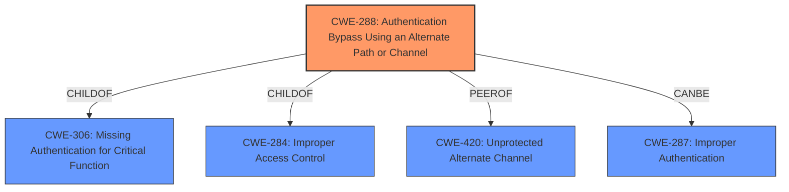

# Analysis Report for CVE-2022-39219

# Vulnerability Analysis Report: CVE-2022-39219

## Description


## Analysis (with Relationship Data)

# Summary
| CWE ID | CWE Name | Confidence | CWE Abstraction Level | CWE Vulnerability Mapping Label | CWE-Vulnerability Mapping Notes |
|---|---|---|---|---|---|
| CWE-288 | Authentication Bypass Using an Alternate Path or Channel | 0.9 | Base | Allowed | Primary CWE |
| CWE-287 | Improper Authentication | 0.6 | Class | Discouraged | Secondary Candidate |
| CWE-863 | Incorrect Authorization | 0.5 | Class | Allowed-with-Review | Secondary Candidate |

## Evidence and Confidence

*   **Confidence Score:** 0.8
*   **Evidence Strength:** HIGH

## Relationship Analysis
The primary CWE selected is CWE-288 (Authentication Bypass Using an Alternate Path or Channel), which is a child of CWE-306 (Missing Critical Authentication) and CWE-284 (Improper Access Control). CWE-288 is also a peer of CWE-420 (Unprotected Alternate Channel), indicating similar vulnerabilities involving bypassing security mechanisms through alternate routes. The relationship of CWE-288 to CWE-287 (Improper Authentication) is such that CWE-288 can be a more specific case of CWE-287, where authentication is bypassed due to an alternate path. The abstraction levels influenced the selection, prioritizing the more specific Base level CWE-288 over the broader Class level CWE-287.



## Vulnerability Chain
The vulnerability chain starts with the **root cause**, which is the **authentication bypass** due to the application not properly enforcing authorization checks when using HTTP Basic Authentication. This leads to the weakness of inconsistent authorization enforcement based on the authentication method. The impact of this is that users with read-only permissions can perform write requests, leading to unauthorized write access and potential data integrity violations.

## Summary of Analysis
Initially, several CWEs were considered, including CWE-287 (Improper Authentication) and CWE-863 (Incorrect Authorization), due to the **authentication bypass**. However, the key aspect of the vulnerability is that it involves an **alternate path** (HTTP Basic Authentication) that bypasses the normal authentication checks enforced when using cookie-based authentication. The evidence from the CVE Reference Links Content Summary states, "While cookie-based authentication correctly restricted 'monitor' group users to read-only access, this restriction was bypassed when using HTTP Basic Authentication." This clearly points to CWE-288 (Authentication Bypass Using an Alternate Path or Channel) as the most appropriate CWE, as it specifically addresses vulnerabilities where an alternate path or channel bypasses authentication requirements. The fact that "checkWriteRequest is not called for basic auth" reinforces the alternate path.

The selection of CWE-288 is based on direct evidence from the vulnerability description and the CVE Reference Links Content Summary. The relationship graph shows that CWE-288 is a more specific case of improper authentication and access control issues. The abstraction level of CWE-288 is Base, which is the preferred level of specificity.

CWE-287 (Improper Authentication) was considered because the application **fails to properly authenticate** and authorize users under certain conditions. However, CWE-288 is more specific because it highlights the alternate path issue. CWE-863 (Incorrect Authorization) was also considered because the application performs an authorization check, but it does not correctly perform the check when using HTTP Basic Authentication. However, this is better characterized as a bypass rather than an incorrect check, making CWE-288 more suitable.

Relevant CWE Information:

# Enhanced Context (25 CWEs)

## CWE-918: Server-Side Request Forgery (SSRF)
## CWE-303: Incorrect Implementation of Authentication Algorithm
## CWE-807: Reliance on Untrusted Inputs in a Security Decision
## CWE-319: Cleartext Transmission of Sensitive Information
## CWE-212: Improper Removal of Sensitive Information Before Storage or Transfer
## CWE-74: Improper Neutralization of Special Elements in Output Used by a Downstream Component ('Injection')
## CWE-1391: Use of Weak Credentials
## CWE-639: Authorization Bypass Through User-Controlled Key
## CWE-668: Exposure of Resource to Wrong Sphere
## CWE-204: Observable Response Discrepancy
## CWE-863: Incorrect Authorization
## CWE-1390: Weak Authentication
## CWE-285: Improper Authorization
## CWE-287: Improper Authentication
## CWE-639: Authorization Bypass Through User-Controlled Key
## CWE-201: Insertion of Sensitive Information Into Sent Data
## CWE-613: Insufficient Session Expiration
## CWE-178: Improper Handling of Case Sensitivity
## CWE-420: Unprotected Alternate Channel
## CWE-202: Exposure of Sensitive Information Through Data Queries
## CWE-1289: Improper Validation of Unsafe Equivalence in Input
## CWE-209: Generation of Error Message Containing Sensitive Information
## CWE-611: Improper Restriction of XML External Entity Reference
## CWE-212: Improper Removal of Sensitive Information Before Storage or Transfer
## CWE-226: Sensitive Information in Resource Not Removed Before Reuse

CWE-918, CWE-303, CWE-807, CWE-319, CWE-212, CWE-74, CWE-1391, CWE-639, CWE-668, CWE-204, CWE-1390, CWE-201, CWE-613, CWE-178, CWE-420, CWE-202, CWE-1289, CWE-209, CWE-611 and CWE-226 were considered but are not applicable because the vulnerability is primarily an **authentication bypass** issue through an alternate channel rather than issues related to request forgery, algorithm implementation, untrusted inputs, sensitive information exposure, or session management.


## CWE Relationship Analysis

Current CWEs represent these abstraction levels: .


### Vulnerability Chain Analysis

**Chain starting from CWE-807:**
- 807 (Reliance on Untrusted Inputs in a Security Decision) - ROOT


**Chain starting from CWE-668:**
- 668 (Exposure of Resource to Wrong Sphere) - ROOT


### CWE Relationship Diagram

```mermaid
graph TD
    classDef primary fill:#f96,stroke:#333,stroke-width:2px
    classDef secondary fill:#69f,stroke:#333
    classDef tertiary fill:#9e9,stroke:#333
```


*Report generated on 2025-03-30 23:03:55*
