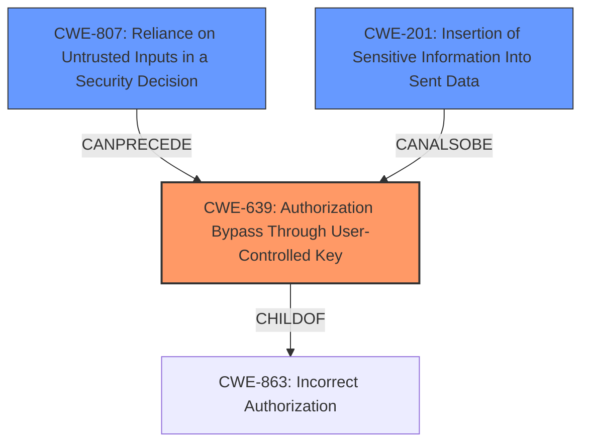

# Raw Analyzer Response for CVE-2022-39222

# Summary
| CWE ID    | CWE Name                                                       | Confidence | CWE Abstraction Level | CWE Vulnerability Mapping Label | CWE-Vulnerability Mapping Notes |
| :-------- | :------------------------------------------------------------- | :--------- | :---------------------- | :------------------------------ | :------------------------------ |
| CWE-639   | Authorization Bypass Through User-Controlled Key               | 0.9        | Base                    | Primary                         | Allowed                       |
| CWE-807   | Reliance on Untrusted Inputs in a Security Decision           | 0.7        | Base                    | Secondary                       | Allowed                       |
| CWE-201   | Insertion of Sensitive Information Into Sent Data             | 0.6        | Base                    | Secondary                       | Allowed                       |

## Evidence and Confidence

*   **Confidence Score:** 0.8
*   **Evidence Strength:** HIGH

## Relationship Analysis
The primary CWE is CWE-639, which is a Base level CWE and a child of CWE-863 (Incorrect Authorization). This indicates a specific type of authorization issue where a user-controlled key is used to bypass authorization checks. CWE-807 (Reliance on Untrusted Inputs in a Security Decision) can precede CWE-639, as the bypass is possible due to the system relying on an input that the user controls, this is further compounded by CWE-201 because the attacker is able to use the information to poll the `/approval` endpoint

## Vulnerability Chain
The vulnerability chain starts with the **improper OAuth configuration**, leading to a predictable request ID. The attacker can then use this predictable ID to poll the `/approval` endpoint and steal the OAuth authorization code. Finally, the attacker can exchange the authorization code for a token, gaining unauthorized access.

Root Cause: **Improper OAuth configuration** (Inferred CWE) -> CWE-807 (Reliance on Untrusted Inputs in a Security Decision) -> CWE-639 (Authorization Bypass Through User-Controlled Key) -> CWE-201 (Insertion of Sensitive Information Into Sent Data) -> Unauthorized Access

## Summary of Analysis
The initial assessment, based on the vulnerability description and CVE reference links, points towards an authorization bypass vulnerability due to a predictable request ID. The primary CWE, CWE-639 (Authorization Bypass Through User-Controlled Key), accurately captures the essence of the vulnerability, where an attacker can modify a user-controlled key (the state parameter) to gain unauthorized access.

The evidence supporting this decision is derived from the following:

*   Vulnerability Description Key Phrases: "**improper OAuth configuration**"
*   CVE Reference Links Content Summary: "The vulnerability stems from a predictable request ID used in the `/approval` endpoint, which allowed an attacker to fetch the OAuth authorization code before the legitimate user... The Dex instance used the state parameter received during the initial redirect to the connector IDP as the request ID, which was not protected."

The retriever results also supports CWE-639 as the top match, and CWE-863 (Incorrect Authorization) which is a parent of CWE-639.

CWE-807 is a contributing factor because the system relies on the state parameter which can be manipulated by the attacker to gain access. CWE-201 is also a contributing factor because the attacker is able to obtain information to poll the `/approval` endpoint.

The selected CWEs are at the optimal level of specificity. CWE-639 is a Base level CWE, which is preferred. Although CWE-863 is a Class, it is a parent of CWE-639 and less specific to the vulnerability.

Relevant CWE Information:

# Enhanced Context (25 CWEs)
The following CWEs were identified as potentially relevant to this vulnerability:

## CWE-639: Authorization Bypass Through User-Controlled Key
**Abstraction Level**: Base
**Similarity Score**: 0.75
**Source**: dense

**Description**:
The system's authorization functionality does not prevent one user from gaining access to another user's data or record by modifying the key value identifying the data.

**Mapping Guidance**:
- Usage: Allowed
- Rationale: This CWE entry is at the Base level of abstraction, which is a preferred level of abstraction for mapping to the root causes of vulnerabilities.