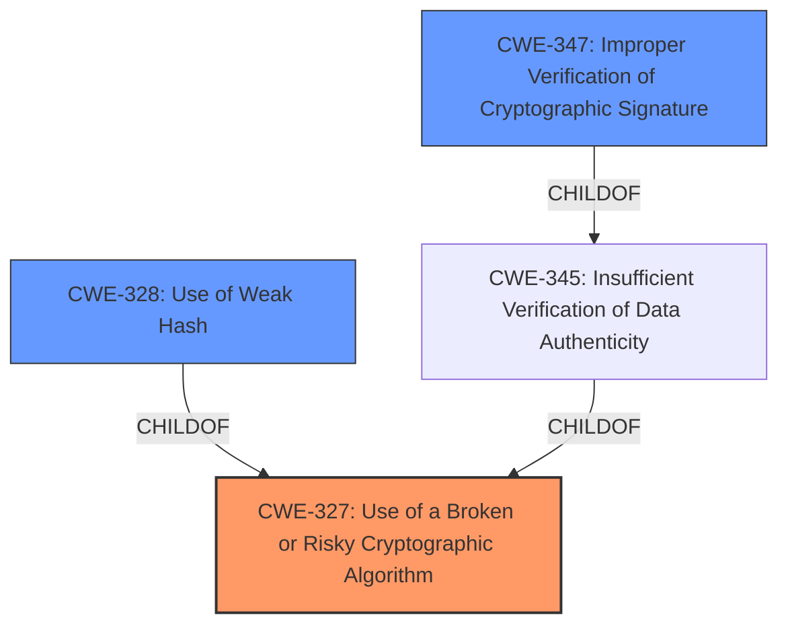

# Enhanced Analysis for CVE-2022-39237

# Summary
| CWE ID  | CWE Name                                                        | Confidence | CWE Abstraction Level | CWE Vulnerability Mapping Label | CWE-Vulnerability Mapping Notes |
| :-------- | :-------------------------------------------------------------- | :--------- | :---------------------- | :------------------------------ | :------------------------------ |
| CWE-327   | Use of a Broken or Risky Cryptographic Algorithm              | 0.9        | Class                   | Primary                         | Allowed-with-Review             |
| CWE-328   | Use of Weak Hash                                              | 0.8        | Base                    | Secondary                       | Allowed                         |
| CWE-347   | Improper Verification of Cryptographic Signature              | 0.7        | Base                    | Secondary                       | Allowed                         |

## Evidence and Confidence

*   **Confidence Score:** 0.9
*   **Evidence Strength:** HIGH

## Relationship Analysis
The primary CWE is CWE-327, a class-level weakness indicating the use of a broken or risky cryptographic algorithm. The more specific, base-level CWEs, CWE-328 and CWE-347, are related as they describe specific instances of this broader class. CWE-328 (Use of Weak Hash) directly addresses the use of a cryptographically weak hash algorithm, while CWE-347 (Improper Verification of Cryptographic Signature) highlights the **failure to properly verify cryptographic signatures**, which is a consequence of using the **weak hash**. These relationships were considered in choosing the optimal level of specificity, favoring the class-level CWE-327 to encompass the overall cryptographic issue, and including the more specific, base-level CWEs as contributing factors.



## Vulnerability Chain
The vulnerability chain starts with the **root cause**: a failure to verify the cryptographic strength of the hash algorithm (CWE-327). This leads to the use of a **weak hash** algorithm (CWE-328). The **impact** is the **improper verification of cryptographic signatures** (CWE-347), which could allow an attacker to compromise image integrity and replace a legitimate image with a malicious one.

## Summary of Analysis
The initial analysis focused on identifying the **root cause** of the vulnerability, which is the **failure to verify the cryptographic strength of the hash algorithms**. The provided evidence from the CVE description includes the key phrase "**did not verify that the hash algorithm(s) used are cryptographically secure**". The CVE reference link summary explicitly states the "**lack of proper checks to ensure that only secure hash algorithms are used for verifying digital signatures**".

The Retriever Results listed CWE-327, CWE-347, and CWE-328 as top candidates. While CWE-328 (Use of Weak Hash) seemed initially like a good fit, the more encompassing nature of CWE-327 (Use of a Broken or Risky Cryptographic Algorithm) was deemed more appropriate to capture the overall cryptographic risk. Further analysis revealed that the **improper verification of signatures** (CWE-347) stemmed from the **use of the weak hash** (CWE-328) and both were a result of the product's **failure to verify the hash algorithm's security** (CWE-327).

The decision to include CWE-328 and CWE-347 as secondary mappings was driven by the need to provide a comprehensive representation of the vulnerability. These additional mappings highlight the specific technical weaknesses and their consequences, supplementing the higher-level classification of CWE-327.

The selected CWEs are at the optimal level of specificity, as they accurately reflect the weakness while providing enough context to understand the potential impact. CWE-327 captures the overarching cryptographic flaw, while CWE-328 and CWE-347 provide details about the specific weaknesses.

Relevant CWE Information:

# Enhanced Context (25 CWEs)

## CWE-327: Use of a Broken or Risky Cryptographic Algorithm
**Abstraction Level**: Class
**Similarity Score**: 6641.54 (sparse)
**Description**:
The product uses a broken or risky cryptographic algorithm or protocol.

**Mapping Guidance**:
- Usage: Allowed-with-Review

## CWE-347: Improper Verification of Cryptographic Signature
**Abstraction Level**: Base
**Similarity Score**: 6239.71 (sparse)
**Description**:
The product does not verify, or incorrectly verifies, the cryptographic signature for data.

**Mapping Guidance**:
- Usage: Allowed

## CWE-328: Use of Weak Hash
**Abstraction Level**: Base
**Similarity Score**: 6874.98 (sparse)
**Description**:
The product uses an algorithm that produces a digest (output value) that does not meet security expectations for a hash function that allows an adversary to reasonably determine the original input (preimage attack), find another input that can produce the same hash (2nd preimage attack), or find multiple inputs that evaluate to the same hash (birthday attack).

**Mapping Guidance**:
- Usage: Allowed

CWEs considered but not used:

- CWE-916: Use of Password Hash With Insufficient Computational Effort - While hashing is involved, this vulnerability is not specific to password hashing, making it less relevant.
- CWE-1240: Use of a Cryptographic Primitive with a Risky Implementation - Although related to cryptographic primitives, the core issue is not the implementation itself, but the **lack of verification of the algorithm's security**.
- CWE-330: Use of Insufficiently Random Values - Randomness is not the primary concern in this vulnerability.
- CWE-407: Inefficient Algorithmic Complexity - Algorithmic complexity is not directly related to this vulnerability.
- CWE-804: Guessable CAPTCHA - CAPTCHA is not relevant in this vulnerability.
- CWE-201, CWE-202, CWE-209, CWE-208, CWE-212, CWE-756, CWE-1272 - These CWEs are related to information exposure, which is an impact of this vulnerability, but not the **root cause**.
- CWE-345: Insufficient Verification of Data Authenticity - While related, CWE-347 is a more specific Base case of signature verification.
- CWE-301: Reflection Attack in an Authentication Protocol - Authentication protocols are not directly involved in the vulnerability.
- CWE-1294: Insecure Security Identifier Mechanism - This is specific to System-on-Chip (SoC) and not applicable here.


## CWE Relationship Analysis

Current CWEs represent these abstraction levels: .


### Vulnerability Chain Analysis

**Chain starting from CWE-916:**
- 916 (Use of Password Hash With Insufficient Computational Effort) - ROOT


**Chain starting from CWE-201:**
- 201 (Insertion of Sensitive Information Into Sent Data) - ROOT


### CWE Relationship Diagram

```mermaid
graph TD
    classDef primary fill:#f96,stroke:#333,stroke-width:2px
    classDef secondary fill:#69f,stroke:#333
    classDef tertiary fill:#9e9,stroke:#333
```