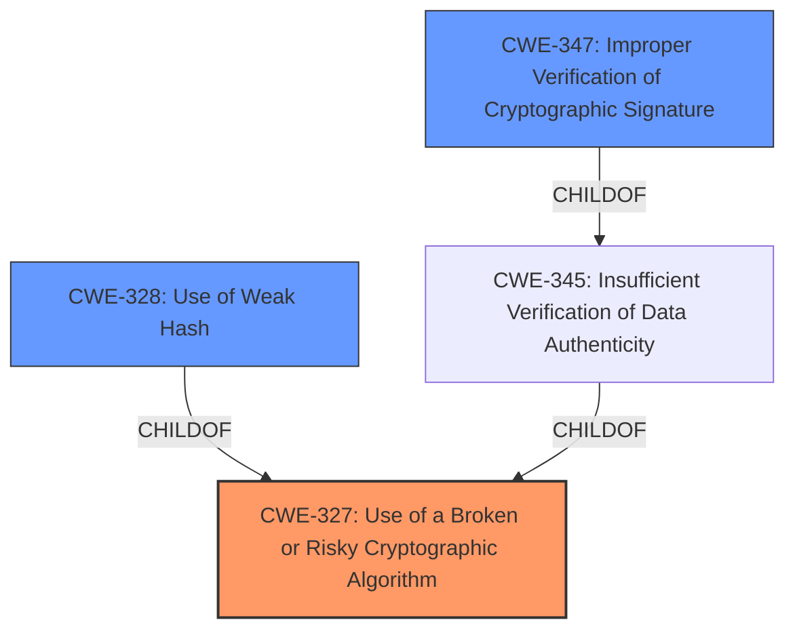

# Analysis for CVE-2022-39237

# Summary
| CWE ID  | CWE Name                                                        | Confidence | CWE Abstraction Level | CWE Vulnerability Mapping Label | CWE-Vulnerability Mapping Notes |
| :-------- | :-------------------------------------------------------------- | :--------- | :---------------------- | :------------------------------ | :------------------------------ |
| CWE-327   | Use of a Broken or Risky Cryptographic Algorithm              | 0.9        | Class                   | Primary                         | Allowed-with-Review             |
| CWE-328   | Use of Weak Hash                                              | 0.8        | Base                    | Secondary                       | Allowed                         |
| CWE-347   | Improper Verification of Cryptographic Signature              | 0.7        | Base                    | Secondary                       | Allowed                         |

## Evidence and Confidence

*   **Confidence Score:** 0.9
*   **Evidence Strength:** HIGH

## Relationship Analysis
The primary CWE is CWE-327, a class-level weakness indicating the use of a broken or risky cryptographic algorithm. The more specific, base-level CWEs, CWE-328 and CWE-347, are related as they describe specific instances of this broader class. CWE-328 (Use of Weak Hash) directly addresses the use of a cryptographically weak hash algorithm, while CWE-347 (Improper Verification of Cryptographic Signature) highlights the **failure to properly verify cryptographic signatures**, which is a consequence of using the **weak hash**. These relationships were considered in choosing the optimal level of specificity, favoring the class-level CWE-327 to encompass the overall cryptographic issue, and including the more specific, base-level CWEs as contributing factors.

## Vulnerability Chain
The vulnerability chain starts with the **root cause**: a failure to verify the cryptographic strength of the hash algorithm (CWE-327). This leads to the use of a **weak hash** algorithm (CWE-328). The **impact** is the **improper verification of cryptographic signatures** (CWE-347), which could allow an attacker to compromise image integrity and replace a legitimate image with a malicious one.

## Summary of Analysis
The initial analysis focused on identifying the **root cause** of the vulnerability, which is the **failure to verify the cryptographic strength of the hash algorithms**. The provided evidence from the CVE description includes the key phrase "**did not verify that the hash algorithm(s) used are cryptographically secure**". The CVE reference link summary explicitly states the "**lack of proper checks to ensure that only secure hash algorithms are used for verifying digital signatures**".

The Retriever Results listed CWE-327, CWE-347, and CWE-328 as top candidates. While CWE-328 (Use of Weak Hash) seemed initially like a good fit, the more encompassing nature of CWE-327 (Use of a Broken or Risky Cryptographic Algorithm) was deemed more appropriate to capture the overall cryptographic risk. Further analysis revealed that the **improper verification of signatures** (CWE-347) stemmed from the **use of the weak hash** (CWE-328) and both were a result of the product's **failure to verify the hash algorithm's security** (CWE-327).

The decision to include CWE-328 and CWE-347 as secondary mappings was driven by the need to provide a comprehensive representation of the vulnerability. These additional mappings highlight the specific technical weaknesses and their consequences, supplementing the higher-level classification of CWE-327.

The selected CWEs are at the optimal level of specificity, as they accurately reflect the weakness while providing enough context to understand the potential impact. CWE-327 captures the overarching cryptographic flaw, while CWE-328 and CWE-347 provide details about the specific weaknesses.

Relevant CWE Information:

# Enhanced Context (25 CWEs)

## CWE-327: Use of a Broken or Risky Cryptographic Algorithm
**Abstraction Level**: Class
**Similarity Score**: 6641.54 (sparse)
**Description**:
The product uses a broken or risky cryptographic algorithm or protocol.

**Mapping Guidance**:
- Usage: Allowed-with-Review

## CWE-347: Improper Verification of Cryptographic Signature
**Abstraction Level**: Base
**Similarity Score**: 6239.71 (sparse)
**Description**:
The product does not verify, or incorrectly verifies, the cryptographic signature for data.

**Mapping Guidance**:
- Usage: Allowed

## CWE-328: Use of Weak Hash
**Abstraction Level**: Base
**Similarity Score**: 6874.98 (sparse)
**Description**:
The product uses an algorithm that produces a digest (output value) that does not meet security expectations for a hash function that allows an adversary to reasonably determine the original input (preimage attack), find another input that can produce the same hash (2nd preimage attack), or find multiple inputs that evaluate to the same hash (birthday attack).

**Mapping Guidance**:
- Usage: Allowed

CWEs considered but not used:

- CWE-916: Use of Password Hash With Insufficient Computational Effort - While hashing is involved, this vulnerability is not specific to password hashing, making it less relevant.
- CWE-1240: Use of a Cryptographic Primitive with a Risky Implementation - Although related to cryptographic primitives, the core issue is not the implementation itself, but the **lack of verification of the algorithm's security**.
- CWE-330: Use of Insufficiently Random Values - Randomness is not the primary concern in this vulnerability.
- CWE-407: Inefficient Algorithmic Complexity - Algorithmic complexity is not directly related to this vulnerability.
- CWE-804: Guessable CAPTCHA - CAPTCHA is not relevant in this vulnerability.
- CWE-201, CWE-202, CWE-209, CWE-208, CWE-212, CWE-756, CWE-1272 - These CWEs are related to information exposure, which is an impact of this vulnerability, but not the **root cause**.
- CWE-345: Insufficient Verification of Data Authenticity - While related, CWE-347 is a more specific Base case of signature verification.
- CWE-301: Reflection Attack in an Authentication Protocol - Authentication protocols are not directly involved in the vulnerability.
- CWE-1294: Insecure Security Identifier Mechanism - This is specific to System-on-Chip (SoC) and not applicable here.

# Enhanced Query for CVE-2022-39237

## Vulnerability Description
syslabs/sif is the Singularity Image Format (SIF) reference implementation. In versions prior to 2.8.1the `github.com/sylabs/sif/v2/pkg/integrity` package **did not verify that the hash algorithm(s) used are cryptographically secure** when verifying digital signatures. A patch is available in version >= v2.8.1 of the module. Users are encouraged to upgrade. Users unable to upgrade may independently validate that the hash algorithm(s) used for metadata digest(s) and signature hash are cryptographically secure.

### Vulnerability Description Key Phrases
- **rootcause:** **did not verify that the hash algorithm(s) used are cryptographically secure**
- **product:** github.com/sylabs/sif/v2/pkg/integrity
- **version:** prior to 2.8.1

## CVE Reference Links Content Summary
Based on the provided content, here's a breakdown of the vulnerability described in CVE-2022-39237:

**Root Cause:**
- The vulnerability stems from the `github.com/sylabs/sif/v2/pkg/integrity` package's failure to validate the cryptographic strength of hash algorithms used during digital signature verification. Specifically, the code did not enforce the use of only secure hash algorithms when verifying signatures.

**Weaknesses/Vulnerabilities Present:**
- **Insufficient cryptographic validation:** The core weakness is the lack of proper checks to ensure that only secure hash algorithms are used for verifying digital signatures. This allows the use of weaker, potentially compromised algorithms.
- **Use of hardcoded algorithms:** The `supportedPGPAlgorithms` variable in `clearsign.go` and similar logic in other files, while seemingly providing a list of algorithms, did not prevent the use of other hash algorithms elsewhere. The fix enforces that the passed in hash algorithm is within the allowed set of algorithms.
- **Incorrect `openpgp` library usage:** The `openpgp.CheckDetachedSignature` function did not allow for specifying a list of acceptable hash algorithms. The fix replaces this call with `openpgp.CheckDetachedSignatureAndHash` which allows for enforcing that only the `supportedPGPAlgorithms` hash algorithms were used to create the signature.

**Impact of Exploitation:**
- **Compromised image integrity:** An attacker could potentially create a container image with a signature using a weak or compromised hash algorithm.
- **Image replacement:** By exploiting the lack of hash algorithm validation, an attacker can replace the legitimate image with a malicious one.
- **Unexpected container execution:** Users may unknowingly run the tampered container image, leading to various security risks, potentially code execution, data theft, etc.

**Attack Vectors:**
- The primary attack vector involves the creation and distribution of a specially crafted container image with a signature using a weak hash algorithm.
- An attacker would need to get the image into a location where an affected version of the software will attempt to verify its signature.

**Required Attacker Capabilities/Position:**
- The attacker needs the ability to create and sign a container image. This could be achieved through access to a signing key or by compromising a build or signing process.
- The attacker needs to have their malicious image placed somewhere where a user would attempt to verify and use it, which could involve a compromised repository, supply chain attack, or other methods.
- The attacker needs to be able to cause the user to verify the signature using a vulnerable version of the software.

**Additional Information:**
- The vulnerability is in the `github.com/sylabs/sif/v2` Go module, specifically versions 2.8.0 and earlier.
- The fix is in version 2.8.1 of the module and commit `07fb86029a12e3210f6131e065570124605daeaa`.
- The vulnerability was assigned CVE-2022-39237.
- The vulnerability is also tracked by GHSA-m5m3-46gj-wch8
- The Gentoo Security Advisory GLSA 202210-19 also relates to this vulnerability, impacting `app-containers/apptainer` before version 1.1.2.
- The CVSS score is 2.3, with a vector of CVSS:3.1/AV:L/AC:H/PR:H/UI:R/S:C/C:N/I:L/A:N, indicating a low severity issue that requires a local attack vector, high attack complexity and high privileges, with user interaction.
- The vulnerability is categorized as CWE-328 (Use of a Broken or Risky Cryptographic Algorithm).

## Retriever Results

### Top Combined Results

| Rank | CWE ID | Name | Abstraction | Usage  | Retrievers | Individual Scores |
|------|--------|------|-------------|-------|------------|-------------------|
| 1 | 327 | Use of a Broken or Risky Cryptographic Algorithm | Class | Allowed-with-Review | sparse | 0.677 |
| 2 | 347 | Improper Verification of Cryptographic Signature | Base | Allowed | sparse | 0.579 |
| 3 | 328 | Use of Weak Hash | Base | Allowed | sparse | 0.558 |
| 4 | 407 | Inefficient Algorithmic Complexity | Class | Allowed-with-Review | sparse | 0.532 |
| 5 | 330 | Use of Insufficiently Random Values | Class | Discouraged | sparse | 0.492 |
| 6 | 1294 | Insecure Security Identifier Mechanism | Class | Allowed-with-Review | dense | 0.393 |
| 7 | 804 | Guessable CAPTCHA | Base | Allowed | graph | 0.002 |
| 8 | 345 | Insufficient Verification of Data Authenticity | Class | Discouraged | sparse | 0.475 |
| 9 | 201 | Insertion of Sensitive Information Into Sent Data | Base | Allowed | sparse | 0.475 |
| 10 | 916 | Use of Password Hash With Insufficient Computational Effort | Base | Allowed | sparse | 0.474 |

# Complete CWE Specifications

## CWE-327: Use of a Broken or Risky Cryptographic Algorithm
**Abstraction:** Class
**Status:** Draft

### Description
The product uses a broken or risky cryptographic algorithm or protocol.

### Extended Description

Cryptographic algorithms are the methods by which data is scrambled to prevent observation or influence by unauthorized actors. Insecure cryptography can be exploited to expose sensitive information, modify data in unexpected ways, spoof identities of other users or devices, or other impacts.

It is very difficult to produce a secure algorithm, and even high-profile algorithms by accomplished cryptographic experts have been broken. Well-known techniques exist to break or weaken various kinds of cryptography. Accordingly, there are a small number of well-understood and heavily studied algorithms that should be used by most products. Using a non-standard or known-insecure algorithm is dangerous because a determined adversary may be able to break the algorithm and compromise whatever data has been protected.

Since the state of cryptography advances so rapidly, it is common for an algorithm to be considered "unsafe" even if it was once thought to be strong. This can happen when new attacks are discovered, or if computing power increases so much that the cryptographic algorithm no longer provides the amount of protection that was originally thought.

For a number of reasons, this weakness is even more challenging to manage with hardware deployment of cryptographic algorithms as opposed to software implementation. First, if a flaw is discovered with hardware-implemented cryptography, the flaw cannot be fixed in most cases without a recall of the product, because hardware is not easily replaceable like software. Second, because the hardware product is expected to work for years, the adversary's computing power will only increase over time.

### Alternative Terms
None

### Relationships
ChildOf -> CWE-693
PeerOf -> CWE-311

### Mapping Guidance
**Usage:** Allowed-with-Review
**Rationale:** This CWE entry is a Class and might have Base-level children that would be more appropriate
**Comments:** Examine children of this entry to see if there is a better fit
**Reasons:**
- Abstraction

### Additional Notes
**[Maintenance]** Since CWE 4.4, various cryptography-related entries, including CWE-327 and CWE-1240, have been slated for extensive research, analysis, and community consultation to define consistent terminology, improve relationships, and reduce overlap or duplication. As of CWE 4.6, this work is still ongoing.

**[Maintenance]** The Taxonomy_Mappings to ISA/IEC 62443 were added in CWE 4.10, but they are still under review and might change in future CWE versions. These draft mappings were performed by members of the "Mapping CWE to 62443" subgroup of the CWE-CAPEC ICS/OT Special Interest Group (SIG), and their work is incomplete as of CWE 4.10. The mappings are included to facilitate discussion and review by the broader ICS/OT community, and they are likely to change in future CWE versions.

### Observed Examples
- **CVE-2022-30273:** SCADA-based protocol supports a legacy encryption mode that uses Tiny Encryption Algorithm (TEA) in ECB mode, which leaks patterns in messages and cannot protect integrity
- **CVE-2022-30320:** Programmable Logic Controller (PLC) uses a protocol with a cryptographically insecure hashing algorithm for passwords.
- **CVE-2008-3775:** Product uses "ROT-25" to obfuscate the password in the registry.

## CWE-347: Improper Verification of Cryptographic Signature
**Abstraction:** Base
**Status:** Draft

### Description
The product does not verify, or incorrectly verifies, the cryptographic signature for data.

### Extended Description
Not provided

### Alternative Terms
None

### Relationships
ChildOf -> CWE-345
ChildOf -> CWE-345

### Mapping Guidance
**Usage:** Allowed
**Rationale:** This CWE entry is at the Base level of abstraction, which is a preferred level of abstraction for mapping to the root causes of vulnerabilities.
**Comments:** Carefully read both the name and description to ensure that this mapping is an appropriate fit. Do not try to 'force' a mapping to a lower-level Base/Variant simply to comply with this preferred level of abstraction.
**Reasons:**
- Acceptable-Use

### Observed Examples
- **CVE-2002-1796:** Does not properly verify signatures for "trusted" entities.
- **CVE-2005-2181:** Insufficient verification allows spoofing.
- **CVE-2005-2182:** Insufficient verification allows spoofing.

## CWE-328: Use of Weak Hash
**Abstraction:** Base
**Status:** Draft

### Description
The product uses an algorithm that produces a digest (output value) that does not meet security expectations for a hash function that allows an adversary to reasonably determine the original input (preimage attack), find another input that can produce the same hash (2nd preimage attack), or find multiple inputs that evaluate to the same hash (birthday attack).

### Extended Description

A hash function is defined as an algorithm that maps arbitrarily sized data into a fixed-sized digest (output) such that the following properties hold:

  1. The algorithm is not invertible (also called "one-way" or "not reversible")

  1. The algorithm is deterministic; the same input produces the same digest every time

 Building on this definition, a cryptographic hash function must also ensure that a malicious actor cannot leverage the hash function to have a reasonable chance of success at determining any of the following:

  1. the original input (preimage attack), given only the digest

  1. another input that can produce the same digest (2nd preimage attack), given the original input

  1. a set of two or more inputs that evaluate to the same digest (birthday attack), given the actor can arbitrarily choose the inputs to be hashed and can do so a reasonable amount of times

What is regarded as "reasonable" varies by context and threat model, but in general, "reasonable" could cover any attack that is more efficient than brute force (i.e., on average, attempting half of all possible combinations). Note that some attacks might be more efficient than brute force but are still not regarded as achievable in the real world.

Any algorithm that does not meet the above conditions will generally be considered weak for general use in hashing.

In addition to algorithmic weaknesses, a hash function can be made weak by using the hash in a security context that breaks its security guarantees. For example, using a hash function without a salt for storing passwords (that are sufficiently short) could enable an adversary to create a "rainbow table" [REF-637] to recover the password under certain conditions; this attack works against such hash functions as MD5, SHA-1, and SHA-2.

### Alternative Terms
None

### Relationships
ChildOf -> CWE-326
ChildOf -> CWE-327

### Mapping Guidance
**Usage:** Allowed
**Rationale:** This CWE entry is at the Base level of abstraction, which is a preferred level of abstraction for mapping to the root causes of vulnerabilities.
**Comments:** Carefully read both the name and description to ensure that this mapping is an appropriate fit. Do not try to 'force' a mapping to a lower-level Base/Variant simply to comply with this preferred level of abstraction.
**Reasons:**
- Acceptable-Use

### Additional Notes
**[Maintenance]** Since CWE 4.4, various cryptography-related entries including CWE-328 have been slated for extensive research, analysis, and community consultation to define consistent terminology, improve relationships, and reduce overlap or duplication. As of CWE 4.6, this work is still ongoing.

### Observed Examples
- **CVE-2022-30320:** Programmable Logic Controller (PLC) uses a protocol with a cryptographically insecure hashing algorithm for passwords.
- **CVE-2005-4900:** SHA-1 algorithm is not collision-resistant.
- **CVE-2020-25685:** DNS product uses a weak hash (CRC32 or SHA-1) of the query name, allowing attacker to forge responses by computing domain names with the same hash.

## CWE-407: Inefficient Algorithmic Complexity
**Abstraction:** Class
**Status:** Incomplete

### Description
An algorithm in a product has an inefficient worst-case computational complexity that may be detrimental to system performance and can be triggered by an attacker, typically using crafted manipulations that ensure that the worst case is being reached.

### Extended Description
Not provided

### Alternative Terms
Quadratic Complexity: Used when the algorithmic complexity is related to the square of the number of inputs (N^2)

### Relationships
ChildOf -> CWE-405

### Mapping Guidance
**Usage:** Allowed-with-Review
**Rationale:** This CWE entry is a Class and might have Base-level children that would be more appropriate
**Comments:** Examine children of this entry to see if there is a better fit
**Reasons:**
- Abstraction

### Observed Examples
- **CVE-2021-32617:** C++ library for image metadata has "quadratic complexity" issue with unnecessarily repetitive parsing each time an invalid character is encountered
- **CVE-2020-10735:** Python has "quadratic complexity" issue when converting string to int with many digits in unexpected bases
- **CVE-2020-5243:** server allows ReDOS with crafted User-Agent strings, due to overlapping capture groups that cause excessive backtracking.

## CWE-330: Use of Insufficiently Random Values
**Abstraction:** Class
**Status:** Stable

### Description
The product uses insufficiently random numbers or values in a security context that depends on unpredictable numbers.

### Extended Description
When product generates predictable values in a context requiring unpredictability, it may be possible for an attacker to guess the next value that will be generated, and use this guess to impersonate another user or access sensitive information.

### Alternative Terms
None

### Relationships
ChildOf -> CWE-693
CanPrecede -> CWE-804

### Mapping Guidance
**Usage:** Discouraged
**Rationale:** This CWE entry is a level-1 Class (i.e., a child of a Pillar). It might have lower-level children that would be more appropriate
**Comments:** Examine children of this entry to see if there is a better fit
**Reasons:**
- Abstraction

### Additional Notes
**[Relationship]** This can be primary to many other weaknesses such as cryptographic errors, authentication errors, symlink following, information leaks, and others.

**[Maintenance]** As of CWE 4.3, CWE-330 and its descendants are being investigated by the CWE crypto team to identify gaps related to randomness and unpredictability, as well as the relationships between randomness and cryptographic primitives. This "subtree analysis" might result in the addition or deprecation of existing entries; the reorganization of relationships in some views, e.g. the research view (CWE-1000); more consistent use of terminology; and/or significant modifications to related entries.

**[Maintenance]** As of CWE 4.5, terminology related to randomness, entropy, and predictability can vary widely. Within the developer and other communities, "randomness" is used heavily. However, within cryptography, "entropy" is distinct, typically implied as a measurement. There are no commonly-used definitions, even within standards documents and cryptography papers. Future versions of CWE will attempt to define these terms and, if necessary, distinguish between them in ways that are appropriate for different communities but do not reduce the usability of CWE for mapping, understanding, or other scenarios.

### Observed Examples
- **CVE-2021-3692:** PHP framework uses mt_rand() function (Marsenne Twister) when generating tokens
- **CVE-2020-7010:** Cloud application on Kubernetes generates passwords using a weak random number generator based on deployment time.
- **CVE-2009-3278:** Crypto product uses rand() library function to generate a recovery key, making it easier to conduct brute force attacks.

## CWE-1294: Insecure Security Identifier Mechanism
**Abstraction:** Class
**Status:** Incomplete

### Description
The System-on-Chip (SoC) implements a Security Identifier mechanism to differentiate what actions are allowed or disallowed when a transaction originates from an entity. However, the Security Identifiers are not correctly implemented.

### Extended Description

Systems-On-Chip (Integrated circuits and hardware engines) implement Security Identifiers to differentiate/identify actions originated from various agents. These actions could be 'read', 'write', 'program', 'reset', 'fetch', 'compute', etc. Security identifiers are generated and assigned to every agent in the System (SoC) that is either capable of generating an action or receiving an action from another agent. Every agent could be assigned a unique, Security Identifier based on its trust level or privileges.

A broad class of flaws can exist in the Security Identifier process, including but not limited to missing security identifiers, improper conversion of security identifiers, incorrect generation of security identifiers, etc.

### Alternative Terms
None

### Relationships
ChildOf -> CWE-284

### Mapping Guidance
**Usage:** Allowed-with-Review
**Rationale:** This CWE entry is a Class and might have Base-level children that would be more appropriate
**Comments:** Examine children of this entry to see if there is a better fit
**Reasons:**
- Abstraction

### Additional Notes
**[Maintenance]** This entry is still under development and will continue to see updates and content improvements.

## CWE-804: Guessable CAPTCHA
**Abstraction:** Base
**Status:** Incomplete

### Description
The product uses a CAPTCHA challenge, but the challenge can be guessed or automatically recognized by a non-human actor.

### Extended Description

An automated attacker could bypass the intended protection of the CAPTCHA challenge and perform actions at a higher frequency than humanly possible, such as launching spam attacks.

There can be several different causes of a guessable CAPTCHA:

  - An audio or visual image that does not have sufficient distortion from the unobfuscated source image.

  - A question is generated with a format that can be automatically recognized, such as a math question.

  - A question for which the number of possible answers is limited, such as birth years or favorite sports teams.

  - A general-knowledge or trivia question for which the answer can be accessed using a data base, such as country capitals or popular entertainers.

  - Other data associated with the CAPTCHA may provide hints about its contents, such as an image whose filename contains the word that is used in the CAPTCHA.

### Alternative Terms
None

### Relationships
ChildOf -> CWE-863
ChildOf -> CWE-1390

### Mapping Guidance
**Usage:** Allowed
**Rationale:** This CWE entry is at the Base level of abstraction, which is a preferred level of abstraction for mapping to the root causes of vulnerabilities.
**Comments:** Carefully read both the name and description to ensure that this mapping is an appropriate fit. Do not try to 'force' a mapping to a lower-level Base/Variant simply to comply with this preferred level of abstraction.
**Reasons:**
- Acceptable-Use

### Observed Examples
- **CVE-2022-4036:** Chain: appointment booking app uses a weak hash (CWE-328) for generating a CAPTCHA, making it guessable (CWE-804)

## CWE-345: Insufficient Verification of Data Authenticity
**Abstraction:** Class
**Status:** Draft

### Description
The product does not sufficiently verify the origin or authenticity of data, in a way that causes it to accept invalid data.

### Extended Description
Not provided

### Alternative Terms
None

### Relationships
ChildOf -> CWE-693

### Mapping Guidance
**Usage:** Discouraged
**Rationale:** This CWE entry is a level-1 Class (i.e., a child of a Pillar). It might have lower-level children that would be more appropriate
**Comments:** Examine children of this entry to see if there is a better fit
**Reasons:**
- Abstraction

### Additional Notes
**[Relationship]** "origin validation" could fall under this.

**[Maintenance]** The specific ways in which the origin is not properly identified should be laid out as separate weaknesses. In some sense, this is more like a category.

### Observed Examples
- **CVE-2022-30260:** Distributed Control System (DCS) does not sign firmware images and only relies on insecure checksums for integrity checks
- **CVE-2022-30267:** Distributed Control System (DCS) does not sign firmware images and only relies on insecure checksums for integrity checks
- **CVE-2022-30272:** Remote Terminal Unit (RTU) does not use signatures for firmware images and relies on insecure checksums

## CWE-201: Insertion of Sensitive Information Into Sent Data
**Abstraction:** Base
**Status:** Draft

### Description
The code transmits data to another actor, but a portion of the data includes sensitive information that should not be accessible to that actor.

### Extended Description
Not provided

### Alternative Terms
None

### Relationships
ChildOf -> CWE-200
CanAlsoBe -> CWE-209
CanAlsoBe -> CWE-202

### Mapping Guidance
**Usage:** Allowed
**Rationale:** This CWE entry is at the Base level of abstraction, which is a preferred level of abstraction for mapping to the root causes of vulnerabilities.
**Comments:** Carefully read both the name and description to ensure that this mapping is an appropriate fit. Do not try to 'force' a mapping to a lower-level Base/Variant simply to comply with this preferred level of abstraction.
**Reasons:**
- Acceptable-Use

### Additional Notes
**[Other]** Sensitive information could include data that is sensitive in and of itself (such as credentials or private messages), or otherwise useful in the further exploitation of the system (such as internal file system structure).

### Observed Examples
- **CVE-2022-0708:** Collaboration platform does not clear team emails in a response, allowing leak of email addresses

## CWE-916: Use of Password Hash With Insufficient Computational Effort
**Abstraction:** Base
**Status:** Incomplete

### Description
The product generates a hash for a password, but it uses a scheme that does not provide a sufficient level of computational effort that would make password cracking attacks infeasible or expensive.

### Extended Description

Many password storage mechanisms compute a hash and store the hash, instead of storing the original password in plaintext. In this design, authentication involves accepting an incoming password, computing its hash, and comparing it to the stored hash.

Many hash algorithms are designed to execute quickly with minimal overhead, even cryptographic hashes. However, this efficiency is a problem for password storage, because it can reduce an attacker's workload for brute-force password cracking. If an attacker can obtain the hashes through some other method (such as SQL injection on a database that stores hashes), then the attacker can store the hashes offline and use various techniques to crack the passwords by computing hashes efficiently. Without a built-in workload, modern attacks can compute large numbers of hashes, or even exhaust the entire space of all possible passwords, within a very short amount of time, using massively-parallel computing (such as cloud computing) and GPU, ASIC, or FPGA hardware. In such a scenario, an efficient hash algorithm helps the attacker.

There are several properties of a hash scheme that are relevant to its strength against an offline, massively-parallel attack:

  - The amount of CPU time required to compute the hash ("stretching")

  - The amount of memory required to compute the hash ("memory-hard" operations)

  - Including a random value, along with the password, as input to the hash computation ("salting")

  - Given a hash, there is no known way of determining an input (e.g., a password) that produces this hash value, other than by guessing possible inputs ("one-way" hashing)

  - Relative to the number of all possible hashes that can be generated by the scheme, there is a low likelihood of producing the same hash for multiple different inputs ("collision resistance")

Note that the security requirements for the product may vary depending on the environment and the value of the passwords. Different schemes might not provide all of these properties, yet may still provide sufficient security for the environment. Conversely, a solution might be very strong in preserving one property, which still being very weak for an attack against another property, or it might not be able to significantly reduce the efficiency of a massively-parallel attack.

### Alternative Terms
None

### Relationships
ChildOf -> CWE-328
ChildOf -> CWE-327

### Mapping Guidance
**Usage:** Allowed
**Rationale:** This CWE entry is at the Base level of abstraction, which is a preferred level of abstraction for mapping to the root causes of vulnerabilities.
**Comments:** Carefully read both the name and description to ensure that this mapping is an appropriate fit. Do not try to 'force' a mapping to a lower-level Base/Variant simply to comply with this preferred level of abstraction.
**Reasons:**
- Acceptable-Use

### Observed Examples
- **CVE-2008-1526:** Router does not use a salt with a hash, making it easier to crack passwords.
- **CVE-2006-1058:** Router does not use a salt with a hash, making it easier to crack passwords.
- **CVE-2008-4905:** Blogging software uses a hard-coded salt when calculating a password hash.

