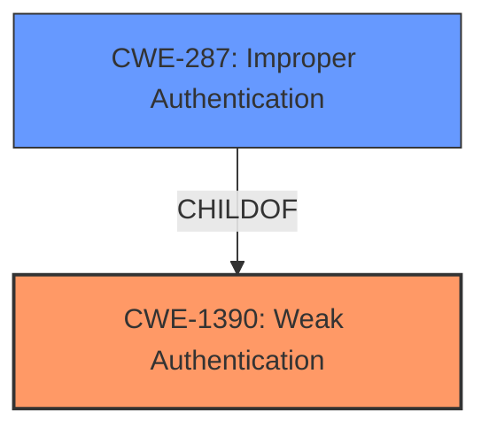

# Enhanced Analysis for CVE-2022-39238

# Summary
| CWE ID | CWE Name | Confidence | CWE Abstraction Level | CWE Vulnerability Mapping Label | CWE-Vulnerability Mapping Notes |
|---|---|---|---|---|---|
| CWE-1390 | Weak Authentication | 0.9 | Class | Primary | Allowed-with-Review |
| CWE-287 | Improper Authentication | 0.7 | Class | Secondary | Discouraged |

## Evidence and Confidence

*   **Confidence Score:** 0.9
*   **Evidence Strength:** HIGH

## Relationship Analysis
The analysis focused on the hierarchical relationship between CWE-287 (Improper Authentication) and its child CWE-1390 (Weak Authentication). While CWE-287 is a broader category, CWE-1390 provides a more specific classification for this vulnerability, which involves an authentication mechanism that doesn't sufficiently prove the claimed identity. The relationship ChildOf(CWE-1390, CWE-287) guided the selection towards the more specific CWE-1390. The usage for CWE-287 is Discouraged and suggests using CWE-1390.



## Vulnerability Chain
The vulnerability chain starts with the **incorrect** authentication logic in Arvados' PAM implementation. This leads to the system **failing** to properly verify the user's account status (enabled/disabled, expired password). The final impact is unauthorized access to Arvados by users with disabled or restricted accounts.

## Summary of Analysis
The primary classification is CWE-1390 (Weak Authentication). The vulnerability description and CVE Reference Links Content Summary clearly indicate that the Arvados system **fails** to sufficiently verify the user's identity when using PAM. Specifically, the system **does not check** if a user account is allowed to access the host after successful authentication with PAM credentials. This aligns perfectly with CWE-1390's description: "The product uses an authentication mechanism to restrict access to specific users or identities, but the mechanism does not sufficiently prove that the claimed identity is correct."

The CVE Reference Links Content Summary explicitly states that the primary weakness is an **improper** authentication check (CWE-287), but the details provided indicate that it's more specifically a case of **weak** authentication (CWE-1390) because the system authenticates using PAM but doesn't validate if access should be granted.

CWE-287 (Improper Authentication) was considered but not used as the primary classification because it is a broader category. The MITRE mapping guidance for CWE-287 states that it is "Discouraged" and suggests considering its children, particularly CWE-1390 (Weak Authentication).

Other CWEs were considered, such as CWE-306 (Missing Authentication for Critical Function), but were deemed less relevant as authentication *is* performed, albeit weakly. CWE-863 (Incorrect Authorization) was also considered, but authorization happens *after* authentication, and the issue lies within the authentication process itself.

The final decision to classify the vulnerability as CWE-1390 is based on the evidence provided in the vulnerability description and CVE Reference Links Content Summary, as well as the MITRE mapping guidance that favors more specific classifications when available. The confidence level is high due to the clear alignment between the vulnerability details and the CWE-1390 description.


## CWE Relationship Analysis

Current CWEs represent these abstraction levels: .


### Vulnerability Chain Analysis

**Chain starting from CWE-306:**
- 306 (Missing Authentication for Critical Function) - ROOT


**Chain starting from CWE-1390:**
- 1390 (Weak Authentication) - ROOT


### CWE Relationship Diagram

```mermaid
graph TD
    classDef primary fill:#f96,stroke:#333,stroke-width:2px
    classDef secondary fill:#69f,stroke:#333
    classDef tertiary fill:#9e9,stroke:#333
```