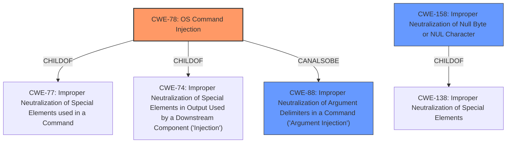

# Enhanced Analysis for CVE-2022-39243

# Summary
| CWE ID | CWE Name | Confidence | CWE Abstraction Level | CWE Vulnerability Mapping Label | CWE-Vulnerability Mapping Notes |
|---|---|---|---|---|---|
| CWE-78 | Improper Neutralization of Special Elements used in an OS Command ('OS Command Injection') | 1.0 | Base | Allowed | Primary CWE |
| CWE-158 | Improper Neutralization of Null Byte or NUL Character | 0.7 | Variant | Allowed | Secondary Candidate |
| CWE-88 | Improper Neutralization of Argument Delimiters in a Command ('Argument Injection') | 0.6 | Base | Allowed | Secondary Candidate |

## Evidence and Confidence

*   **Confidence Score:** 0.8
*   **Evidence Strength:** HIGH

## Relationship Analysis
The primary CWE is CWE-78, which is a base-level weakness describing **improper neutralization** of special elements in OS commands, leading to **command injection**. CWE-78 is a child of CWE-77 (Improper Neutralization of Special Elements used in a Command) and CWE-74 (Improper Neutralization of Special Elements in Output Used by a Downstream Component ('Injection')).

CWE-158 (Improper Neutralization of Null Byte or NUL Character) is a variant-level weakness and a child of CWE-138 (Improper Neutralization of Special Elements). It details the specific case of **improper neutralization** of null bytes, which is the mechanism used in this vulnerability.

CWE-88 (Improper Neutralization of Argument Delimiters in a Command ('Argument Injection')) is a base-level weakness and is a peer of CWE-78. It describes the case where argument delimiters are **improperly neutralized**, leading to unintended arguments being passed to a command.



## Vulnerability Chain
The vulnerability chain starts with **improper input validation** (explicitly mentioned in the vulnerability description) that allows null characters in command arguments. This leads to **improper neutralization** of special elements (null bytes), which then results in **OS command injection**.

## Summary of Analysis
The initial assessment and resulting conclusion are based on the evidence provided in the vulnerability description and CVE reference links.

The vulnerability involves NuProcess, a Java library, which **fails to properly sanitize** command strings, allowing attackers to inject command line arguments using NUL characters. The root cause is the **improper handling of null characters** in the command arguments, which leads to the ability to inject arbitrary commands when the process forks on Linux.

The graph relationships influenced the selection by highlighting the hierarchical connections between the different types of **command injection** and **improper neutralization** weaknesses. The primary weakness is CWE-78, as it accurately describes the **OS command injection** resulting from the **improper handling of null bytes**.

CWE-78 is at the optimal level of specificity because it directly addresses the core issue of **OS command injection** due to **improper neutralization** of special elements in OS commands.

**Supporting Evidence:**

*   Vulnerability Description Key Phrases: "**rootcause: improper input validation**", "**weakness: command injection**", "**vector: NUL characters in strings**"
*   CVE Reference Links Content Summary: "The vulnerability stems from the way NuProcess handles command-line arguments...interprets embedded null characters (`\u0000`) as argument delimiters, allowing an attacker to inject additional command-line arguments."

**Other CWEs Considered:**

*   CWE-77: While command injection is present, CWE-78 is more specific as it is related to **OS command injection**.
*   CWE-79: This is for Cross-Site Scripting, which is unrelated to this vulnerability.
*   CWE-93: This is for CRLF injection, which is unrelated to this vulnerability.
*   CWE-116: This is for Improper Encoding or Escaping of Output, which doesn't fully capture the vulnerability.
*   CWE-1336: This is for Improper Neutralization of Special Elements Used in a Template Engine, which is unrelated to this vulnerability.
*   CWE-158: This CWE addresses the specific issue of **improper neutralization** of null bytes, which is the vector used for the injection. However, it does not fully capture the **command injection** aspect of the vulnerability. It's considered as a secondary candidate to highlight the root cause.
*   CWE-88: This CWE describes the **improper neutralization** of argument delimiters, which is similar to what is happening here with the null bytes acting as argument delimiters. It's considered a secondary candidate to emphasize the mechanism.


## CWE Relationship Analysis

Current CWEs represent these abstraction levels: .


### Vulnerability Chain Analysis

**Chain starting from CWE-158:**
- 158 (Improper Neutralization of Null Byte or NUL Character) - ROOT


**Chain starting from CWE-78:**
- 78 (Improper Neutralization of Special Elements used in an OS Command ('OS Command Injection')) - ROOT


### CWE Relationship Diagram

```mermaid
graph TD
    classDef primary fill:#f96,stroke:#333,stroke-width:2px
    classDef secondary fill:#69f,stroke:#333
    classDef tertiary fill:#9e9,stroke:#333
```