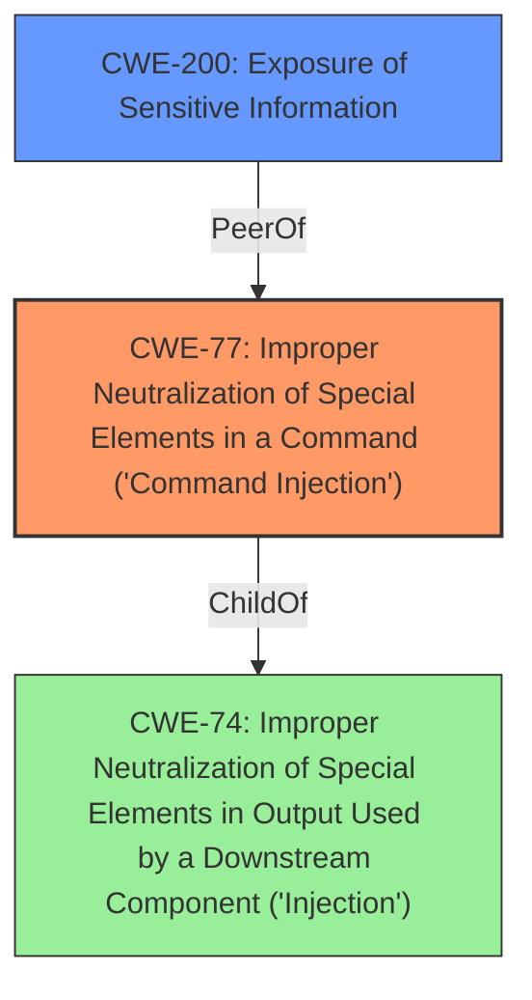

# Enhanced Analysis for CVE-2022-39265

# Summary
| CWE ID | CWE Name | Confidence | CWE Abstraction Level | CWE Vulnerability Mapping Label | CWE-Vulnerability Mapping Notes |
|---|---|---|---|---|---|
| CWE-77 | Improper Neutralization of Special Elements in a Command ('Command Injection') | 0.9 | Base | Allowed | Primary CWE |
| CWE-200 | Exposure of Sensitive Information | 0.7 | Class | Allowed-with-Review | Secondary CWE |

## Evidence and Confidence

*   **Confidence Score:** 0.8
*   **Evidence Strength:** HIGH

## Relationship Analysis
The primary CWE is CWE-77, which is a base-level CWE. The secondary CWE is CWE-200, which is a class-level CWE. CWE-77 relates to the command injection vulnerability. CWE-200 relates to the exposure of sensitive information.



## Vulnerability Chain
The vulnerability chain starts with **improper neutralization** in the "Additional Parameters" setting, leading to command injection, which results in potential remote code execution and exposure of sensitive information.

## Summary of Analysis
The vulnerability in MyBB allows for command injection due to **improper neutralization** of input in the "Additional Parameters" setting for PHP's mail() function. This can lead to remote code execution and exposure of sensitive information.

The primary CWE is CWE-77 (Improper Neutralization of Special Elements in a Command ('Command Injection')). The "CVE Reference Links Content Summary" section explicitly mentions that the vulnerability stems from the ability to inject arbitrary command parameters into the `mail()` function due to the application not properly sanitizing the input provided to the "Additional Parameters for PHP's mail()" setting. This aligns directly with CWE-77's description, which covers cases where a product constructs a command string but fails to properly delimit arguments, allowing attackers to inject malicious commands. Confidence in this mapping is high (0.9).

CWE-200 (Exposure of Sensitive Information) is considered as a secondary CWE (confidence 0.7) because the vulnerability description mentions that exploitation can lead to access to sensitive information. This is further supported by the "CVE Reference Links Content Summary" section, which states that an attacker might be able to extract sensitive data. While command injection is the primary mechanism, the potential for information exposure justifies including CWE-200 as a secondary concern.

The retriever results suggest other CWEs, such as CWE-862 (Missing Authorization), CWE-1336 (Improper Neutralization of Special Elements Used in a Template Engine), and CWE-94 (Improper Control of Generation of Code ('Code Injection')). However, these are not as directly relevant as CWE-77. Authorization issues are not the primary problem, and the vulnerability doesn't involve template engine injection or direct code injection in the traditional sense. Instead, it's about injecting commands into an existing command execution context.

CWE-77 is selected as the primary CWE because it is the most specific and accurate representation of the **root cause**, which is the **improper neutralization** of command elements. It is at the base level of abstraction, which is preferred.


## CWE Relationship Analysis

Current CWEs represent these abstraction levels: .


### Vulnerability Chain Analysis

**Chain starting from CWE-862:**
- 862 (Missing Authorization) - ROOT


**Chain starting from CWE-200:**
- 200 (Exposure of Sensitive Information to an Unauthorized Actor) - ROOT


### CWE Relationship Diagram

```mermaid
graph TD
    classDef primary fill:#f96,stroke:#333,stroke-width:2px
    classDef secondary fill:#69f,stroke:#333
    classDef tertiary fill:#9e9,stroke:#333
```