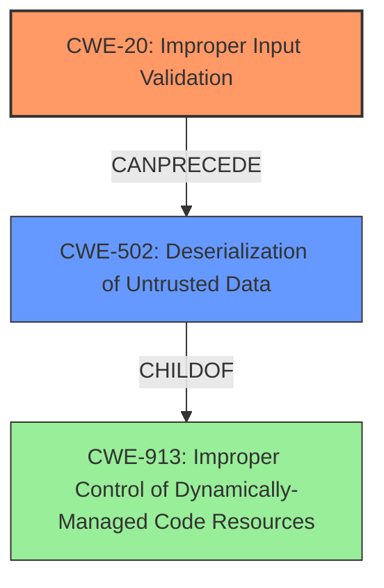

# Analysis Report for CVE-2022-39266

# Vulnerability Analysis Report: CVE-2022-39266

## Description


## Analysis (with Relationship Data)

# Summary
| CWE ID | CWE Name | Confidence | CWE Abstraction Level | CWE Vulnerability Mapping Label | CWE-Vulnerability Mapping Notes |
|---|---|---|---|---|---|
| CWE-20 | Improper Input Validation | 0.9 | Class | Primary | Discouraged |
| CWE-502 | Deserialization of Untrusted Data | 0.7 | Base | Secondary | Allowed |

## Evidence and Confidence

*   **Confidence Score:** 0.8
*   **Evidence Strength:** HIGH

## Relationship Analysis
The primary CWE is CWE-20 **Improper Input Validation**, which is a Class-level CWE. CWE-502 **Deserialization of Untrusted Data** is a Base-level CWE. CWE-20 can precede several other CWEs. CWE-502 is a child of CWE-913, **Improper Control of Dynamically-Managed Code Resources**. The relationships influenced the selection by confirming that input validation issues can lead to deserialization problems.



## Vulnerability Chain
The chain of events is as follows:
1.  The application receives untrusted v8 cached data.
2.  Due to **improper input validation (CWE-20)**, the application processes the untrusted data.
3.  The untrusted data leads to **deserialization of untrusted data (CWE-502)**.
4.  The deserialization bypasses the sandbox, leading to arbitrary code execution.

## Summary of Analysis
Initially, the analysis focused on the **improper input validation** described in the "Vulnerability Description Key Phrases" section and the "CVE Reference Links Content Summary" section, which states: "The vulnerability stems from the usage of untrusted v8 cached data through the `CachedDataOptions` API, which allows for the execution of arbitrary code." The description indicates the **rootcause** is a failure to validate untrusted data, which led to the selection of CWE-20 **Improper Input Validation**.

The "CVE Reference Links Content Summary" section also mentions "Improper Authentication (CWE-287)" and "Use of a Broken or Risky Cryptographic Algorithm (CWE-693)", but those appear to be less accurate descriptions of the weakness being described.

The retriever results also list several relevant CWEs including CWE-20, CWE-502, CWE-863, and CWE-1336.

CWE-20 **Improper Input Validation** is selected as the primary CWE because it is the most direct representation of the **rootcause**. However, CWE-20 is a Class-level CWE and is "Discouraged" for use. It can be used in this case because there are no more specific Base or Variant level CWEs that are appropriate.

CWE-502 **Deserialization of Untrusted Data** is selected as a secondary CWE because the vulnerability involves processing v8 cached data, which could be interpreted as deserialization.

The selected CWEs are at the optimal level of specificity given the available information.

Relevant CWE Information:

# Enhanced Context (25 CWEs)

## CWE-1289: Improper Validation of Unsafe Equivalence in Input
**Abstraction Level**: Base
**Similarity Score**: 0.76
**Source**: dense
**Description**:
The product receives an input value that is used as a resource identifier or other type of reference, but it does not validate or incorrectly validates that the input is equivalent to a potentially-unsafe value.
**Mapping Guidance**:
- Usage: Allowed

This CWE was considered, but it doesn't precisely fit because the problem isn't about equivalence but about validating the structure and content of the cached data.

## CWE-653: Improper Isolation or Compartmentalization
**Abstraction Level**: Class
**Similarity Score**: 0.75
**Source**: dense
**Description**:
The product does not properly compartmentalize or isolate functionality, processes, or resources that require different privilege levels, rights, or permissions.
**Mapping Guidance**:
- Usage: Allowed

This CWE relates to the sandbox bypass but does not directly address the **rootcause** of the vulnerability, which is the **improper handling of untrusted data**.

## CWE-404: Improper Resource Shutdown or Release
**Abstraction Level**: Class
**Similarity Score**: 0.74
**Source**: dense
**Description**:
The product does not release or incorrectly releases a resource before it is made available for re-use.
**Mapping Guidance**:
- Usage: Allowed-with-Review

This CWE does not apply because the issue is not about resource release.

## CWE-138: Improper Neutralization of Special Elements
**Abstraction Level**: Class
**Similarity Score**: 0.74
**Source**: dense
**Description**:
The product receives input from an upstream component, but it does not neutralize or incorrectly neutralizes special elements that could be interpreted as control elements or syntactic markers when they are sent to a downstream component.
**Mapping Guidance**:
- Usage: Discouraged

While this could be related to the structure of the v8 cached data, it is less specific than CWE-20 or CWE-502.

## CWE-74: Improper Neutralization of Special Elements in Output Used by a Downstream Component ('Injection')
**Abstraction Level**: Class
**Similarity Score**: 0.74
**Source**: dense
**Description**:
The product constructs all or part of a command, data structure, or record using externally-influenced input from an upstream component, but it does not neutralize or incorrectly neutralizes special elements that could modify how it is parsed or interpreted when it is sent to a downstream component.
**Mapping Guidance**:
- Usage: Discouraged

This CWE is related to injection, which is a potential consequence, but not the **rootcause** of the vulnerability.

## CWE-807: Reliance on Untrusted Inputs in a Security Decision
**Abstraction Level**: Base
**Similarity Score**: 0.74
**Source**: dense
**Description**:
The product uses a protection mechanism that relies on the existence or values of an input, but the input can be modified by an untrusted actor in a way that bypasses the protection mechanism.
**Mapping Guidance**:
- Usage: Allowed

This is somewhat relevant, but CWE-20 and CWE-502 more directly address the **rootcause**.

## CWE-184: Incomplete List of Disallowed Inputs
**Abstraction Level**: Base
**Similarity Score**: 0.74
**Source**: dense
**Description**:
The product implements a protection mechanism that relies on a list of inputs (or properties of inputs) that are not allowed by policy or otherwise require other action to neutralize before additional processing takes place, but the list is incomplete.
**Mapping Guidance**:
- Usage: Allowed

This CWE is not applicable because the issue isn't about an incomplete list of disallowed inputs.

## CWE-226: Sensitive Information in Resource Not Removed Before Reuse
**Abstraction Level**: Base
**Similarity Score**: 0.73
**Source**: dense
**Description**:
The product releases a resource such as memory or a file so that it can be made available for reuse, but it does not clear or "zeroize" the information contained in the resource before the product performs a critical state transition or makes the resource available for reuse by other entities.
**Mapping Guidance**:
- Usage: Allowed

This CWE does not apply because the issue is not related to the reuse of resources.

## CWE-915: Improperly Controlled Modification of Dynamically-Determined Object Attributes
**Abstraction Level**: Base
**Similarity Score**: 0.73
**Source**: dense
**Description**:
The product receives input from an upstream component that specifies multiple attributes, properties, or fields that are to be initialized or updated in an object, but it does not properly control which attributes can be modified.
**Mapping Guidance**:
- Usage: Allowed

This is a possibility, but less likely than CWE-502 since the vulnerability description doesn't focus on object attribute modification specifically.

## CWE-345: Insufficient Verification of Data Authenticity
**Abstraction Level**: Class
**Similarity Score**: 0.73
**Source**: dense
**Description**:
The product does not sufficiently verify the origin or authenticity of data, in a way that causes it to accept invalid data.
**Mapping Guidance**:
- Usage: Discouraged

While related to trust, this is less specific than CWE-20 or CWE-502.

## CWE-1336: Improper Neutralization of Special Elements Used in a Template Engine
**Abstraction Level


## CWE Relationship Analysis

Current CWEs represent these abstraction levels: .


### Vulnerability Chain Analysis

**Chain starting from CWE-693:**
- 693 (Protection Mechanism Failure) - ROOT


**Chain starting from CWE-913:**
- 913 (Improper Control of Dynamically-Managed Code Resources) - ROOT


### CWE Relationship Diagram

```mermaid
graph TD
    classDef primary fill:#f96,stroke:#333,stroke-width:2px
    classDef secondary fill:#69f,stroke:#333
    classDef tertiary fill:#9e9,stroke:#333
```


*Report generated on 2025-03-30 11:53:16*
