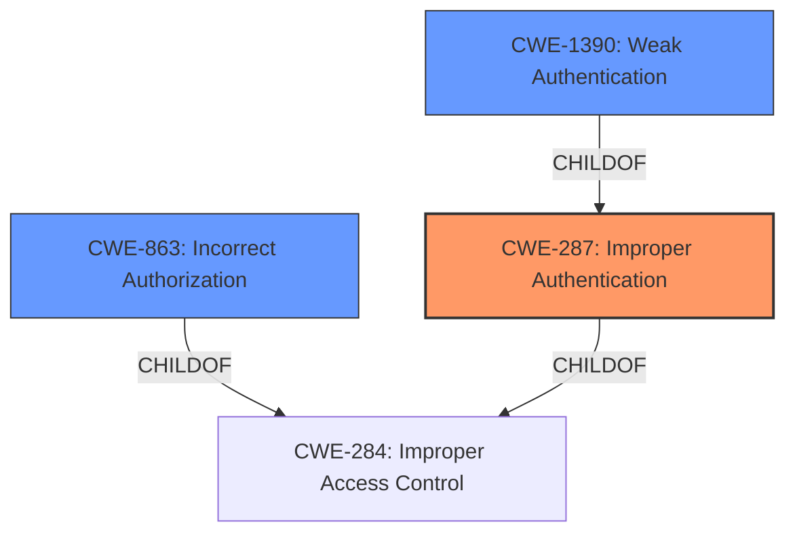

# Analysis for CVE-2022-39267

# Summary

| CWE ID | CWE Name | Confidence | CWE Abstraction Level | CWE Vulnerability Mapping Label | CWE-Vulnerability Mapping Notes |
|---|---|---|---|---|---|
| CWE-287 | Improper Authentication | 0.9 | Class | Primary | Discouraged |
| CWE-1390 | Weak Authentication | 0.8 | Class | Secondary | Allowed-with-Review |
| CWE-863 | Incorrect Authorization | 0.6 | Class | Secondary | Allowed-with-Review |

## Evidence and Confidence

*   **Confidence Score:** 0.9
*   **Evidence Strength:** HIGH

## Relationship Analysis
The primary CWE is CWE-287, which is a Class-level CWE. CWE-1390 (Weak Authentication) is a child of CWE-287, providing a more specific classification. CWE-863 (Incorrect Authorization) is a peer, representing a closely related but distinct weakness. While CWE-1390 is more specific than CWE-287, the evidence points more strongly to a general failure to properly authenticate, rather than a specific weakness in the authentication mechanism itself. Thus, CWE-287 is preferred, though its usage is discouraged.

## Vulnerability Chain
The vulnerability chain starts with the **improper authentication** mechanism in Bifrost. The application **weakly** relies on the presence of the `X-Requested-With` header for authentication checks. The absence of this header leads to an **authentication bypass**, ultimately granting unauthorized access to admin and monitor functionalities.

## Summary of Analysis
The initial assessment identified **authentication bypass** as the core issue. The vulnerability description and CVE Reference Links Content Summary clearly indicate that the application **fails to properly authenticate** requests lacking the `X-Requested-With` header.

The retriever results suggested CWE-287 (**Improper Authentication**) as the top candidate, along with CWE-863 (**Incorrect Authorization**) and CWE-1390 (**Weak Authentication**).

The graph relationships highlight that CWE-1390 is a child of CWE-287, making it a more specific classification. However, the vulnerability's root cause is the **lack of robust authentication**, rather than a specific weakness in an existing authentication mechanism. The application simply skips authentication if the header is missing.

Therefore, CWE-287 is selected as the primary CWE, despite the discouraged usage, because it accurately reflects the fundamental problem: **the application does not properly authenticate** requests.

The evidence supporting this decision is:

*   Vulnerability Description Key Phrases: "**weakness: authentication bypass**"
*   CVE Reference Links Content Summary: "The application uses the presence of the `X-Requested-With: XMLHttpRequest` header to determine if a request should be subject to authentication checks. By removing this header, an attacker can bypass the authentication."

CWE-1390 is a secondary candidate because the authentication *is* weak, relying on a easily-spoofed header, but the primary issue is the complete bypass. CWE-863 is also a secondary candidate as the application ultimately authorizes the request, however, first it improperly authenticates it.

Other CWEs Considered:

*   CWE-201 (Insertion of Sensitive Information Into Sent Data), CWE-918 (Server-Side Request Forgery (SSRF)), CWE-1284 (Improper Validation of Specified Quantity in Input), CWE-204 (Observable Response Discrepancy), CWE-613 (Insufficient Session Expiration), CWE-93 (Improper Neutralization of CRLF Sequences ('CRLF Injection')), and CWE-1333 (Inefficient Regular Expression Complexity) were considered but deemed less relevant as they did not directly address the core issue of **authentication bypass**.

Ultimately, the selected CWEs are at the optimal level of specificity, capturing both the fundamental flaw (**improper authentication**) and the resulting vulnerability (**authentication bypass**).