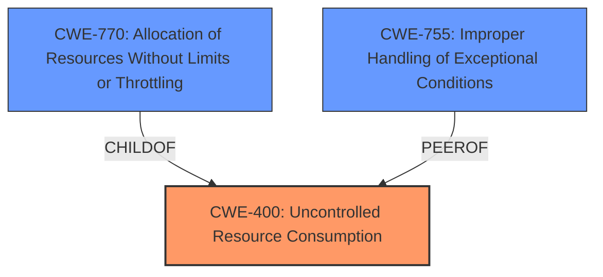

# Enhanced Analysis for CVE-2022-39271

# Summary
| CWE ID  | CWE Name                                                                   | Confidence | CWE Abstraction Level | CWE Vulnerability Mapping Label | CWE-Vulnerability Mapping Notes |
| :-------- | :------------------------------------------------------------------------- | :--------- | :---------------------- | :------------------------------ | :------------------------------ |
| CWE-400 | Uncontrolled Resource Consumption                                             | 0.75       | Class                   | Primary                       | Discouraged                    |
| CWE-770 | Allocation of Resources Without Limits or Throttling                       | 0.60       | Base                    | Secondary                      | Allowed                        |
| CWE-755 | Improper Handling of Exceptional Conditions                                | 0.50       | Class                    | Secondary                      | Discouraged                     |

## Evidence and Confidence

*   **Confidence Score:** 0.70
*   **Evidence Strength:** MEDIUM

## Relationship Analysis
The primary relationship influencing the CWE selection is the parent-child relationship between CWE-400 (Uncontrolled Resource Consumption) and CWE-770 (Allocation of Resources Without Limits or Throttling). CWE-770 is a more specific case of CWE-400. However, given the limited information, it is difficult to determine if the resource allocation is truly without limits, or if the **failure to handle the error condition** is the primary driver of the resource consumption. CWE-755 is another Class level option for the **failure to handle the error condition**.



## Vulnerability Chain
The vulnerability chain starts with the **improper handling of the fatal error** during the closing of an HTTP/2 connection. This leads to the connection hanging indefinitely, resulting in **uncontrolled resource consumption** and ultimately a denial-of-service.

## Summary of Analysis
Initially, CWE-400 (Uncontrolled Resource Consumption) was considered as the primary weakness, given that the vulnerability ultimately leads to a denial-of-service. The "CVE Reference Links Content Summary" section indicates that a closing HTTP/2 server connection could hang indefinitely due to a subsequent fatal error. This directly aligns with the description of CWE-400: "The product does not properly control the allocation and maintenance of a limited resource, thereby enabling an actor to influence the amount of resources consumed, eventually leading to the exhaustion of available resources."

However, the root cause seems to stem from the **improper handling of the error**, which causes the connection to hang indefinitely. This could potentially point to CWE-755 (Improper Handling of Exceptional Conditions). Further analysis suggests that the uncontrolled resource consumption is a consequence of the initial error handling **failure**.

The relationship graph shows that CWE-770 is a child of CWE-400, providing a more specific scenario of resource allocation without limits. However, without further information, it is difficult to ascertain if the allocation itself is without limits or if the **lack of proper error handling** leads to the resource exhaustion.

Therefore, the final decision leans towards CWE-400 as the primary weakness, with CWE-770 and CWE-755 as contributing factors that exacerbate the vulnerability. The selection of CWE-400 is at the Class level of abstraction, due to the lack of sufficient evidence to pinpoint the specific base-level weakness.

Relevant CWE Information:

# Enhanced Context (25 CWEs)
The following CWEs were identified as potentially relevant to this vulnerability:

## CWE-226: Sensitive Information in Resource Not Removed Before Reuse
**Abstraction Level**: Base
**Similarity Score**: 0.76
**Source**: dense

**Description**:
The product releases a resource such as memory or a file so that it can be made available for reuse, but it does not clear or "zeroize" the information contained in the resource before the product performs a critical state transition or makes the resource available for reuse by other entities.

**Mapping Guidance**:
- Usage: Allowed
- Rationale: This CWE entry is at the Base level of abstraction, which is a preferred level of abstraction for mapping to the root causes of vulnerabilities.

**Why Not Used**: This vulnerability is related to resource consumption and error handling during the closing of HTTP/2 connections, not the reuse of resources with sensitive information.

## CWE-404: Improper Resource Shutdown or Release
**Abstraction Level**: Class
**Similarity Score**: 0.76
**Source**: dense

**Description**:
The product does not release or incorrectly releases a resource before it is made available for re-use.

**Mapping Guidance**:
- Usage: Allowed-with-Review
- Rationale: This CWE entry is a Class and might have Base-level children that would be more appropriate

**Why Not Used**: Although related to resource release, this CWE does not fully capture the specific issue of a connection hanging due to a fatal error. CWE-400 and CWE-770 are more relevant.

## CWE-1289: Improper Validation of Unsafe Equivalence in Input
**Abstraction Level**: Base
**Similarity Score**: 0.75
**Source**: dense

**Description**:
The product receives an input value that is used as a resource identifier or other type of reference, but it does not validate or incorrectly validates that the input is equivalent to a potentially-unsafe value.

**Mapping Guidance**:
- Usage: Allowed
- Rationale: This CWE entry is at the Base level of abstraction, which is a preferred level of abstraction for mapping to the root causes of vulnerabilities.

**Why Not Used**: This CWE focuses on input validation, which is not the primary issue described in the vulnerability.

## CWE-664: Improper Control of a Resource Through its Lifetime
**Abstraction Level**: Pillar
**Similarity Score**: 0.75
**Source**: dense

**Description**:
The product does not maintain or incorrectly maintains control over a resource throughout its lifetime of creation, use, and release.

**Mapping Guidance**:
- Usage: Discouraged
- Rationale: This CWE entry is high-level when lower-level children are available.

**Why Not Used**: This CWE is too broad and does not provide enough specificity compared to CWE-400 or CWE-770.

## CWE-807: Reliance on Untrusted Inputs in a Security Decision
**Abstraction Level**: Base
**Similarity Score**: 0.74
**Source**: dense

**Description**:
The product uses a protection mechanism that relies on the existence or values of an input, but the input can be modified by an untrusted actor in a way that bypasses the protection mechanism.

**Mapping Guidance**:
- Usage: Allowed
- Rationale: This CWE entry is at the Base level of abstraction, which is a preferred level of abstraction for mapping to the root causes of vulnerabilities.

**Why Not Used**: This CWE is not relevant as the vulnerability is not related to reliance on untrusted inputs for security decisions.

## CWE-405: Asymmetric Resource Consumption (Amplification)
**Abstraction Level**: Class
**Similarity Score**: 0.73
**Source**: dense

**Description**:
The product does not properly control situations in which an adversary can cause the product to consume or produce excessive resources without requiring the adversary to invest equivalent work or otherwise prove authorization, i.e., the adversary's influence is "asymmetric."

**Mapping Guidance**:
- Usage: Allowed-with-Review
- Rationale: This CWE entry is a Class and might have Base-level children that would be more appropriate

**Why Not Used**: While there is resource consumption, the description does not explicitly state asymmetric resource consumption.

## CWE-667: Improper Locking
**Abstraction Level**: Class
**Similarity Score**: 0.73
**Source**: dense

**Description**:
The product does not properly acquire or release a lock on a resource, leading to unexpected resource state changes and behaviors.

**Mapping Guidance**:
- Usage: Allowed-with-Review
- Rationale: This CWE entry is a Class and might have Base-level children that would be more appropriate

**Why Not Used**: There is no mention of locking mechanisms or issues in the vulnerability description.

## CWE-668: Exposure of Resource to Wrong Sphere
**Abstraction Level**: Class
**Similarity Score**: 0.73
**Source**: dense

**Description**:
The product exposes a resource to the wrong control sphere, providing unintended actors with inappropriate access to the resource.

**Mapping Guidance**:
- Usage: Discouraged
- Rationale: CWE-668 is high-level and is often misused as a catch-all when lower-level CWE IDs might be applicable. It is sometimes used for low-information vulnerability reports [REF-1287]. It is a level-1 Class (i.e., a child of a Pillar). It is not


## CWE Relationship Analysis

Current CWEs represent these abstraction levels: .


### Vulnerability Chain Analysis

**Chain starting from CWE-400:**
- 400 (Uncontrolled Resource Consumption) - ROOT


**Chain starting from CWE-755:**
- 755 (Improper Handling of Exceptional Conditions) - ROOT


### CWE Relationship Diagram

```mermaid
graph TD
    classDef primary fill:#f96,stroke:#333,stroke-width:2px
    classDef secondary fill:#69f,stroke:#333
    classDef tertiary fill:#9e9,stroke:#333
```