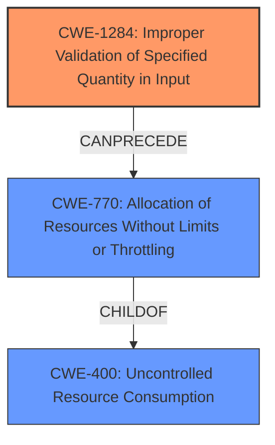

# Raw Analyzer Response for CVE-2022-39272

# Summary
| CWE ID   | CWE Name                                                             | Confidence | CWE Abstraction Level | CWE Vulnerability Mapping Label | CWE-Vulnerability Mapping Notes |
| -------- | -------------------------------------------------------------------- | ---------- | --------------------- | ------------------------------- | ----------------------------- |
| CWE-1284 | Improper Validation of Specified Quantity in Input                  | 0.9        | Base                  | Primary                         | Allowed                       |
| CWE-770  | Allocation of Resources Without Limits or Throttling                 | 0.7        | Base                  | Secondary                       | Allowed                       |
| CWE-400  | Uncontrolled Resource Consumption                                    | 0.6       | Class                  | Secondary                       | Allowed                       |

## Evidence and Confidence

*   **Confidence Score:** 0.8
*   **Evidence Strength:** HIGH

## Relationship Analysis
The primary CWE is CWE-1284, representing the **improper validation of specified quantity in input**. This leads to CWE-770, **allocation of resources without limits or throttling**, because the unvalidated quantity (time duration) is used to allocate resources. This ultimately results in CWE-400, **uncontrolled resource consumption**, and a denial of service.

## Vulnerability Chain
The vulnerability chain starts with **improper validation of input** (CWE-1284), leading to **uncontrolled resource allocation** (CWE-770), which eventually causes **uncontrolled resource consumption** and a **denial of service** (CWE-400).

## Summary of Analysis
The initial assessment identifies CWE-1284 as the primary weakness due to the **lack of validation** of the `.spec.interval` and `.spec.timeout` fields. The CVE reference summary states, "Lack of input validation within Flux controllers to restrict the values that can be used for fields like `.spec.interval` and `.spec.timeout` which are defined using `metav1.Duration` type." This aligns directly with CWE-1284's description: "The product receives input that is expected to specify a quantity (such as size or length), but it does not validate or incorrectly validates that the quantity has the required properties." This **improper validation** allows **invalid data** to be used, as stated in the Vulnerability Description Key Phrases, triggering the denial of service.

The Retriever Results further support this, listing CWE-1284 as the top combined result. The graph relationships show that CWE-1284 can precede CWE-789 (Memory Allocation with Excessive Size Value), but in this case, CWE-770 is a better fit as it describes the broader allocation of resources without limits.

The selection of CWE-1284 is at the optimal level of specificity because it directly addresses the **root cause** of the vulnerability. While CWE-20 (Improper Input Validation) is a parent of CWE-1284, CWE-1284 provides more specific context related to quantity, which is relevant in this case (time duration).

CWE-770 is selected as a secondary CWE because the **improperly validated quantity** leads to uncontrolled allocation of resources. The description of CWE-770, "The product allocates a reusable resource or group of resources on behalf of an actor without imposing any restrictions on the size or number of resources that can be allocated," accurately reflects the vulnerability.

CWE-400 is included to represent the final impact of the vulnerability, **uncontrolled resource consumption**, resulting in a denial of service.

Other CWEs Considered:

*   CWE-789 (Memory Allocation with Excessive Size Value): Considered but deemed less appropriate because the vulnerability doesn't specifically relate to excessive memory allocation but rather a broader allocation of resources.
*   CWE-94 (Improper Control of Generation of Code ('Code Injection')): Not applicable as the vulnerability doesn't involve code injection.
*   CWE-863 (Incorrect Authorization): Not applicable because the issue is not related to authorization.
*   CWE-457 (Use of Uninitialized Variable): Not applicable because the vulnerability is not related to the use of an uninitialized variable.
*   CWE-79 (Improper Neutralization of Input During Web Page Generation ('Cross-site Scripting')): Not applicable because the vulnerability does not involve cross-site scripting.
*   CWE-116 (Improper Encoding or Escaping of Output): Not applicable because the vulnerability does not involve encoding or escaping of output.

Relevant CWE Information:

# Enhanced Context (25 CWEs)
The following CWEs were identified as potentially relevant to this vulnerability:

## CWE-74: Improper Neutralization of Special Elements in Output Used by a Downstream Component ('Injection')
**Abstraction Level**: Class
**Similarity Score**: 0.77
**Source**: dense

**Description**:
The product constructs all or part of a command, data structure, or record using externally-influenced input from an upstream component, but it does not neutralize or incorrectly neutralizes special elements that could modify how it is parsed or interpreted when it is sent to a downstream component.

**Mapping Guidance**:
- Usage: Discouraged
- Rationale: CWE-74 is high-level and often misused when lower-level weaknesses are more appropriate.

## CWE-838: Inappropriate Encoding for Output Context
**Abstraction Level**: Base
**Similarity Score**: 0.76
**Source**: dense

**Description**:
The product uses or specifies an encoding when generating output to a downstream component, but the specified encoding is not the same as the encoding that is expected by the downstream component.

**Mapping Guidance**:
- Usage: Allowed
- Rationale: This CWE entry is at the Base level of abstraction, which is a preferred level of abstraction for mapping to the root causes of vulnerabilities.

## CWE-80: Improper Neutralization of Script-Related HTML Tags in a Web Page (Basic XSS)
**Abstraction Level**: Variant
**Similarity Score**: 0.76
**Source**: dense

**Description**:
The product receives input from an upstream component, but it does not neutralize or incorrectly neutralizes special characters such as "<", ">", and "&" that could be interpreted as web-scripting elements when they are sent to a downstream component that processes web pages.

**Mapping Guidance**:
- Usage: Allowed
- Rationale: This CWE entry is at the Variant level of abstraction, which is a preferred level of abstraction for mapping to the root causes of vulnerabilities.

## CWE-116: Improper Encoding or Escaping of Output
**Abstraction Level**: Class
**Similarity Score**: 0.76
**Source**: dense

**Description**:
The product prepares a structured message for communication with another component, but encoding or escaping of the data is either missing or done incorrectly. As a result, the intended structure of the message is not preserved.

**Mapping Guidance**:
- Usage: Allowed-with-Review
- Rationale: This CWE entry is a Class and might have Base-level children that would be more appropriate

## CWE-1289: Improper Validation of Unsafe Equivalence in Input
**Abstraction Level**: Base
**Similarity Score**: 0.76
**Source**: dense

**Description**:
The product receives an input value that is used as a resource identifier or other type of reference, but it does not validate or incorrectly validates that the input is equivalent to a potentially-unsafe value.

**Mapping Guidance**:
- Usage: Allowed
- Rationale: This CWE entry is at the Base level of abstraction, which is a preferred level of abstraction for mapping to the root causes of vulnerabilities.

## CWE-138: Improper Neutralization of Special Elements
**Abstraction Level**: Class
**Similarity Score**: 0.76
**Source**: dense

**Description**:
The product receives input from an upstream component, but it does not neutralize or incorrectly neutralizes special elements that could be interpreted as control elements or syntactic markers when they are sent to a downstream component.

**Mapping Guidance**:
- Usage: Discouraged
- Rationale: This CWE entry is a level-1 Class (i.e., a child of a Pillar). It might have lower-level children that would be more appropriate

## CWE-184: Incomplete List of Disallowed Inputs
**Abstraction Level**: Base
**Similarity Score**: 0.75
**Source**: dense

**Description**:
The product implements a protection mechanism that relies on a list of inputs (or properties of inputs) that are not allowed by policy or otherwise require other action to neutralize before additional processing takes place, but the list is incomplete