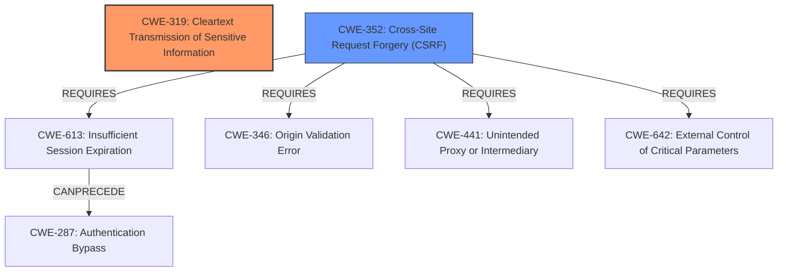

# Analysis Report for CVE-2022-39287

# Vulnerability Analysis Report: CVE-2022-39287

## Description


## Analysis (with Relationship Data)

# Summary
| CWE ID | CWE Name | Confidence | CWE Abstraction Level | CWE Vulnerability Mapping Label | CWE-Vulnerability Mapping Notes |
|---|---|---|---|---|---|
| CWE-319 | Cleartext Transmission of Sensitive Information | 1.0 | Base | Allowed | Primary CWE |
| CWE-352 | Cross-Site Request Forgery (CSRF) | 0.7 | Compound | Allowed | Secondary Candidate |

## Evidence and Confidence

*   **Confidence Score:** 0.85
*   **Evidence Strength:** HIGH

## Relationship Analysis
The primary relationship influencing the decision is that CWE-319 is a Base level CWE, offering a specific classification for the root cause. While CWE-352 (CSRF) is relevant as the potential impact, it's a Compound CWE. There is also a CanPrecede relationship from CWE-613 Insufficient Session Expiration to CWE-287 Authentication Bypass, which could be a step in exploiting CSRF, but is not explicitly mentioned.



## Vulnerability Chain
The vulnerability chain starts with the **cleartext transmission** of the CSRF token (CWE-319). This **weakness** makes the CSRF token vulnerable to interception, which allows an attacker to perform actions on behalf of the user (CWE-352).

## Summary of Analysis
The primary **root cause** of the vulnerability is the **cleartext transmission** of CSRF tokens. The vulnerability description explicitly states that "CSRF tokens were transmitted in the clear." This aligns directly with CWE-319. The CVE reference links confirm this, noting that the tokens were stored as plain text in cookies, making them easily readable. This is strong evidence for CWE-319.

CWE-352 is a reasonable secondary consideration because the **impact** of the **cleartext transmission** is that it undermines the CSRF protection mechanism, potentially leading to CSRF attacks. The retriever lists CWE-352 as a likely candidate. However, CWE-352 is a compound weakness, and the primary weakness is the **cleartext transmission**, so I am classifying CWE-319 as the primary CWE.

The decision to prioritize CWE-319 is based on its direct match to the **root cause** as explicitly stated in the vulnerability description and confirmed by the CVE reference links. While CWE-352 is a relevant **impact**, the focus here is on the underlying **weakness** that enables the potential for CSRF attacks. CWE-319 is also at a Base level of abstraction.

Relevant CWE Information:
# Enhanced Context (25 CWEs)
The following CWEs were identified as potentially relevant to this vulnerability:

## CWE-319: Cleartext Transmission of Sensitive Information
**Abstraction Level**: Base
**Similarity Score**: 0.74
**Source**: dense

**Description**:
The product transmits sensitive or security-critical data in cleartext in a communication channel that can be sniffed by unauthorized actors.

**Mapping Guidance**:
- Usage: Allowed
- Rationale: This CWE entry is at the Base level of abstraction, which is a preferred level of abstraction for mapping to the root causes of vulnerabilities.

## CWE-352: Cross-Site Request Forgery (CSRF)
**Abstraction Level**: Compound
**Similarity Score**: 8266.01
**Source**: sparse

**Description**:
The web application does not, or can not, sufficiently verify whether a well-formed, valid, consistent request was intentionally provided by the user who submitted the request.

**Mapping Guidance**:
- Usage: Allowed
- Rationale: This is a well-known Composite of multiple weaknesses that must all occur simultaneously, although it is attack-oriented in nature.


## CWE Relationship Analysis

Current CWEs represent these abstraction levels: .


### Vulnerability Chain Analysis

**Chain starting from CWE-319:**
- 319 (Cleartext Transmission of Sensitive Information) - ROOT


**Chain starting from CWE-352:**
- 352 (Cross-Site Request Forgery (CSRF)) - ROOT


### CWE Relationship Diagram

```mermaid
graph TD
    classDef primary fill:#f96,stroke:#333,stroke-width:2px
    classDef secondary fill:#69f,stroke:#333
    classDef tertiary fill:#9e9,stroke:#333
```


*Report generated on 2025-03-30 19:39:40*
