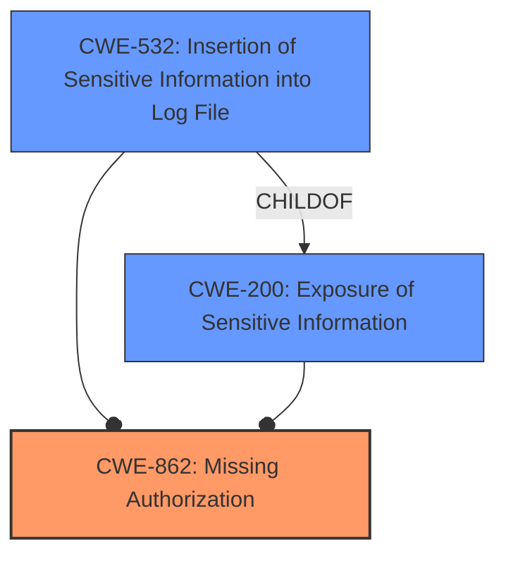

# Raw Analyzer Response for CVE-2022-39289

```markdown
# Summary 
| CWE ID    | CWE Name                                                       | Confidence | CWE Abstraction Level | CWE Vulnerability Mapping Label | CWE-Vulnerability Mapping Notes |
| --------- | -------------------------------------------------------------- | ---------- | --------------------- | ------------------------------- | ----------------------------- |
| CWE-862   | Missing Authorization                                           | 0.9        | Class                 | Allowed-with-Review             | Abstraction                   |
| CWE-532   | Insertion of Sensitive Information into Log File | 0.7        | Base                 | Allowed             | Acceptable-Use                  |
| CWE-200   | Exposure of Sensitive Information | 0.6        | Class                 | Allowed             | Acceptable-Use                  |

## Evidence and Confidence

*   **Confidence Score:** 0.8
*   **Evidence Strength:** HIGH

## Relationship Analysis
The primary CWE is CWE-862, representing the **missing authorization**. The vulnerability allows unauthorized access and manipulation of database logs. CWE-532 represents the potential insertion of sensitive information into log files, stemming from the lack of proper authorization. CWE-200 represents the potential exposure of sensitive information. These are related because **missing authorization** can lead to the other issues.



## Vulnerability Chain
The vulnerability chain starts with the **missing authorization** (CWE-862), which allows unauthorized **insertion, modification, and deletion of logs without System Privileges**. This leads to potential **insertion of sensitive information into log files** (CWE-532) and the exposure of sensitive information (CWE-200) to unauthorized users.

## Summary of Analysis
The initial assessment identified that the core issue is a **missing authorization** check in the ZoneMinder API. This allows unprivileged users to access and manipulate database logs. The evidence from the vulnerability description, especially the key phrases and the CVE reference link content summary, strongly supports this conclusion.

The primary decision is based on the fact that the API endpoints for viewing, adding, editing, and deleting logs were not enforcing the necessary system privileges. This aligns directly with the definition of CWE-862, **Missing Authorization**. The impact of this weakness includes potential information disclosure (CWE-200) and data manipulation.

The retriever results also pointed to CWE-862 as a potential candidate, although it is a Class-level CWE. Given the available information, it accurately represents the core issue.

*   **CWE-862: Missing Authorization**: The vulnerability description clearly states that the API exposes database log contents to users without privileges, allowing insertion, modification, and deletion of logs without system privileges. This directly indicates a **failure to perform an authorization check**, which is the defining characteristic of CWE-862. The CVE reference link content summary reinforces this by stating that the primary weakness is the **failure to properly authorize access** to log-related API endpoints.
*   **CWE-532: Insertion of Sensitive Information into Log File**: This CWE is considered because the unauthorized modification of logs could lead to the **insertion of sensitive information into the log file**. The retriever results also suggest this CWE.
*   **CWE-200: Exposure of Sensitive Information**: The vulnerability allows unprivileged users to view database log contents, leading to potential **information disclosure**. The CVE reference link content summary mentions information disclosure as one of the impacts of exploitation.

The selected CWEs are at the optimal level of specificity because they directly address the root cause (**missing authorization**) and the immediate consequences (potential **insertion of sensitive data into logs** and information disclosure).

Relevant CWE Information:

# Enhanced Context (25 CWEs)
The following CWEs were identified as potentially relevant to this vulnerability:

## CWE-212: Improper Removal of Sensitive Information Before Storage or Transfer
**Abstraction Level**: Base
**Similarity Score**: 0.77
**Source**: dense

**Description**:
The product stores, transfers, or shares a resource that contains sensitive information, but it does not properly remove that information before the product makes the resource available to unauthorized actors.

**Mapping Guidance**:
- Usage: Allowed
- Rationale: This CWE entry is at the Base level of abstraction, which is a preferred level of abstraction for mapping to the root causes of vulnerabilities.


## CWE-312: Cleartext Storage of Sensitive Information
**Abstraction Level**: Base
**Similarity Score**: 0.76
**Source**: dense

**Description**:
The product stores sensitive information in cleartext within a resource that might be accessible to another control sphere.

**Mapping Guidance**:
- Usage: Allowed
- Rationale: This CWE entry is at the Base level of abstraction, which is a preferred level of abstraction for mapping to the root causes of vulnerabilities.


## CWE-226: Sensitive Information in Resource Not Removed Before Reuse
**Abstraction Level**: Base
**Similarity Score**: 0.76
**Source**: dense

**Description**:
The product releases a resource such as memory or a file so that it can be made available for reuse, but it does not clear or "zeroize" the information contained in the resource before the product performs a critical state transition or makes the resource available for reuse by other entities.

**Mapping Guidance**:
- Usage: Allowed
- Rationale: This CWE entry is at the Base level of abstraction, which is a preferred level of abstraction for mapping to the root causes of vulnerabilities.


## CWE-668: Exposure of Resource to Wrong Sphere
**Abstraction Level**: Class
**Similarity Score**: 0.76
**Source**: dense

**Description**:
The product exposes a resource to the wrong control sphere, providing unintended actors with inappropriate access to the resource.

**Mapping Guidance**:
- Usage: Discouraged
- Rationale: CWE-668 is high-level and is often misused as a catch-all when lower-level CWE IDs might be applicable. It is sometimes used for low-information vulnerability reports [REF-1287]. It is a level-1 Class (i.e., a child of a Pillar). It is not useful for trend analysis.


## CWE-538: Insertion of Sensitive Information into Externally-Accessible File or Directory
**Abstraction Level**: Base
**Similarity Score**: 0.76
**Source**: dense

**Description**:
The product places sensitive information into files or directories that are accessible to actors who are allowed to have access to the files, but not to the sensitive information.

**Mapping Guidance**:
- Usage: Allowed
- Rationale: This CWE entry is at the Base level of abstraction, which is a preferred level of abstraction for mapping to the root causes of vulnerabilities.


## CWE-319: Cleartext Transmission of Sensitive Information
**Abstraction Level**: Base
**Similarity Score**: 0.75
**Source**: dense

**Description**:
The product transmits sensitive or security-critical data in cleartext in a communication channel that can be sniffed by unauthorized actors.

**Mapping Guidance**:
- Usage: Allowed
- Rationale: This CWE entry is at the Base level of abstraction, which is a preferred level of abstraction for mapping to the root causes of vulnerabilities.


## CWE-639: Authorization Bypass Through User-Controlled Key
**Abstraction Level**: Base
**Similarity Score**: 0.75
**Source**: dense

**Description**:
The system's authorization functionality does not prevent one user from gaining access to another user's data or record by modifying the key value identifying the data.

**Mapping Guidance**:
- Usage: Allowed
- Rationale: This CWE entry is at the Base level of abstraction, which is a preferred level of abstraction for mapping to the root causes of vulnerabilities.


## CWE-807: Reliance on Untrusted Inputs in a Security Decision
**Abstraction Level**: Base
**Similarity Score**: 0.75
**Source**: dense

**Description**:
The product uses a protection mechanism that relies on the existence or values of an input, but the input can be modified by an untrusted actor in a way that bypasses the protection mechanism.

**Mapping Guidance**:
- Usage: Allowed
- Rationale: This CWE entry is at the Base level of abstraction, which is a preferred level of abstraction for mapping to the root causes of vulnerabilities.


## CWE-1390: Weak Authentication
**Abstraction Level**: Class
**Similarity Score**: 0.75
**Source**: dense

**Description**:
The product uses an authentication mechanism to restrict access to specific users or identities, but the mechanism does not sufficiently prove that the claimed identity is correct.

**Mapping Guidance**:
- Usage: Allowed-with-Review
- Rationale: This