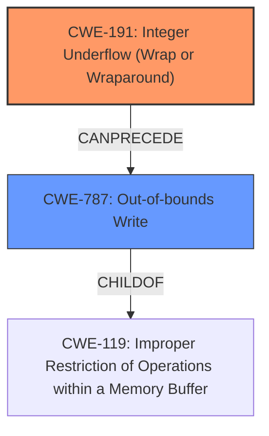

# Analysis Report for CVE-2022-39293

# Vulnerability Analysis Report: CVE-2022-39293

## Description


## Analysis (with Relationship Data)

# Summary
| CWE ID | CWE Name | Confidence | CWE Abstraction Level | CWE Vulnerability Mapping Label | CWE-Vulnerability Mapping Notes |
|---|---|---|---|---|---|
| CWE-191 | Integer Underflow (Wrap or Wraparound) | 1.0 | Base | Allowed | Primary CWE |
| CWE-787 | Out-of-bounds Write | 0.7 | Base | Allowed | Secondary Candidate |

## Evidence and Confidence

*   **Confidence Score:** 0.85
*   **Evidence Strength:** HIGH

## Relationship Analysis
The primary weakness is **CWE-191 (Integer Underflow)**, which directly leads to **CWE-787 (Out-of-bounds Write)**. The integer underflow corrupts the `data_length`, which then results in writing to an unexpected memory address.



## Vulnerability Chain
The vulnerability chain starts with receiving a crafted USB packet with a `header_length` value.

1.  **CWE-191 (Integer Underflow)**: The **lack of input validation** of `header_length` (which is sent in the crafted usb packet) results in an integer underflow when `header_length` is smaller than `UX_HOST_CLASS_PIMA_DATA_HEADER_SIZE`.
2.  **CWE-787 (Out-of-bounds Write)**: The incorrect `data_length` value, which is a consequence of the underflow, causes the data pointer to move to an unexpected address, leading to a write buffer overflow.

## Summary of Analysis
The primary **weakness** is the **integer underflow** (CWE-191) due to the **lack of input validation**. This underflow subsequently leads to an out-of-bounds write (CWE-787). The evidence is strong, supported by the vulnerability description and the CVE reference links content summary. The selection of CWE-191 as the primary cause is based on the fact that the integer underflow directly leads to the out-of-bounds write. The relationship analysis confirms this chain of events.

> Vulnerability Description Key Phrases
> -   **weakness:** **integer overflow**
> CVE Reference Links Content Summary
> -   Integer underflow in the `_ux_host_class_pima_read` function when calculating data length.

The provided evidence explicitly mentions the integer underflow as the root cause. The graph relationships show that CWE-191 can precede CWE-787. Both CWEs are at the Base level of abstraction, which is the preferred level.

CWE-190 (Integer Overflow or Wraparound) was considered but not selected as the vulnerability description mentions **Integer Underflow**. CWE-1284 (Improper Validation of Specified Quantity in Input) was also considered, since it is a prerequisite for triggering the integer underflow, but it was not selected because the integer underflow is the more direct and immediate cause of the vulnerability.

Relevant CWE Information:

# Enhanced Context (25 CWEs)
The following CWEs were identified as potentially relevant to this vulnerability:

## CWE-191: Integer Underflow (Wrap or Wraparound)
**Abstraction Level**: Base
**Similarity Score**: 0.82
**Source**: dense

**Description**:
The product subtracts one value from another, such that the result is less than the minimum allowable integer value, which produces a value that is not equal to the correct result.

**Mapping Guidance**:
- Usage: Allowed
- Rationale: This CWE entry is at the Base level of abstraction, which is a preferred level of abstraction for mapping to the root causes of vulnerabilities.

## CWE-787: Out-of-bounds Write
**Abstraction Level**: base
**Similarity Score**: 4.33
**Source**: graph

**Description**:
CWE-787: Out-of-bounds Write

**Mapping Guidance**:
- Usage: Allowed
- Rationale: This CWE entry is at the Base level of abstraction, which is a preferred level of abstraction for mapping to the root causes of vulnerabilities.


## CWE Relationship Analysis

Current CWEs represent these abstraction levels: .


### Vulnerability Chain Analysis

**Chain starting from CWE-190:**
- 190 (Integer Overflow or Wraparound) - ROOT


**Chain starting from CWE-1284:**
- 1284 (Improper Validation of Specified Quantity in Input) - ROOT


### CWE Relationship Diagram

```mermaid
graph TD
    classDef primary fill:#f96,stroke:#333,stroke-width:2px
    classDef secondary fill:#69f,stroke:#333
    classDef tertiary fill:#9e9,stroke:#333
```


*Report generated on 2025-03-30 13:53:52*
