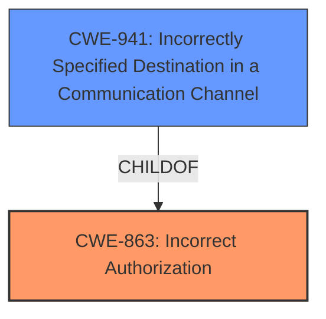

# Enhanced Analysis for CVE-2022-39302

# Summary
| CWE ID | CWE Name | Confidence | CWE Abstraction Level | CWE Vulnerability Mapping Label | CWE-Vulnerability Mapping Notes |
|---|---|---|---|---|---|
| CWE-863 | Incorrect Authorization | 0.9 | Class | Primary | Allowed-with-Review |
| CWE-941 | Incorrectly Specified Destination in a Communication Channel | 0.7 | Base | Secondary | Allowed |

## Evidence and Confidence

*   **Confidence Score:** 0.8
*   **Evidence Strength:** HIGH

## Relationship Analysis
The primary relationship influencing the decision is the parent-child relationship between CWE-863 (Incorrect Authorization) and other potential base-level CWEs like CWE-639 (Authorization Bypass Through User-Controlled Key). CWE-863 is a class-level CWE. The weakness of allowing cross-server channel configuration and sending messages to unintended channels is primarily an authorization issue. CWE-941 describes incorrectly specifying a destination in a communication channel. This secondary weakness supports the concept of the bot being tricked into sending messages to the wrong server.



## Vulnerability Chain
The chain of events is as follows:
1.  **Root Cause:** **Improper access control** (as stated in the vulnerability description and supported by the CVE Reference). This maps to **CWE-863 (Incorrect Authorization)** because the application **does not correctly perform the check** to verify that the channel being configured for logging belongs to the same server.

2.  The application allows configuration of logging to target channels from different servers and **incorrectly specifies the destination in a communication channel** (**CWE-941**).

3.  **Impact:** This leads to the ability to send log messages to another guild channel, bypassing raid and webhook protections, and enabling spamming and mass advertisements.

## Summary of Analysis
The initial assessment considered several CWEs, primarily focusing on authorization and authentication bypasses. However, based on the provided evidence, the root cause is best described as an authorization flaw where the bot **does not correctly** verify whether a user has the right to specify a channel from another server as a logging target. The vulnerability description states "**improper access control**," and the CVE Reference confirms that the root cause is the application allowing configuration of features to target channels from different servers.

CWE-863 (Incorrect Authorization) is chosen as the primary CWE because it directly addresses the core issue of the bot performing an authorization check, but performing it incorrectly. The CVE Reference details the **weakness** as "Cross-server channel configuration vulnerability, allowing unauthorized access to channels on other Discord servers." CWE-941 is a secondary weakness.

CWE-287 (Improper Authentication) and CWE-306 (Missing Authentication for Critical Function) were considered but deemed less appropriate because the vulnerability is not about bypassing authentication altogether. The attacker needs to have some level of privilege on their own server to configure the bot.

The selected CWEs are at an optimal level of specificity. CWE-863 is a Class-level CWE, but it accurately reflects the nature of the **incorrect authorization** in this vulnerability. A more specific Base-level CWE could potentially be considered if the specifics of the authorization implementation were known. CWE-941 is base level and provides additional details.

Relevant CWE Information:

# Enhanced Context (25 CWEs)

## CWE-1390: Weak Authentication
**Abstraction Level**: Class
**Similarity Score**: 0.77
**Source**: dense

**Description**:
The product uses an authentication mechanism to restrict access to specific users or identities, but the mechanism does not sufficiently prove that the claimed identity is correct.

**Mapping Guidance**:
- Usage: Allowed-with-Review
- Rationale: This CWE entry is a Class and might have Base-level children that would be more appropriate

*Not Selected*: Authentication is not the primary issue.

## CWE-303: Incorrect Implementation of Authentication Algorithm
**Abstraction Level**: Base
**Similarity Score**: 0.77
**Source**: dense

**Description**:
The requirements for the product dictate the use of an established authentication algorithm, but the implementation of the algorithm is incorrect.

**Mapping Guidance**:
- Usage: Allowed
- Rationale: This CWE entry is at the Base level of abstraction, which is a preferred level of abstraction for mapping to the root causes of vulnerabilities.

*Not Selected*: Authentication is not the primary issue.

## CWE-807: Reliance on Untrusted Inputs in a Security Decision
**Abstraction Level**: Base
**Similarity Score**: 0.76
**Source**: dense

**Description**:
The product uses a protection mechanism that relies on the existence or values of an input, but the input can be modified by an untrusted actor in a way that bypasses the protection mechanism.

**Mapping Guidance**:
- Usage: Allowed
- Rationale: This CWE entry is at the Base level of abstraction, which is a preferred level of abstraction for mapping to the root causes of vulnerabilities.

*Not Selected*: The core issue is incorrect authorization not relying on untrusted inputs.

## CWE-941: Incorrectly Specified Destination in a Communication Channel
**Abstraction Level**: Base
**Similarity Score**: 0.76
**Source**: dense

**Description**:
The product creates a communication channel to initiate an outgoing request to an actor, but it does not correctly specify the intended destination for that actor.

**Mapping Guidance**:
- Usage: Allowed
- Rationale: This CWE entry is at the Base level of abstraction, which is a preferred level of abstraction for mapping to the root causes of vulnerabilities.

*Selected as Secondary*: The vulnerability allows specifying a destination channel on a different server.

## CWE-1391: Use of Weak Credentials
**Abstraction Level**: Class
**Similarity Score**: 0.76
**Source**: dense

**Description**:
The product uses weak credentials (such as a default key or hard-coded password) that can be calculated, derived, reused, or guessed by an attacker.

**Mapping Guidance**:
- Usage: Allowed-with-Review
- Rationale: This CWE entry is a Class and might have Base-level children that would be more appropriate

*Not Selected*: Credentials are not the primary issue.

## CWE-639: Authorization Bypass Through User-Controlled Key
**Abstraction Level**: Base
**Similarity Score**: 0.76
**Source**: dense

**Description**:
The system's authorization functionality does not prevent one user from gaining access to another user's data or record by modifying the key value identifying the data.

**Mapping Guidance**:
- Usage: Allowed
- Rationale: This CWE entry is at the Base level of abstraction, which is a preferred level of abstraction for mapping to the root causes of vulnerabilities.

*Not Selected*: While authorization is involved, the bypass is not directly through a user-controlled key.

## CWE-799: Improper Control of Interaction Frequency
**Abstraction Level**: Class
**Similarity Score**: 0.75
**Source**: dense

**Description**:
The product does not properly limit the number or frequency of interactions that it has with an actor, such as the number of incoming requests.

**Mapping Guidance**:
- Usage: Allowed-with-Review
- Rationale: This CWE entry is a Class and might have Base-level children that would be more appropriate

*Not Selected*: Frequency of interactions is not the primary issue.

## CWE-288: Authentication Bypass Using an Alternate Path or Channel
**Abstraction Level**: Base
**Similarity Score**: 0.75
**Source**: dense

**Description**:
The product requires authentication, but the product has an alternate path or channel that does not require authentication.

**Mapping Guidance**:
- Usage: Allowed
- Rationale: This CWE entry is at the Base level of abstraction, which is a preferred level of abstraction for mapping to the root causes of vulnerabilities.

*Not Selected*: Authentication is not the primary issue.

## CWE-300: Channel Accessible by Non-Endpoint
**Abstraction Level**: Class
**Similarity Score**: 0.75
**Source**: dense

**Description**:
The product does not adequately verify the identity of actors at both ends of a communication channel, or does not adequately ensure the integrity of the channel, in a way that allows the channel to be accessed or influenced by an actor that is not an endpoint.

**Mapping Guidance**:
- Usage: Discouraged
- Rationale: CWE-300 is commonly misused for vulnerabilities in which the prerequisites for exploitation require the adversary to be in a privileged "in-the-middle" position.

*Not Selected*: Does not apply because the attacker configures the channel, not due to an in-the-middle position.

## CWE-1289: Improper Validation of Unsafe Equivalence in Input
**Abstraction Level**: Base
**Similarity Score**: 0.75
**Source**: dense

**Description**:
The product receives an input value that is


## CWE Relationship Analysis

Current CWEs represent these abstraction levels: .


### Vulnerability Chain Analysis

**Chain starting from CWE-941:**
- 941 (Incorrectly Specified Destination in a Communication Channel) - ROOT


**Chain starting from CWE-300:**
- 300 (Channel Accessible by Non-Endpoint) - ROOT


### CWE Relationship Diagram

```mermaid
graph TD
    classDef primary fill:#f96,stroke:#333,stroke-width:2px
    classDef secondary fill:#69f,stroke:#333
    classDef tertiary fill:#9e9,stroke:#333
```