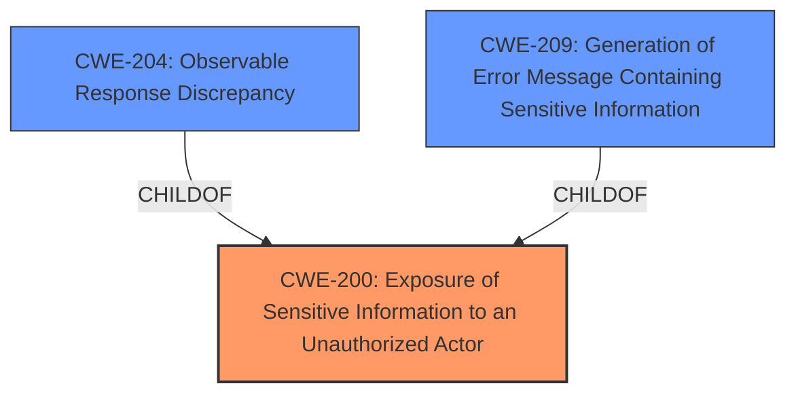

# Analysis for CVE-2022-39307

# Summary
| CWE ID | CWE Name | Confidence | CWE Abstraction Level | CWE Vulnerability Mapping Label | CWE-Vulnerability Mapping Notes |
|---|---|---|---|---|---|
| CWE-200 | Exposure of Sensitive Information to an Unauthorized Actor | 1.0 | Class | Primary | Allowed-with-Review: Although CWE-200 is a Class-level CWE and is generally discouraged, it is the best fit because the vulnerability results in the disclosure of sensitive information (user existence) to unauthorized actors. |
| CWE-204 | Observable Response Discrepancy | 0.8 | Base | Secondary | Allowed: The vulnerability allows attackers to differentiate responses based on whether a username exists or not. |
| CWE-209 | Generation of Error Message Containing Sensitive Information | 0.7 | Base | Secondary | Allowed: The vulnerability generates an error message that reveals sensitive information |

## Evidence and Confidence

*   **Confidence Score:** 0.9
*   **Evidence Strength:** HIGH

## Relationship Analysis
The primary CWE is CWE-200 (Exposure of Sensitive Information to an Unauthorized Actor), which is a Class-level CWE. CWE-200 has children like CWE-209 (Generation of Error Message Containing Sensitive Information) and CWE-201 (Insertion of Sensitive Information Into Sent Data), which are more specific Base-level CWEs. CWE-204 (Observable Response Discrepancy) is also a child of CWE-203 and is related to information exposure through different responses.

## Vulnerability Chain
The vulnerability chain starts with the application failing to properly handle password reset requests. The server's response reveals whether a given username or email exists, leading to user enumeration and information disclosure.

## Summary of Analysis
Initially, the analysis focused on identifying the most specific CWE related to the information leak. The **weakness** is that the application reveals whether a user exists or not, which constitutes sensitive information. The evidence from the "CVE Reference Links Content Summary" confirms the **root cause** is related to how Grafana handles password reset requests. Specifically, "The server's response to this request reveals whether the provided username or email exists within the system, specifically by returning a "user not found" message if the user does not exist."

CWE-200 (Exposure of Sensitive Information to an Unauthorized Actor) is the primary CWE because it broadly covers the exposure of sensitive information to unauthorized actors. While CWE-200 is discouraged due to its high-level nature, in this case, it is the best fit as the vulnerability's core is the disclosure itself.

CWE-204 (Observable Response Discrepancy) is a secondary CWE because the vulnerability allows attackers to distinguish between responses based on user existence. CWE-209 (Generation of Error Message Containing Sensitive Information) is also a secondary CWE because the error message contains sensitive information about user existence.

The selection of CWE-200 is justified because the core issue is the exposure of sensitive information. The additional CWEs provide further specificity by highlighting the observable discrepancy and the generation of error messages. These selected CWEs are at the optimal level of specificity given the information available.

Relevant CWE Information:

# Enhanced Context (25 CWEs)
The following CWEs were identified as potentially relevant to this vulnerability:

## CWE-204: Observable Response Discrepancy
**Abstraction Level**: Base
**Similarity Score**: 0.78
**Source**: dense

**Description**:
The product provides different responses to incoming requests in a way that reveals internal state information to an unauthorized actor outside of the intended control sphere.

**Mapping Guidance**:
- Usage: Allowed
- Rationale: This CWE entry is at the Base level of abstraction, which is a preferred level of abstraction for mapping to the root causes of vulnerabilities.

## CWE-668: Exposure of Resource to Wrong Sphere
**Abstraction Level**: Class
**Similarity Score**: 0.78
**Source**: dense

**Description**:
The product exposes a resource to the wrong control sphere, providing unintended actors with inappropriate access to the resource.

**Mapping Guidance**:
- Usage: Discouraged
- Rationale: CWE-668 is high-level and is often misused as a catch-all when lower-level CWE IDs might be applicable. It is sometimes used for low-information vulnerability reports [REF-1287]. It is a level-1 Class (i.e., a child of a Pillar). It is not useful for trend analysis.

## CWE-209: Generation of Error Message Containing Sensitive Information
**Abstraction Level**: Base
**Similarity Score**: 0.77
**Source**: dense

**Description**:
The product generates an error message that includes sensitive information about its environment, users, or associated data.

**Mapping Guidance**:
- Usage: Allowed
- Rationale: This CWE entry is at the Base level of abstraction, which is a preferred level of abstraction for mapping to the root causes of vulnerabilities.

## CWE-497: Exposure of Sensitive System Information to an Unauthorized Control Sphere
**Abstraction Level**: Base
**Similarity Score**: 0.77
**Source**: dense

**Description**:
The product does not properly prevent sensitive system-level information from being accessed by unauthorized actors who do not have the same level of access to the underlying system as the product does.

**Mapping Guidance**:
- Usage: Allowed
- Rationale: This CWE entry is at the Base level of abstraction, which is a preferred level of abstraction for mapping to the root causes of vulnerabilities.

## CWE-212: Improper Removal of Sensitive Information Before Storage or Transfer
**Abstraction Level**: Base
**Similarity Score**: 0.77
**Source**: dense

**Description**:
The product stores, transfers, or shares a resource that contains sensitive information, but it does not properly remove that information before the product makes the resource available to unauthorized actors.

**Mapping Guidance**:
- Usage: Allowed
- Rationale: This CWE entry is at the Base level of abstraction, which is a preferred level of abstraction for mapping to the root causes of vulnerabilities.

## CWE-538: Insertion of Sensitive Information into Externally-Accessible File or Directory
**Abstraction Level**: Base
**Similarity Score**: 0.77
**Source**: dense

**Description**:
The product places sensitive information into files or directories that are accessible to actors who are allowed to have access to the files, but not to the sensitive information.

**Mapping Guidance**:
- Usage: Allowed
- Rationale: This CWE entry is at the Base level of abstraction, which is a preferred level of abstraction for mapping to the root causes of vulnerabilities.

## CWE-639: Authorization Bypass Through User-Controlled Key
**Abstraction Level**: Base
**Similarity Score**: 0.77
**Source**: dense

**Description**:
The system's authorization functionality does not prevent one user from gaining access to another user's data or record by modifying the key value identifying the data.

**Mapping Guidance**:
- Usage: Allowed
- Rationale: This CWE entry is at the Base level of abstraction, which is a preferred level of abstraction for mapping to the root causes of vulnerabilities.

## CWE-1390: Weak Authentication
**Abstraction Level**: Class
**Similarity Score**: 0.76
**Source**: dense

**Description**:
The product uses an authentication mechanism to restrict access to specific users or identities, but the mechanism does not sufficiently prove that the claimed identity is correct.

**Mapping Guidance**:
- Usage: Allowed-with-Review
- Rationale: This CWE entry is a Class and might have Base-level children that would be more appropriate

## CWE-41: Improper Resolution of Path Equivalence
**Abstraction Level**: Base
**Similarity Score**: 0.76
**Source**: dense

**Description**:
The product is vulnerable to file system contents disclosure through path equivalence. Path equivalence involves the use of special characters in file and directory names. The associated manipulations are intended to generate multiple names for the same object.

**Mapping Guidance**:
- Usage: Allowed
- Rationale: This CWE entry is at the Base level of abstraction, which is a preferred level of abstraction for mapping to the root causes of vulnerabilities.

## CWE-807: Reliance on Untrusted Inputs in a Security Decision
**Abstraction Level**: Base
**Similarity Score**: 0.76
**Source**: dense

**Description**:
The product uses a protection mechanism that relies on the existence or values of an input, but the input can be modified by an untrusted actor in a way that bypasses the protection mechanism.

**Mapping Guidance**:
- Usage