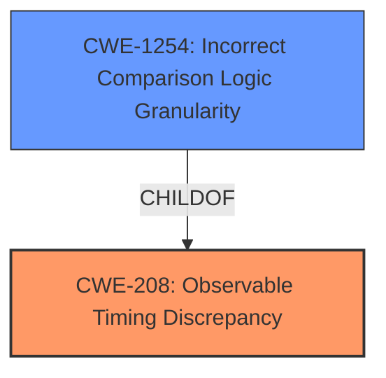

# Analysis for CVE-2022-39308

# Summary
| CWE ID    | CWE Name                                  | Confidence | CWE Abstraction Level | CWE Vulnerability Mapping Label | CWE-Vulnerability Mapping Notes |
| :-------- | :---------------------------------------- | :--------- | :-------------------- | :------------------------------ | :------------------------------ |
| CWE-208   | Observable Timing Discrepancy           | 1          | Base                  | Primary                         | Allowed                       |
| CWE-1254  | Incorrect Comparison Logic Granularity  | 0.8        | Base                  | Secondary                       | Allowed                       |

## Evidence and Confidence

*   **Confidence Score:** 0.9
*   **Evidence Strength:** HIGH

## Relationship Analysis
The primary CWE is CWE-208, which describes an observable timing discrepancy. CWE-1254, Incorrect Comparison Logic Granularity is a child of CWE-208, representing a more specific case where the comparison logic's granularity leads to timing discrepancies. The vulnerability involves a timing attack due to the use of regular string comparison instead of a constant-time algorithm, making CWE-208 the more direct and higher-level classification. However, because the timing discrepancy is explicitly linked to the comparison logic, CWE-1254 is a relevant secondary CWE.

## Vulnerability Chain
The vulnerability chain starts with the **incorrect** implementation of access token validation using regular string comparison instead of a constant-time algorithm. This leads to observable **timing discrepancies** during validation. An attacker can exploit these timing differences to guess the access token through a brute-force attack, resulting in unauthorized API access.

## Summary of Analysis
The initial analysis focused on identifying the root cause of the vulnerability and the mechanism through which it is exploited. The vulnerability description and CVE details clearly point to a **timing attack** arising from the use of regular string comparison.

The primary CWE selected is CWE-208 (Observable Timing Discrepancy). The vulnerability description states, "GoCD versions from 19.2.0 to 19.10.0 (inclusive) are subject to a **timing attack** in validation of access tokens due to use of regular string comparison for validation of the token rather than a constant time algorithm." The CVE reference summary also states, "The vulnerability is due to the use of a regular string comparison instead of a constant-time algorithm when validating access tokens."

CWE-1254 (Incorrect Comparison Logic Granularity) was also considered because the timing discrepancy arises from the comparison logic itself. However, CWE-208 is a more direct representation of the vulnerability. Both CWEs are at the Base level of abstraction, which is preferred.

The selected CWEs are at the optimal level of specificity because they directly address the root cause (**timing attack**) and the underlying mechanism (comparison logic). The MITRE mapping guidance supports the selection of Base-level CWEs when applicable.

Relevant CWE Information:

# Enhanced Context (25 CWEs)

## CWE-208: Observable Timing Discrepancy
**Abstraction Level**: Base
**Similarity Score**: 0.80
**Source**: dense

**Description**:
Two separate operations in a product require different amounts of time to complete, in a way that is observable to an actor and reveals security-relevant information about the state of the product, such as whether a particular operation was successful or not.

**Mapping Guidance**:
- Usage: Allowed
- Rationale: This CWE entry is at the Base level of abstraction, which is a preferred level of abstraction for mapping to the root causes of vulnerabilities.

**Technical Explanation**:

The vulnerability in GoCD arises because the time taken to validate access tokens varies depending on the input, specifically due to the use of regular string comparison instead of a constant-time algorithm. This **timing discrepancy** is observable to an attacker, who can then use this information to infer properties of the access token.

**Security Implications**:

The primary security implication is the potential for unauthorized API access. By exploiting the timing differences, an attacker can perform a brute-force attack to guess a valid access token, thereby gaining access to sensitive resources and functionalities.

**Relationship Justification**:

CWE-208 is the primary weakness because it directly represents the **observable timing discrepancy**.

**Mapping Guidance Influence**:

The MITRE mapping guidance for CWE-208 allows its usage and supports it due to its Base level of abstraction, aligning well with identifying the root cause of the vulnerability.

## CWE-1254: Incorrect Comparison Logic Granularity
**Abstraction Level**: Base
**Similarity Score**: 6202.21
**Source**: sparse

**Description**:
The product's comparison logic is performed over a series of steps rather than across the entire string in one operation. If there is a comparison logic failure on one of these steps, the operation may be vulnerable to a timing attack that can result in the interception of the process for nefarious purposes.

**Mapping Guidance**:
- Usage: Allowed
- Rationale: This CWE entry is at the Base level of abstraction, which is a preferred level of abstraction for mapping to the root causes of vulnerabilities.

**Technical Explanation**:

In the context of the GoCD vulnerability, the **incorrect** comparison logic granularity refers to the use of regular string comparison, which terminates as soon as a mismatch is found. This results in timing differences that can be exploited in a **timing attack**.

**Security Implications**:

Similar to CWE-208, the security implication is the potential for an attacker to infer information about the access token by observing the timing differences. This can lead to a brute-force attack and unauthorized API access.

**Relationship Justification**:

CWE-1254 is a secondary consideration because it describes the specific type of comparison logic that leads to the **timing discrepancy**. It is a child of CWE-208.

**Mapping Guidance Influence**:

The MITRE mapping guidance for CWE-1254 allows its usage and supports it due to its Base level of abstraction.