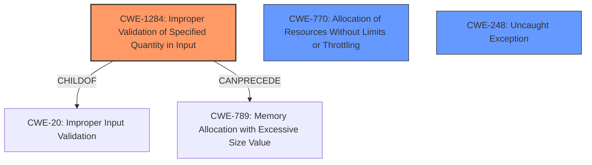

# Analysis for CVE-2022-39313

# Summary
| CWE ID    | CWE Name                                                    | Confidence | CWE Abstraction Level | CWE Vulnerability Mapping Label | CWE-Vulnerability Mapping Notes |
| :-------- | :---------------------------------------------------------- | :--------- | :-------------------- | :------------------------------ | :------------------------------ |
| CWE-1284  | Improper Validation of Specified Quantity in Input        | 0.85       | Base                  | Primary                         | Allowed                         |
| CWE-770   | Allocation of Resources Without Limits or Throttling        | 0.75       | Base                  | Secondary                       | Allowed                         |
| CWE-248   | Uncaught Exception                                        | 0.65       | Base                  | Secondary                       | Allowed                         |

## Evidence and Confidence

*   **Confidence Score:** 0.75
*   **Evidence Strength:** HIGH

## Relationship Analysis
The primary weakness is **CWE-1284 (Improper Validation of Specified Quantity in Input)**, which is a child of **CWE-20 (Improper Input Validation)**. This relationship indicates that the root cause lies in the failure to properly validate the byte range specified in the file download request. **CWE-1284** can precede **CWE-789 (Memory Allocation with Excessive Size Value)**, suggesting that an invalid quantity could lead to excessive memory allocation. **CWE-770 (Allocation of Resources Without Limits or Throttling)** is also a relevant factor, as the lack of validation could allow an attacker to exhaust server resources. Finally, **CWE-248 (Uncaught Exception)** is considered because the description indicates the server crashes, which can be caused by an exception not being properly caught.

## Vulnerability Chain
The vulnerability chain starts with the **improper validation of the byte range** (CWE-1284). This leads to a potential **allocation of excessive resources** (CWE-770) or **memory allocation with an excessive size value** (CWE-789). Ultimately, this results in the server crashing, which can be represented by an **uncaught exception** (CWE-248), leading to a denial-of-service condition.

## Summary of Analysis
The initial analysis focused on the **improper parsing of the range parameter** within file download requests, leading to server crashes. The primary CWE selected is **CWE-1284 (Improper Validation of Specified Quantity in Input)**, as the root cause is the **lack of validation** of the byte range. The vulnerability description key phrases like "invalid byte range" and the CVE reference link content summary stating "**improper input validation leading to server crashes**" support this.

**CWE-770 (Allocation of Resources Without Limits or Throttling)** is a secondary concern because the **lack of validation** could allow attackers to exhaust resources, although the description doesn't explicitly state resource exhaustion.

**CWE-248 (Uncaught Exception)** is included as the server crashes, suggesting an exception is not caught.

Other CWEs considered but not used:

*   **CWE-789 (Memory Allocation with Excessive Size Value)**: While possible, there's no explicit evidence of excessive memory allocation.
*   **CWE-918 (Server-Side Request Forgery (SSRF))**: Not relevant as the vulnerability isn't related to making requests to unexpected destinations.
*   **CWE-226 (Sensitive Information in Resource Not Removed Before Reuse)**: Not relevant as the vulnerability isn't about sensitive information leakage.

The selected CWEs are at the optimal level of specificity because they accurately reflect the root cause and potential consequences of the vulnerability based on the provided evidence. The relationships between the CWEs provide a comprehensive view of the vulnerability's nature and potential impact.