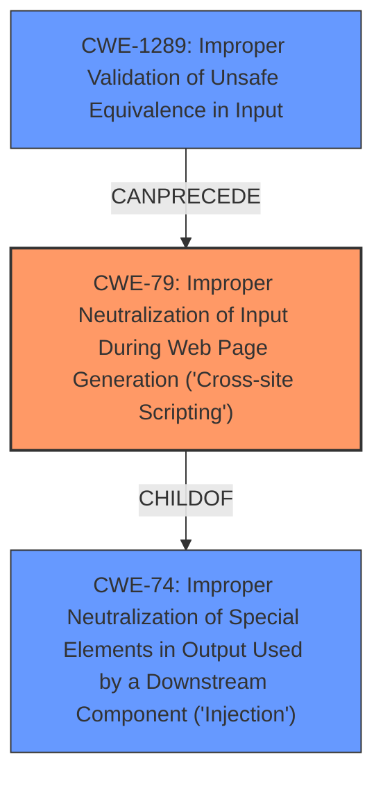

# Analysis for CVE-2022-39338

# Summary
| CWE ID | CWE Name | Confidence | CWE Abstraction Level | CWE Vulnerability Mapping Label | CWE-Vulnerability Mapping Notes |
|---|---|---|---|---|---|
| **CWE-79** | Improper Neutralization of Input During Web Page Generation ('Cross-site Scripting') | 1 | Base | Primary | Allowed |
| CWE-1289 | Improper Validation of Unsafe Equivalence in Input | 0.7 | Base | Secondary | Allowed |

## Evidence and Confidence

*   **Confidence Score:** 0.9
*   **Evidence Strength:** HIGH

## Relationship Analysis
The primary relationship influencing the CWE selection is that CWE-79 is a Base level CWE that accurately describes the **stored cross site scripting** vulnerability. CWE-79 is a child of CWE-74 (Improper Neutralization of Special Elements in Output Used by a Downstream Component ('Injection')), indicating that XSS is a type of injection. CWE-1289 is the **improper validation** that led to the XSS.

## Vulnerability Chain
The vulnerability chain starts with **improper discovery url validation** (CWE-1289) leading to a **stored cross site scripting** vulnerability (CWE-79). The chain is: **improper validation** -> **stored XSS**.

## Summary of Analysis
The primary weakness is a **stored cross-site scripting** vulnerability (CWE-79) due to **improper discovery url validation** (CWE-1289).

The evidence for CWE-79 is:
*   Vulnerability Description Key Phrases: "**weakness:** **stored cross site scripting**"
*   CVE Reference Links Content Summary: "**Stored Cross-Site Scripting (XSS):** The primary weakness is a stored XSS vulnerability. By inserting a malicious URL into the `authorization_endpoint`, an attacker could inject arbitrary JavaScript that would execute when the page is loaded in Safari."

The evidence for CWE-1289 is:
*   Vulnerability Description Key Phrases: "**rootcause:** **improper discovery url validation**"
*   CVE Reference Links Content Summary: "The vulnerability stems from a failure to properly validate the `authorization_endpoint` URL before inserting it into a `<meta>` tag."

CWE-79 is at the optimal level of specificity (Base) as it directly describes the XSS vulnerability.

CWE-116 (Improper Encoding or Escaping of Output) was considered, but it's more about the encoding of output to prevent injection, whereas the core issue here is the **improper validation** of the URL, which allows the malicious script to be stored in the first place.

CWE-918 (Server-Side Request Forgery (SSRF)) was considered, but it describes a situation where the server is fetching content from an unexpected destination, which is not the case here.

CWE-201 (Insertion of Sensitive Information Into Sent Data) was considered, but the issue isn't about sensitive data being inserted, but rather malicious code being injected.

CWE-923 (Improper Restriction of Communication Channel to Intended Endpoints) was considered, but this vulnerability doesn't involve a communication channel being directed to the wrong endpoint.

CWE-204 (Observable Response Discrepancy) was considered, but it focuses on information leakage through different responses, not code injection.

CWE-322 (Key Exchange without Entity Authentication) was considered, but it is irrelevant because the vulnerability has nothing to do with key exchange.

CWE-346 (Origin Validation Error) was considered, but the root cause is more specifically about the improper validation of the URL itself, which makes CWE-1289 a more precise fit.

CWE-352 (Cross-Site Request Forgery (CSRF)) was considered, but CSRF is about tricking a user into performing actions, whereas this vulnerability is about injecting malicious code.

CWE-863 (Incorrect Authorization) was considered, but the problem isn't with authorization, but rather with **improper validation** and subsequent XSS.

CWE-74 (Improper Neutralization of Special Elements in Output Used by a Downstream Component ('Injection')) was considered, but it is a class level CWE.