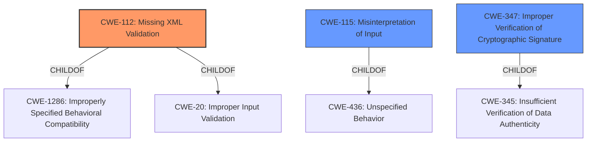

# Analysis for CVE-2022-39353

# Summary
| CWE ID    | CWE Name                                                                                                      | Confidence | CWE Abstraction Level | CWE Vulnerability Mapping Label | CWE-Vulnerability Mapping Notes |
| :---------- | :------------------------------------------------------------------------------------------------------------ | :--------- | :---------------------- | :------------------------------ | :------------------------------ |
| CWE-112     | Missing XML Validation                                                                                        | 0.9        | Base                    | Allowed                       | Primary CWE                     |
| CWE-115     | Misinterpretation of Input                                                                                    | 0.7        | Base                    | Allowed                       | Secondary Candidate             |
| CWE-347     | Improper Verification of Cryptographic Signature                                                            | 0.6        | Base                    | Allowed                       | Secondary Candidate             |

## Evidence and Confidence

*   **Confidence Score:** 0.8
*   **Evidence Strength:** HIGH

## Relationship Analysis
The primary CWE, CWE-112, Missing XML Validation, is a base-level CWE, which is a preferred level for mapping. It's a child of CWE-1286 and CWE-20, indicating a lack of proper input handling in the context of XML. CWE-115, Misinterpretation of Input, is also a base-level CWE, a child of CWE-436, and represents a broader category where the system misinterprets data. CWE-347, Improper Verification of Cryptographic Signature, is a base-level CWE and a child of CWE-345, which describes vulnerabilities related to cryptographic signature handling. The relationship analysis shows a hierarchical structure moving from general input issues to specific XML validation and cryptographic concerns.

## Vulnerability Chain
The vulnerability chain begins with the **root cause**: `xmldom` **parses XML that is not well-formed**. This leads to the impact of **multiple root nodes** being added to the DOM, violating XML standards. This can then lead to vulnerabilities in dependent applications, such as signature injection (CVE-2022-39299). The chain highlights a path from initial parsing error to downstream security impacts.

## Summary of Analysis
The initial analysis focused on the fact that `xmldom` **parses XML that is not well-formed**. This is the core of the vulnerability. The CVE description states that the library adds all root nodes to the `childNodes` collection of the `Document` without reporting an error, which breaks the XML standard.

The retriever results and CVE description support the selection of CWE-112 (Missing XML Validation) as the primary CWE. The library fails to properly validate the XML structure against expected schemas, specifically the single root element requirement. This aligns with the CWE description, which states that the product "accepts XML from an untrusted source but does not validate the XML against the proper schema." The confidence is high because the evidence strongly supports this classification.

CWE-115 (Misinterpretation of Input) was considered as a secondary CWE since the parser is misinterpreting the structure of the XML document by allowing multiple root elements when only one is expected.

CWE-347 (Improper Verification of Cryptographic Signature) was considered because the CVE description mentions signature injection in SAML processing as a potential consequence. However, this is more of an impact than a direct cause, so it was classified as a secondary candidate.

Other CWEs considered but not selected:

*   CWE-79 (Improper Neutralization of Input During Web Page Generation ('Cross-site Scripting')): While XSS is a common vulnerability, it does not directly relate to the root cause of the XML parsing issue.
*   CWE-494 (Download of Code Without Integrity Check): This CWE is not relevant since the vulnerability does not involve downloading code.
*   CWE-427 (Uncontrolled Search Path Element): This CWE is not applicable as the vulnerability is not related to search paths.
*   CWE-1390 (Weak Authentication): Authentication is not the primary issue here.
*   CWE-1336 (Improper Neutralization of Special Elements Used in a Template Engine): Template engines are not involved.
*   CWE-776 (Improper Restriction of Recursive Entity References in DTDs ('XML Entity Expansion')): While XML is involved, the issue is not about entity expansion but about validating the root element.

The final selection of CWE-112 is based on the direct evidence of missing XML validation. It's the most specific CWE that addresses the **root cause** of the vulnerability, and is at the base level of abstraction.