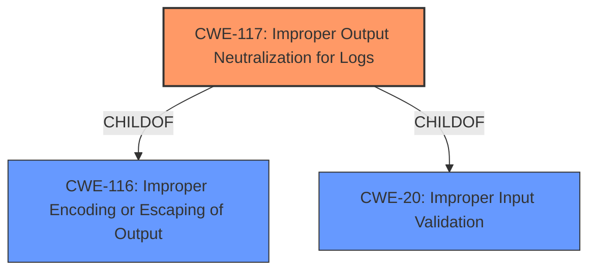

# Analysis for CVE-2022-3941

# Summary
| CWE ID | CWE Name | Confidence | CWE Abstraction Level | CWE Vulnerability Mapping Label | CWE-Vulnerability Mapping Notes |
|---|---|---|---|---|---|
| CWE-117 | Improper Output Neutralization for Logs | 1.0 | Base | Allowed | Primary CWE |

## Evidence and Confidence

*   **Confidence Score:** 1.0
*   **Evidence Strength:** HIGH

## Relationship Analysis
The primary relationship influencing the selection was the direct match of the vulnerability description's **improper output neutralization** to CWE-117. While other CWEs were considered, none directly addressed the specific weakness of **improper output neutralization** within logs. CWE-117 is a Base level CWE which is the preferred level of abstraction.

## Vulnerability Chain
The vulnerability chain starts with the manipulation of the X-Forwarded-For argument, leading to **improper output neutralization** for logs and ultimately a critical vulnerability in the Activity Log Plugin.
  - Manipulation of X-Forwarded-For (External Input)
  - **Improper Output Neutralization** (CWE-117)
  - Forged Log Entries / Malicious Content Injection (Impact)

## Summary of Analysis
The initial analysis focused on the **rootcause** identified in the vulnerability description, which is "**improper output neutralization**". The Retriever Results highlighted CWE-117 as the top candidate, which aligns directly with this root cause. The vulnerability description states, "The manipulation of the argument X-Forwarded-For leads to **improper output neutralization** for logs." This statement provides direct evidence supporting the selection of CWE-117.

The graph relationships further reinforced this decision, as CWE-117 is a child of CWE-116 (Improper Encoding or Escaping of Output) and CWE-20 (Improper Input Validation). However, CWE-117 is more specific to the context of log outputs, making it a better fit than its parent classes.

The final selection of CWE-117 is based on the direct match with the vulnerability description, the Retriever Results, and the hierarchical relationships within the CWE structure. CWE-117 is at the optimal level of specificity, addressing the **improper output neutralization** for logs.

Relevant CWE Information:

# Enhanced Context (25 CWEs)

## CWE-117: Improper Output Neutralization for Logs
**Abstraction:** Base
**Status:** Draft

### Description
The product does not neutralize or incorrectly neutralizes output that is written to logs.

### Extended Description

This can allow an attacker to forge log entries or inject malicious content into logs.

Log forging vulnerabilities occur when:

1.  Data enters an application from an untrusted source.
2.  The data is written to an application or system log file.

### Mapping Guidance
**Usage:** Allowed
**Rationale:** This CWE entry is at the Base level of abstraction, which is a preferred level of abstraction for mapping to the root causes of vulnerabilities.

### Observed Examples
- **CVE-2006-4624:** Chain: inject fake log entries with fake timestamps using CRLF injection

CWEs Considered but Not Used:

*   CWE-79 (Improper Neutralization of Input During Web Page Generation ('Cross-site Scripting')): While this CWE involves **improper neutralization**, it is specific to web page generation, which is not the case here. The vulnerability is about logs, not web pages.
*   CWE-89 (Improper Neutralization of Special Elements used in an SQL Command ('SQL Injection')): This CWE focuses on SQL commands, which are not relevant to this vulnerability.
*   CWE-74 (Improper Neutralization of Special Elements in Output Used by a Downstream Component ('Injection')): This is a class-level CWE and is too broad. CWE-117 is a more specific child of this CWE and applies directly to the logging context.
*   CWE-113 (Improper Neutralization of CRLF Sequences in HTTP Headers ('HTTP Request/Response Splitting')): This CWE focuses on CRLF sequences in HTTP headers, which is not the primary issue here. While the X-Forwarded-For header is involved, the core problem is **improper neutralization** in logs.
* CWE-1336 (Improper Neutralization of Special Elements Used in a Template Engine): This is specific to template engines which is not relevant here.