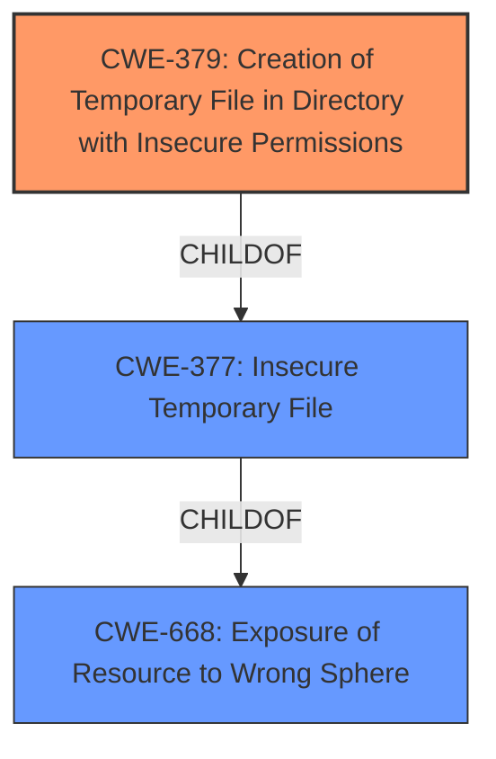

# Enhanced Analysis for CVE-2022-3952

# Summary
| CWE ID | CWE Name | Confidence | CWE Abstraction Level | CWE Vulnerability Mapping Label | CWE-Vulnerability Mapping Notes |
|---|---|---|---|---|---|
| CWE-379 | Creation of Temporary File in Directory with Insecure Permissions | 1.0 | Base | Allowed | Primary CWE |

## Evidence and Confidence

*   **Confidence Score:** 1.0
*   **Evidence Strength:** HIGH

## Relationship Analysis
The primary relationship that influenced the CWE selection was the ChildOf relationship between CWE-379 and CWE-377 (Insecure Temporary File). While CWE-377 is a broader Class, CWE-379 is a more specific Base that directly addresses the **creation of temporary files in directories with insecure permissions**. This direct match guided the selection of CWE-379.



## Vulnerability Chain
The chain of events leading to the vulnerability can be mapped as follows:

1.  **Root Cause:** **Insecure Creation of Temporary Directory** using `File.createTempFile()` followed by `delete()` and then `mkdir()` or `mkdirs()`.
2.  **Weakness 1:** CWE-379 Creation of Temporary File in Directory with Insecure Permissions. This enables potential information disclosure.
3.  **Weakness 2:** Race Condition - A malicious user can hijack the directory creation.
4.  **Impact:** Information Disclosure and potential Privilege Escalation if code is executed from the hijacked temporary directory.

## Summary of Analysis
The analysis is based on the provided vulnerability description and the CVE Reference Links Content Summary, which gave a rootcause evidence.

The vulnerability involves the insecure creation of temporary directories, leading to potential information disclosure and privilege escalation. The core issue is the **creation of a temporary file in a directory with insecure permissions**, which aligns perfectly with CWE-379.

The CVE Reference Links Content Summary states:
"**Weaknesses/Vulnerabilities Present:**
*   **CWE-379:** Creation of Temporary File in Directory with Insecure Permissions."

The Retriever Results listed CWE-379 as the top match with a similarity score of 0.221. The MITRE mapping guidance for CWE-379 states "Usage: Allowed" and "Rationale: This CWE entry is at the Base level of abstraction, which is a preferred level of abstraction for mapping to the root causes of vulnerabilities."

Other CWEs considered but not used:

*   CWE-79 (Improper Neutralization of Input During Web Page Generation ('Cross-site Scripting')): While listed in the Retriever Results, this CWE is not applicable because the vulnerability is not related to web page generation or cross-site scripting.
*   CWE-378 (Creation of Temporary File With Insecure Permissions): Similar to CWE-379, but less specific. CWE-379 is more precise as it explicitly mentions the directory aspect.
*   CWE-89 (Improper Neutralization of Special Elements used in an SQL Command ('SQL Injection')): This CWE is not relevant as the vulnerability has nothing to do with SQL injection.
*   CWE-341 (Predictable from Observable State): While predictability could be a factor in exploiting the race condition, the primary weakness is the insecure permissions of the temporary directory, not the predictability of its name or location.
*   CWE-377 (Insecure Temporary File): This is a broader class, and CWE-379 is a more specific base that accurately captures the weakness.
*   CWE-184 (Incomplete List of Disallowed Inputs): Not relevant to the specific vulnerability scenario.
*   CWE-334 (Small Space of Random Values): Not relevant to the specific vulnerability scenario.
*   CWE-927 (Use of Implicit Intent for Sensitive Communication): This is specific to Android applications and intents, which is not applicable here.
*   CWE-59 (Improper Link Resolution Before File Access ('Link Following')): The vulnerability does not involve symlink following or link resolution issues.

The selection of CWE-379 is at the optimal level of specificity because it directly addresses the root cause of the vulnerability: the **creation of temporary files in directories with insecure permissions**.


## CWE Relationship Analysis

Current CWEs represent these abstraction levels: .


### Vulnerability Chain Analysis

**Chain starting from CWE-89:**
- 89 (Improper Neutralization of Special Elements used in an SQL Command ('SQL Injection')) - ROOT


**Chain starting from CWE-184:**
- 184 (Incomplete List of Disallowed Inputs) - ROOT


### CWE Relationship Diagram

```mermaid
graph TD
    classDef primary fill:#f96,stroke:#333,stroke-width:2px
    classDef secondary fill:#69f,stroke:#333
    classDef tertiary fill:#9e9,stroke:#333
```