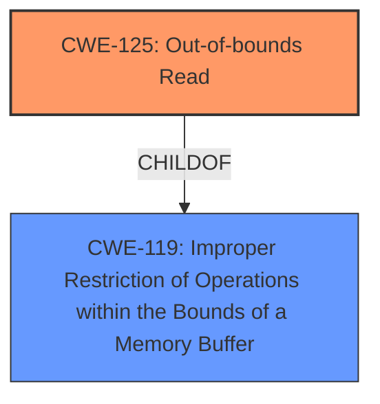

# Enhanced Analysis for CVE-2022-3965

# Summary
| CWE ID  | CWE Name                                                               | Confidence | CWE Abstraction Level | CWE Vulnerability Mapping Label | CWE-Vulnerability Mapping Notes |
| :------- | :--------------------------------------------------------------------- | :--------- | :---------------------- | :------------------------------ | :------------------------------ |
| CWE-125 | Out-of-bounds Read | 1.0      | Base                    | Allowed                       | Primary CWE                     |
| CWE-119 | Improper Restriction of Operations within the Bounds of a Memory Buffer | 0.5 | Class | Allowed-with-Review | Secondary Candidate |

## Evidence and Confidence

*   **Confidence Score:** 1.0
*   **Evidence Strength:** HIGH

## Relationship Analysis
The primary relationship that influences this decision is the ChildOf relationship between CWE-125 and CWE-119. CWE-125 is a specific type of buffer access error, making it a more precise classification than its parent. While CWE-119 broadly covers memory buffer errors, CWE-125 pinpoints the specific issue of reading beyond the buffer's boundaries.



## Vulnerability Chain
The vulnerability chain is relatively straightforward:
  1.  **Root Cause:** **Out-of-bounds read** in `smc_encode_stream` due to manipulation of `y_size`.
  2.  **Impact:** Potential code execution (as stated in the Gentoo Security Advisory, although not definitively linked to this specific CVE). More generally, out-of-bounds reads can lead to information disclosure or crashes.

## Summary of Analysis
This assessment is based on strong evidence from the vulnerability description and the CVE reference links. The description explicitly states "**out-of-bounds read**." The CVE reference content summary reinforces this, stating that the root cause is "**out-of-bounds** frame access" and that "**out-of-bounds read**: The code attempts to access memory outside the allocated bounds of a frame."

The graph relationships confirm that CWE-125 is a more specific type of memory access error (ChildOf CWE-119), aligning with the principle of selecting the most detailed CWE.

The selection of CWE-125 is at the optimal level of specificity because it directly represents the **rootcause** of the vulnerability: an **out-of-bounds read**.

Relevant CWE Information:

# Enhanced Context (25 CWEs)
The following CWEs were identified as potentially relevant to this vulnerability:

## CWE-125: Out-of-bounds Read
**Abstraction Level**: Base
**Similarity Score**: 0.76
**Source**: dense

**Description**:
The product reads data past the end, or before the beginning, of the intended buffer.

**Mapping Guidance**:
- Usage: Allowed
- Rationale: This CWE entry is at the Base level of abstraction, which is a preferred level of abstraction for mapping to the root causes of vulnerabilities.

## CWE-119: Improper Restriction of Operations within the Bounds of a Memory Buffer
**Abstraction Level**: Class
**Similarity Score**: N/A
**Source**: N/A

**Description**: The product performs an operation on a memory buffer, but it does not correctly restrict the operation to prevent memory corruption. This typically occurs when the software reads or writes to a memory location outside of the intended boundary of the buffer.

### CWE Selection:

*   **CWE-125: Out-of-bounds Read**
    *   **Explanation:** The vulnerability description clearly states that the **rootcause** is an "**out-of-bounds read**." The CVE reference links content summary also confirms this. This aligns directly with the description of CWE-125: "The product reads data past the end, or before the beginning, of the intended buffer."
    *   **Security Implications:** An out-of-bounds read can lead to information disclosure (reading sensitive data from unintended memory locations), denial of service (crashing the application), or, in some cases, code execution.
    *   **Relationships:** CWE-125 is a ChildOf CWE-119 (Improper Restriction of Operations within the Bounds of a Memory Buffer), indicating that it's a specific type of memory access error.
    *   **Mapping Guidance:** The mapping guidance for CWE-125 states "This CWE entry is at the Base level of abstraction, which is a preferred level of abstraction for mapping to the root causes of vulnerabilities" and its Usage is "Allowed".
    *   **Confidence:** 1.0 - High confidence due to the explicit mention of "**out-of-bounds read**" in the vulnerability description and supporting evidence.

*   **CWE-119: Improper Restriction of Operations within the Bounds of a Memory Buffer**
    *   **Explanation:** While CWE-125 is more specific, CWE-119 is a relevant parent class. The vulnerability involves improper handling of memory boundaries, which falls under the broader scope of CWE-119.
    *   **Security Implications:** Similar to CWE-125, CWE-119 can lead to memory corruption, information disclosure, denial of service, or code execution.
    *   **Relationships:** CWE-119 is a parent of CWE-125.
    *   **Mapping Guidance:** The retriever results don't have explicit mapping guidance for CWE-119, but the general principle is to prefer the most specific CWE that accurately represents the vulnerability.
    *   **Confidence:** 0.5 - Lower confidence because CWE-125 provides a more precise classification. It is still relevant as a general weakness category.

### CWEs Considered but Not Used:

*   **CWE-79: Improper Neutralization of Input During Web Page Generation ('Cross-site Scripting')**: This CWE is not relevant because the vulnerability is related to memory access errors, not web page generation or input sanitization.
*   **CWE-190: Integer Overflow or Wraparound**: This CWE is not relevant because the vulnerability is an **out-of-bounds read**, not an integer overflow. Although an integer overflow *could* lead to an out-of-bounds read, the evidence does not suggest that.
*   **CWE-131: Incorrect Calculation of Buffer Size**: This CWE is not relevant as there is no evidence to suggest that the buffer size calculation was incorrect, only that the code reads out of bounds.
*   **CWE-704: Incorrect Type Conversion or Cast, CWE-89: Improper Neutralization of Special Elements used in an SQL Command ('SQL Injection'), CWE-1241: Use of Predictable Algorithm in Random Number Generator, CWE-341: Predictable from Observable State, CWE-378: Creation of Temporary File With Insecure Permissions, CWE-1022: Use of Web Link to Untrusted Target with window.opener Access** These CWEs were also considered but deemed not relevant because they do not align with the specific details of the vulnerability related to memory access.


## CWE Relationship Analysis

Current CWEs represent these abstraction levels: .


### Vulnerability Chain Analysis

**Chain starting from CWE-190:**
- 190 (Integer Overflow or Wraparound) - ROOT


**Chain starting from CWE-131:**
- 131 (Incorrect Calculation of Buffer Size) - ROOT


### CWE Relationship Diagram

```mermaid
graph TD
    classDef primary fill:#f96,stroke:#333,stroke-width:2px
    classDef secondary fill:#69f,stroke:#333
    classDef tertiary fill:#9e9,stroke:#333
```