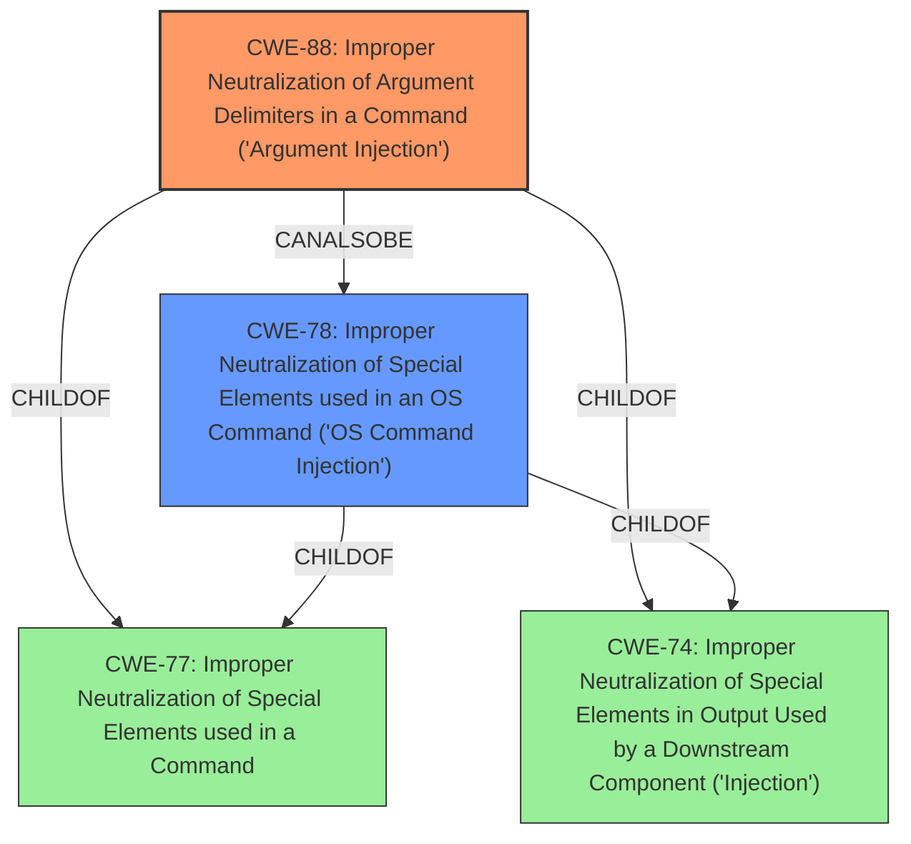

# Analysis for CVE-2022-3967

# Summary
| CWE ID | CWE Name | Confidence | CWE Abstraction Level | CWE Vulnerability Mapping Label | CWE-Vulnerability Mapping Notes |
|---|---|---|---|---|---|
| CWE-88 | Improper Neutralization of Argument Delimiters in a Command ('Argument Injection') | 1 | Base | Allowed | Primary CWE |
| CWE-78 | Improper Neutralization of Special Elements used in an OS Command ('OS Command Injection') | 0.7 | Base | Allowed | Secondary CWE |

## Evidence and Confidence

*   **Confidence Score:** 0.85
*   **Evidence Strength:** HIGH

## Relationship Analysis
The primary CWE selected is CWE-88, which represents **improper neutralization of argument delimiters** in a command. The vulnerability description explicitly mentions **argument injection**, making CWE-88 a direct and strong match. CWE-78, which is **improper neutralization of special elements used in an OS command**, is a related CWE, because argument injection can potentially lead to OS command injection if the injected arguments are maliciously crafted.

## Vulnerability Chain
The vulnerability chain starts with the **improper neutralization of argument delimiters** (CWE-88). If an attacker can inject malicious arguments, this could potentially lead to the execution of arbitrary OS commands (CWE-78), which is the final impact.

## Summary of Analysis
The initial assessment strongly points to CWE-88 due to the presence of **argument injection** in the vulnerability description. The "CVE Reference Links Content Summary" further confirms this by stating that the vulnerability is due to "lack of proper sanitization of input before being used in a `sed` command, potentially leading to command injection." The provided code snippets show the implemented sanitization functions (`format_no_quotes()`, `is_no_new_line_format()`, `is_format_valid()`) aimed at preventing the injection of malicious code through argument manipulation.

CWE-78 was also considered because **argument injection** could lead to OS command injection. If the injected arguments are crafted to execute arbitrary OS commands, then CWE-78 would also be applicable.

Based on the evidence, the primary weakness is the **improper neutralization of argument delimiters** (CWE-88), which is at the Base level of abstraction and is the most specific CWE that accurately represents the vulnerability.

Relevant CWE Information:

# Enhanced Context (25 CWEs)

## CWE-88: Improper Neutralization of Argument Delimiters in a Command ('Argument Injection')
**Abstraction Level**: Base
**Similarity Score**: 8020.83
**Source**: sparse

**Description**:
The product constructs a string for a command to be executed by a separate component
in another control sphere, but it does not properly delimit the
intended arguments, options, or switches within that command string.

**Mapping Guidance**:
- Usage: Allowed
- Rationale: This CWE entry is at the Base level of abstraction, which is a preferred level of abstraction for mapping to the root causes of vulnerabilities.

**Relationships**:
- CANALSOBE -> CWE-78
- CHILDOF -> CWE-77
- CHILDOF -> CWE-74

## CWE-78: Improper Neutralization of Special Elements used in an OS Command ('OS Command Injection')
**Abstraction Level**: base
**Similarity Score**: 5.03
**Source**: graph

**Description**:
CWE-78: Improper Neutralization of Special Elements used in an OS Command ('OS Command Injection')

**Mapping Guidance**:
- Usage: Allowed
- Rationale: This CWE entry is at the Base level of abstraction, which is a preferred level of abstraction for mapping to the root causes of vulnerabilities.

**Relationships**:
- CANFOLLOW -> CWE-184
- CANALSOBE -> CWE-88
- CHILDOF -> CWE-77
- CHILDOF -> CWE-74

CWE-79, CWE-89, CWE-93, CWE-1241, CWE-341, CWE-1336, CWE-208, and CWE-80 were considered but not selected because they do not directly relate to the **argument injection** vulnerability described. These CWEs cover other types of injection vulnerabilities (e.g., XSS, SQL injection) or weaknesses related to randomness and timing discrepancies, which are not relevant to this specific vulnerability.