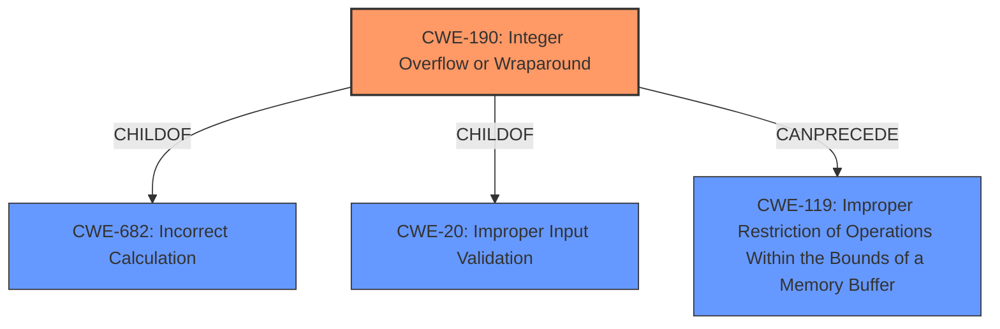

# Analysis Report for CVE-2022-3970

# Vulnerability Analysis Report: CVE-2022-3970

## Description


## Analysis (with Relationship Data)

# Summary
| CWE ID | CWE Name | Confidence | CWE Abstraction Level | CWE Vulnerability Mapping Label | CWE-Vulnerability Mapping Notes |
|---|---|---|---|---|---|
| CWE-190 | Integer Overflow or Wraparound | 1.0 | Base | Allowed | Primary CWE |

## Evidence and Confidence

*   **Confidence Score:** 1.0
*   **Evidence Strength:** HIGH

## Relationship Analysis
The primary relationship that impacted my decision was the direct match of the vulnerability description to the definition of CWE-190. The other relationships, while potentially relevant in a broader context, were not directly applicable to the root cause described in the provided text. The abstraction level of Base for CWE-190 is appropriate as it represents the specific **integer overflow** condition described in the vulnerability.



## Vulnerability Chain
The vulnerability chain is as follows:
1.  **Root Cause:** **Integer overflow** (CWE-190) in `TIFFReadRGBATileExt` function.
2.  Impact: Potential denial of service, information disclosure, or other context-dependent impact, potentially leading to memory corruption or other exploitable conditions (though this is not explicitly stated, it is implied).

## Summary of Analysis
The analysis is primarily based on the provided evidence, which explicitly states that the vulnerability is due to an **integer overflow** in the `TIFFReadRGBATileExt` function of LibTIFF. The "Vulnerability Description Key Phrases" section also highlights the **rootcause** as **integer overflow**. The "CVE Reference Links Content Summary" confirms this, stating "Integer overflow in TIFFReadRGBATileExt function" as the root cause.

CWE-190 perfectly matches this description. The relationship graph shows that CWE-190 can precede CWE-119, which is "Improper Restriction of Operations Within the Bounds of a Memory Buffer," indicating that an **integer overflow** can lead to buffer overflows.

The selected CWE is at the optimal level of specificity because it directly describes the identified weakness.

Relevant CWE Information:

# Enhanced Context (25 CWEs)

## CWE-190: Integer Overflow or Wraparound
**Abstraction:** Base
**Similarity Score**: 0.800 (dense)

**Description**:
The product performs a calculation that can produce an integer overflow or wraparound when the logic assumes that the resulting value will always be larger than the original value. This occurs when an integer value is incremented to a value that is too large to store in the associated representation. When this occurs, the value may become a very small or negative number.

**Mapping Guidance**:
- Usage: Allowed
- Rationale: This CWE entry is at the Base level of abstraction, which is a preferred level of abstraction for mapping to the root causes of vulnerabilities.

**Justification:** This is the primary CWE because the vulnerability description and CVE summary explicitly state that the root cause is an **integer overflow**. The description of CWE-190 directly matches this scenario.

## CWE-79: Improper Neutralization of Input During Web Page Generation ('Cross-site Scripting')
**Abstraction:** Base
**Similarity Score**: 0.591 (sparse)

**Description**:
The product does not neutralize or incorrectly neutralizes user-controllable input before it is placed in output that is used as a web page that is served to other users.

**Mapping Guidance**:
- Usage: Allowed
- Rationale: This CWE entry is at the Base level of abstraction, which is a preferred level of abstraction for mapping to the root causes of vulnerabilities.

**Justification:** This CWE was considered but is not applicable because the vulnerability does not involve web page generation or neutralization of input in that context. It's an **integer overflow** in image processing.

## CWE-89: Improper Neutralization of Special Elements used in an SQL Command ('SQL Injection')
**Abstraction:** Base
**Similarity Score**: 0.582 (sparse)

**Description**:
The product constructs all or part of an SQL command using externally-influenced input from an upstream component, but it does not neutralize or incorrectly neutralizes special elements that could modify the intended SQL command when it is sent to a downstream component.

**Mapping Guidance**:
- Usage: Allowed
- Rationale: This CWE entry is at the Base level of abstraction, which is a preferred level of abstraction for mapping to the root causes of vulnerabilities.

**Justification:** This CWE was considered but is not applicable because the vulnerability does not involve SQL commands or injection. It's an **integer overflow** in image processing.

## CWE-125: Out-of-bounds Read
**Abstraction:** Base
**Similarity Score**: 0.538 (sparse)

**Description**:
The product reads data past the end, or before the beginning, of the intended buffer.

**Mapping Guidance**:
- Usage: Allowed
- Rationale: This CWE entry is at the Base level of abstraction, which is a preferred level of abstraction for mapping to the root causes of vulnerabilities.

**Justification:** While the **integer overflow** could potentially lead to an out-of-bounds read, the primary weakness is the **integer overflow** itself. Therefore, CWE-125 is not the best fit for the root cause.


## CWE Relationship Analysis

Current CWEs represent these abstraction levels: .


### Vulnerability Chain Analysis

**Chain starting from CWE-190:**
- 190 (Integer Overflow or Wraparound) - ROOT


**Chain starting from CWE-89:**
- 89 (Improper Neutralization of Special Elements used in an SQL Command ('SQL Injection')) - ROOT


### CWE Relationship Diagram

```mermaid
graph TD
    classDef primary fill:#f96,stroke:#333,stroke-width:2px
    classDef secondary fill:#69f,stroke:#333
    classDef tertiary fill:#9e9,stroke:#333
```


*Report generated on 2025-03-30 19:54:46*
